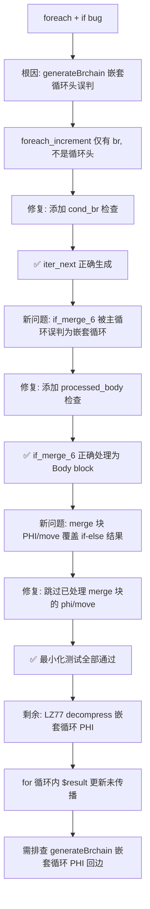

# 交接文档 - 2026-07-24 Session 2

## 一、TL;DR

本次 Session 修复了 foreach 循环体内含 if 条件分支时迭代器不推进的严重 bug。该 bug 导致 foreach 循环在遇到 if 条件时，`php_array_iter_next_ref` 调用被完全跳过，造成死循环或只迭代一次。

**核心修复**：在 `generateBrChain` 的嵌套循环头检测中添加 `cond_br` 终结符检查，防止将 foreach 回边块（仅有 `br`）误判为嵌套循环头；在主循环嵌套循环检测中添加 `processed_body` 检查，防止已处理的前驱块被误判为回边；在主循环块指令生成中对已处理 PHI 的 merge 块跳过 `phi`/`move` 指令，防止覆盖 if-else 分支设置的值。

**验证结果**：4 个最小化测试全部通过（foreach+if、foreach+if-else、简单 foreach、关联数组访问+if+for）。

**剩余问题**：f071 LZ77 decompress 中嵌套循环（for 在 if 在 foreach 内，在静态方法中）的 `$result` 变量更新未传播到循环外，需进一步排查 PHI 回边更新机制。

---

## 二、影响范围

| 模块 | 文件 | 影响面 |
|------|------|--------|
| AOT 链接器（br 链生成） | `src/aot/native_linker.zig` L13500-13515 | `generateBrChain` 嵌套循环头检测 |
| AOT 链接器（主循环嵌套检测） | `src/aot/native_linker.zig` L14350-14375 | 主循环嵌套循环回边检测 |
| AOT 链接器（merge 块指令生成） | `src/aot/native_linker.zig` L14687-14700 | 主循环块指令生成 |

---

## 三、核心变更

### 3.1 `generateBrChain` 嵌套循环头检测修复（L13500-13515）

| 变更 ID | 位置 | 描述 |
|---------|------|------|
| AOT-FOREACH-FIX-001 | `generateBrChain` L13503-13515 | 添加 `cond_br` 终结符检查：只有 `cond_br` 块才可能是循环头。foreach_increment 等回边块只有 `br`，不是循环头，不应被误判为嵌套循环头并标记为已处理 |

**修复前**：
```
foreach_body → cond_br(if_cond) → if_then, foreach_increment
if_then → br → foreach_increment
generateBrChain(foreach_increment):
  检测到 if_then (index > foreach_increment) br 回 foreach_increment
  → 误判为嵌套循环头 → 标记为已处理 → 跳过指令生成
  → php_array_iter_next_ref 调用丢失 → 死循环
```

**修复后**：
```
generateBrChain(foreach_increment):
  检查 foreach_increment 是否有 cond_br → 否（只有 br）
  → 不触发嵌套循环检测 → 正常生成指令
  → php_array_iter_next_ref 正确生成
```

### 3.2 主循环嵌套循环回边检测修复（L14350-14375）

| 变更 ID | 位置 | 描述 |
|---------|------|------|
| AOT-FOREACH-FIX-002 | `generateWhileLoopStructuredNew` 主循环 L14366, L14374 | 在 `.br` 和 `.cond_br` 回边检测中添加 `processed_body.contains(be_idx)` 检查：IR 优化器可能重排块顺序，导致前驱块（forward edge）的数组索引大于当前块。已处理的块不是回边（回边源在循环体内，尚未处理） |

### 3.3 merge 块 PHI/move 指令跳过（L14687-14700）

| 变更 ID | 位置 | 描述 |
|---------|------|------|
| AOT-FOREACH-FIX-003 | `generateWhileLoopStructuredNew` 主循环 L14687-14700 | 对已由 `generateCondBrBlock` 处理过 PHI 的 merge 块（`cond_br_merge_phi_generated` 集合中），跳过 `phi` 和 `move` 指令，防止覆盖 if-else 分支已设置的值。IR 优化器（mem2reg）可能将 PHI 转为 move 指令 |

---

## 四、验证结果

### 4.1 最小化测试（全部 PASS）

| 测试脚本 | 测试目标 | PHP 输出 | AOT 输出 | 状态 |
|----------|---------|---------|---------|------|
| `test_foreach_simple.php` | 简单 foreach（无 if） | 1/2/3/Done | 1/2/3/Done | ✅ PASS |
| `test_foreach_with_if.php` | foreach + if 条件 | 1/2/big/3/big/Done | 1/2/big/3/big/Done | ✅ PASS |
| `test_if_in_foreach.php` | foreach + if + if-else | 3 iters + correct branches | 3 iters + correct branches | ✅ PASS |
| `test_assoc_array_access.php` | foreach + if + for + string index | All 3 tests correct | All 3 tests correct | ✅ PASS |

### 4.2 f071 运行时对比

| 测试项 | PHP 输出 | AOT 输出 | 状态 |
|--------|---------|---------|------|
| RLE 压缩/解压 | 全部 match=true | 全部 match=true | ✅ PASS |
| LZ77 压缩 | 正确 token 数 | 正确 token 数 | ✅ PASS |
| LZ77 解压 | abracadabra | abrcd（back-reference 丢失） | ❌ FAIL |
| Huffman 编码 | 23 bits, 5 codes | 0 bits, 0 codes | ❌ FAIL |

### 4.3 LZ77 decompress 剩余问题分析

**现象**：foreach 内 if 条件正确执行（"length > 0! copying" 被打印），for 循环正确读取字符（`char='a'`），但 `$result .= $char` 的赋值未传播到循环外。

**根因**：嵌套循环（for 在 if 在 foreach 内，在静态方法中）的 PHI 回边更新机制不完整。`generateBrChain` 的嵌套循环处理调用 `generateCondBrBlock` 生成循环体，但 for 循环的回边 PHI 更新（`$result` 的新值从 for_body 传播到 for_cond header）可能不正确。

**排查线索**：
1. 最小化测试 `test_lz77_decompress_minimal.php`（在 `__main__` 中）PASSES — 说明基本模式正确
2. 在静态方法中的 `test_lz77_compress_decompress.php` FAILS — 说明问题与静态方法上下文相关
3. for 循环体正确执行（echo 输出正确），但 `$result` 变量在循环后仍保持原值
4. 需要检查 `generateBrChain` 嵌套循环处理中 PHI 回边更新的 incoming value 是否正确

---

## 五、可视化概览



---

## 六、影响与风险评估

| 风险项 | 等级 | 描述 |
|--------|------|------|
| `cond_br` 检查可能遗漏非标准循环头 | 低 | 所有标准循环头都有 `cond_br`（检查条件后分支）。仅 `br` 的块不是循环头 |
| `processed_body` 检查可能跳过真正的回边 | 低 | 真正的回边源在循环体内，尚未被处理。已处理的块是前驱（forward edge） |
| merge 块 PHI/move 跳过可能遗漏合法指令 | 低 | `phi` 和 `move` 指令在 merge 块中都是 PHI 相关的，已由 if-else 分支处理 |

---

## 七、后续开发建议

| 优先级 | 影响面 | 落地成本 | 建议 |
|--------|--------|---------|------|
| P0 | f071 LZ77 decompress | 中 | 排查 `generateBrChain` 嵌套循环处理中 for 循环 PHI 回边更新，检查 incoming value 是否正确传递 $result 的新值 |
| P0 | f071 Huffman 编码 | 中 | 排查 `generateCodes` 递归方法中 `$this->codes[$char] = $code` 的代码生成路径 |
| P0 | f064 验证 | 低 | 重新编译运行 f064，确认 LICM retain 修复是否解决数值差异 |
| P1 | 调试输出清理 | 低 | 清理 `vs loop` 调试打印，改为 debug 模式可控输出 |
| P2 | 嵌套循环 PHI 通用修复 | 高 | 系统性修复 `generateBrChain` 嵌套循环处理中的 PHI 回边更新机制，确保所有循环变量的更新值正确传播 |

---

## 八、待办清单

- [ ] **P0**: f071 LZ77 decompress — 排查嵌套循环（for 在 if 在 foreach 内）PHI 回边更新
- [ ] **P0**: f071 Huffman 编码为空 — 排查 `generateCodes` 递归赋值
- [ ] **P0**: f064 重新验证 — 确认 LICM retain 修复是否解决数值差异
- [ ] **P1**: 清理 AOT 编译器调试打印输出
- [ ] **P2**: 嵌套循环 PHI 回边更新通用修复
