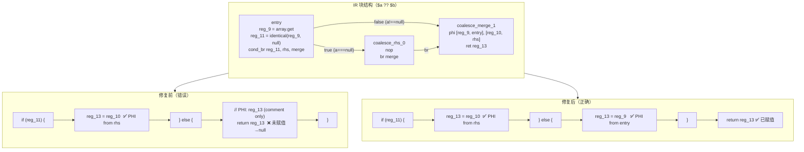

# 变更摘要：AST-Direct Coalesce（`??`）代码生成修复（Session #6）

> **日期**：2026-07-25
> **会话**：Session #6（紧接 Session #5）
> **状态**：f026 输出从 21/23 提升到 **23/23**，与 PHP 完全一致
> **核心文件**：`src/aot/native_linker.zig`（~22,020 行）

---

## 一、TL;DR（高层摘要）

本会话修复了 AST-Direct 标签驱动代码生成路径中 **null 合并运算符（`??`）** 的 PHI 消解缺陷。

**根因**：`$a ?? $b` 在 IR 中 lowering 为 `cond_br (a===null), rhs_block, merge_block`，其中 **false 分支直接跳到 merge 块**（else 目标 == merge 块）。`generateLabelDrivenBlockRange` 的 `.cond_br` 隐式 if/else 生成将 merge 块的指令（PHI 注释 + ret）生成在 else 分支内部，导致：
1. else 分支中 PHI 结果寄存器（如 `reg_13`）**从未赋值**
2. else 分支直接 `return reg_13`（返回 null）

**修复**：检测 coalesce 模式（else 块 == merge 块 且 merge 仅含 PHI 指令），此时 else 分支不生成 merge body，而是从 **entry 块**（cond_br 所在块）消解 PHI，merge 的 ret 由 if/else 之后的 merge 处理逻辑生成。

**效果**：`Stack::peek()` 和 `Queue::front()` 返回正确值（3 和 A），f026 达到 23/23。

---

## 二、影响范围

| 维度 | 说明 |
|------|------|
| 影响文件 | `src/aot/native_linker.zig`（1 个文件） |
| 影响函数 | `generateLabelDrivenBlockRange` 的 `.cond_br` case |
| 影响特性 | null 合并运算符 `??`（coalesce 模式）的 AST-Direct 代码生成 |
| 影响脚本 | 所有使用 `$a ?? $b` 且通过 AST-Direct 路径的 PHP 脚本 |
| 不影响 | 非 coalesce 的 cond_br（if/else、if-without-else 有副作用、嵌套 cond_br 等）保持原有行为 |
| 回归风险 | 低：修改是纯增量分支，仅 `else_is_coalesce_merge == true` 时行为改变 |

---

## 三、核心变更

| # | 变更点 | 位置（约） | 说明 |
|---|--------|-----------|------|
| 1 | 新增 `else_is_coalesce_merge` 检测 | `generateLabelDrivenBlockRange` `.cond_br` else 块处理（~行 6103） | 检测条件：`merge_bi == else_bi` 且 merge 块只含 PHI 指令 |
| 2 | coalesce 时 else 分支 PHI 取自 entry 块 | 同上 | `incoming2.block == block`（cond_br 所在块），而非 `cond_br_data.else_block` |
| 3 | coalesce 时不标记 merge 为已处理 | 同上 | 由 if/else 之后的 merge 处理逻辑（~行 6173）生成 non-PHI 指令 + ret |
| 4 | coalesce 时跳过原有 else body 生成 | 同上 | `if (else_is_coalesce_merge) {...} else if (!processed.contains(ei)) {...}` |
| 5 | coalesce 时跳过原有 else PHI 消解 | 同上 | `if (!else_is_coalesce_merge) { ... 原 PHI 消解 ... }` |

---

## 四、可视化概览

### 4.1 业务流程：coalesce IR 结构与代码生成映射



### 4.2 执行流程：cond_br 隐式 if/else 生成

```mermaid
sequenceDiagram
    participant GLB as generateLabelDrivenBlockRange
    participant Cond as .cond_br case
    participant Then as then 块处理
    participant Else as else 块处理
    participant Merge as merge 块处理

    GLB->>Cond: block.terminator == .cond_br
    Cond->>Cond: 生成 entry 块指令
    Cond->>Then: 处理 then 块（coalesce_rhs_0）
    Then->>Then: 生成 body + PHI from then_block
    Then-->>Cond: merge_bi = else_bi（then 的 .br 目标 == else）
    Cond->>Else: else_is_coalesce_merge?
    alt coalesce 模式（修复后）
        Else->>Else: PHI from entry 块（reg_13 = reg_9）
        Else-->>Cond: 不标记 merge 为已处理
        Cond->>Merge: if/else 闭合后处理 merge
        Merge->>Merge: 生成 non-PHI 指令 + ret（return reg_13）
    else 非 coalesce（原有行为不变）
        Else->>Else: 生成 else body + terminator
        Else->>Else: PHI from else_block
    end
```

---

## 五、详细变更分析

### 5.1 涉及文件列表

| 文件 | 变更类型 | 行数变化 |
|------|---------|----------|
| `src/aot/native_linker.zig` | 修改 | +45 / -2（净增 43 行） |

### 5.2 变更点描述

**文件**：`src/aot/native_linker.zig`
**函数**：`generateLabelDrivenBlockRange`（AST-Direct 标签驱动块范围生成）
**位置**：`.cond_br` case 的 else 块处理段（约行 6101–6180）

**修改前**：
```zig
// 处理 else 块
if (else_bi) |ei| {
    try writer.print("{s}}} else {{\n", .{indent});
    if (!processed.contains(ei)) {
        // 生成 else 块指令（merge 的 phi 注释）+ terminator（ret）
        // → ret 在 else 内部，reg_13 未赋值 → 返回 null
    }
    // PHI 消解：从 else_block 找 incoming（merge 自身无 incoming → 无赋值）
}
```

**修改后**：
```zig
// 处理 else 块
if (else_bi) |ei| {
    try writer.print("{s}}} else {{\n", .{indent});

    // 检测 coalesce 模式：else == merge 且 merge 只含 PHI
    const else_is_coalesce_merge = blk: {
        if (merge_bi) |mi| {
            if (mi == ei) {
                // 检查 merge 块是否只含 PHI 指令
                ...break :blk true;
            }
        }
        break :blk false;
    };

    if (else_is_coalesce_merge) {
        // else 分支无 body，PHI 取自 entry 块（cond_br 所在块）
        // incoming2.block == block  ← 关键修复
        // 不标记 merge 为已处理 → 由后续 merge 处理逻辑生成 ret
    } else if (!processed.contains(ei)) {
        // 原有 else body 处理（不变）
    }

    if (!else_is_coalesce_merge) {
        // 原有 PHI 消解（不变）
    }
}
```

### 5.3 关键技术决策

| 决策 | 选择 | 原因 |
|------|------|------|
| coalesce 检测条件 | `merge_bi == else_bi` 且 merge 只含 PHI | 精确匹配 `$a ?? $b` 的 IR 形态，不影响 if-without-else（merge 有副作用指令如 `size++`） |
| PHI 来源 | entry 块（`block`） | false 分支从 entry 直接跳到 merge，PHI incoming 来自 entry |
| merge 处理 | if/else 之后的 merge 处理逻辑 | 生成 non-PHI 指令 + ret，确保 ret 在 if/else 外层 |
| 对称情况（then == merge） | 暂不处理 | f026 IR 中 coalesce 的 merge 恒为 else 目标（`br (a===null), rhs, merge`），then==merge 模式未出现 |

---

## 六、影响与风险评估

### 6.1 是否破坏式变更

**否**。修改是纯增量分支：
- 当 `else_is_coalesce_merge == false` 时，代码路径与修改前**完全一致**（`else if` / `if (!else_is_coalesce_merge)` 守卫）
- 仅当 `else_is_coalesce_merge == true`（coalesce 模式）时行为改变，且新行为是**正确的**（PHI 正确消解）

### 6.2 变更影响范围及明细

| 场景 | 修改前 | 修改后 | 影响 |
|------|--------|--------|------|
| `$a ?? $b`（coalesce，a 非 null） | 返回 null（错误） | 返回 a（正确） | ✅ 修复 |
| `$a ?? $b`（coalesce，a 为 null） | 返回 b（正确） | 返回 b（正确） | 无变化 |
| `if (cond) {body}` 无 else（merge 有副作用） | 副作用在 else 内（潜在错误，测试未触发） | **不变** | 无变化 |
| 标准 if/else（独立 merge） | 正确 | 正确 | 无变化 |
| 嵌套 cond_br（Pop/Shift） | 正确 | 正确 | 无变化 |

### 6.3 需要特别注意的点

1. **if-without-else 潜在问题未修复**：`if (cond) {body}` 后跟副作用代码（如 `size++`）的模式，副作用仍被生成在 else 分支内。本次未修改（避免回归），但这是 Session #4/#5 的遗留问题。当前 f026 测试因执行路径恰好走 else 而未触发。

2. **PHI 消解仍使用简单赋值**：`reg_13 = reg_9` 无 retain/release。对基本类型（int/bool/null）安全，对象类型可能需后续添加引用计数。

### 6.4 复测路径

```bash
# 1. 重建编译器
zig build

# 2. 编译 f026 AOT 产物
./zig-out/bin/php-interpreter --compile --output=aot_compile_f026 \
  fuzzy_scripts_720/pass/f026_linkedlist_stack_queue_deque.php

# 3. 运行并对比
diff <(./aot_compile_f026) <(php fuzzy_scripts_720/pass/f026_linkedlist_stack_queue_deque.php)
# 期望：无差异（23/23 全部一致）

# 4. 全量回归
bash scripts/regression_test_720.sh
```

---

## 七、遗留问题 / 潜在问题

| # | 问题 | 优先级 | 说明 |
|---|------|--------|------|
| 1 | if-without-else 副作用代码位置 | P1 | `if (cond) {body}` 后的副作用代码（如 `size++`）被生成在 else 分支内，当 cond 为 true 时不执行。f026 未触发（执行路径走 else）。需将 merge 的非 PHI 副作用指令移到 if/else 之后。 |
| 2 | 全量回归失败脚本 | P0 | Session #4/#5 "废弃 fallback" 后，**64/67 脚本失败**（FAIL_COMPILE: 36, FAIL_RUNTIME: 21, FAIL_DIFF: 7, SKIP: 1, PASS: 2）。已确认非本次修改导致（回退 f006/f007/f009 验证）。仅 f026 和 f048 通过。需逐个修复 AST-Direct 路径的块处理缺陷。 |
| 3 | PHI 引用计数 | P2 | 对象类型的 PHI 消解使用简单赋值，无 retain/release |
| 4 | then == merge 对称情况 | P2 | coalesce 的 then 目标为 merge 的模式未处理（当前 IR 不会生成此形态） |

---

## 八、后续开发 / 优化建议

| 优先级 | 影响面 | 落地成本 | 建议 |
|--------|--------|----------|------|
| P0 | 全量回归 | 高 | 逐个修复 Session #4/#5 引入的 `AstDirectGenerationFailed` 脚本（f007/f010/f016/f024/f025 等），定位未处理块 |
| P0 | 回归测试 | 低 | 回归测试完成后分析 `regression_report.md`，确认本次修改无新增失败 |
| P1 | if-without-else | 中 | 修复 `if (cond) {body}` 后副作用代码位置：当 else == merge 且 merge 有非 PHI 指令时，将非 PHI 指令移到 if/else 之后（类似 coalesce 处理但保留副作用） |
| P1 | callable/箭头函数 | 高 | 修复 `fn($v) => $v > 3` 在 AST-Direct 路径的处理（Session #5 遗留 Task #17） |
| P2 | PHI 引用计数 | 中 | 为对象类型的 PHI 消解添加 retain/release |
| P2 | then == merge | 低 | 处理 coalesce 的 then 目标为 merge 的对称模式（防御性） |

---

## 九、验证记录

### 9.1 f026 输出对比（23/23）

| 测试项 | PHP | AOT（修复后） |
|--------|-----|--------------|
| Stack: Peek | 3 | 3 ✅ |
| Queue: Front | A | A ✅ |
| 其余 21 项 | 一致 | 一致 ✅ |

### 9.2 修复前后生成代码对比（Stack::peek）

**修复前**：
```zig
if (reg_11.toBool()) {
    reg_13 = reg_10;           // PHI from rhs (null)
} else {
    // PHI: reg_13 (handled in terminator)  ← 仅注释
    return ...reg_13...;       // ❌ reg_13 未赋值 → null
}
```

**修复后**：
```zig
if (reg_11.toBool()) {
    reg_13 = reg_10;           // PHI from rhs (null)
} else {
    reg_13 = reg_9;            // PHI from entry (array value) ← 修复
}
return ...reg_13...;           // ✅ ret 在 if/else 之后
```

### 9.3 既有失败确认（回退验证）

| 脚本 | 无修改时 | 有修改时 | 结论 |
|------|---------|---------|------|
| f007 | FAIL_COMPILE (AstDirectGenerationFailed) | FAIL_COMPILE | 既有问题 |
| f006 | FAIL_DIFF | FAIL_DIFF | 既有问题 |
| f009 | FAIL_RUNTIME | FAIL_RUNTIME | 既有问题 |
