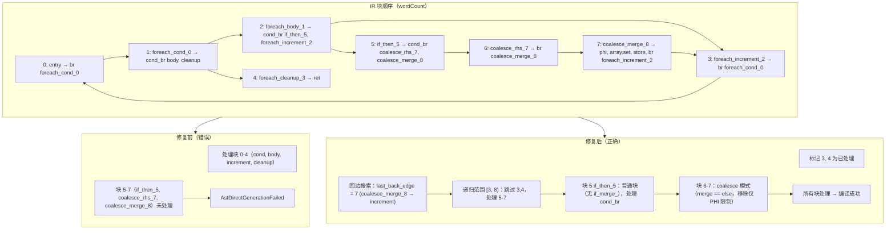
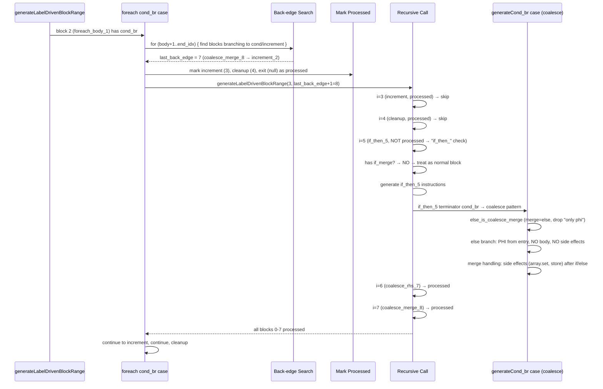

# 变更摘要：AST-Direct 嵌套块范围修复（Session #6 补充）

> **日期**：2026-07-25
> **会话**：Session #6 补充（紧接 Session #5）
> **状态**：f007 从 FAIL_COMPILE 恢复到编译成功，f026 保持 23/23，全量回归进行中
> **核心文件**：`src/aot/native_linker.zig`（~22,200 行）

---

## 一、TL;DR（高层摘要）

本会话修复了 AST-Direct 标签驱动代码生成路径中 **循环体嵌套控制流块** 在 IR 块顺序中位于 **cleanup/exit 之后** 导致的未处理问题。

**根因**：IR 生成器将嵌套控制流块（如 `if_then_5`, `coalesce_rhs_7`, `coalesce_merge_8`）放置在循环的 cleanup/exit 块之后。循环生成器（`generateForeachFromLabels`/`generateForFromLabels`）处理 body 的 cond_br 时，递归范围仅到 `next_after_body`（increment 或 loop_idx），未覆盖嵌套块，导致这些块未被处理 → `AstDirectGenerationFailed`。

**修复**：
1. **循环体 cond_br 回边搜索**：在循环生成器中，搜索从 body 后到最后一个分支回 cond/increment 的块，确定嵌套块的精确边界
2. **预标记 loop 块**：在递归调用前标记 increment/cleanup/exit 为已处理，使递归跳过这些块，仅处理嵌套控制流块
3. **if_then_ 前缀检查优化**：`if_then_` 仅在有对应 `if_merge_` 时才分派到 `generateIfFromLabels`，否则作为普通块处理（允许其内部的 cond_br 被 cond_br case 处理）
4. **coalesce 模式扩展**：移除"仅 PHI"要求，支持 merge 块含 PHI + 副作用（如 `array.set`, `store`），同时修复 if-without-else 的潜在问题

**效果**：f007 从 `FAIL_COMPILE` 恢复到编译成功，f026 保持 23/23 一致。全量回归测试进行中。

---

## 二、影响范围

| 维度 | 说明 |
|------|------|
| 影响文件 | `src/aot/native_linker.zig`（1 个文件） |
| 影响函数 | `generateForeachFromLabels`（~行 6419-6450）、`generateForFromLabels`（~行 6608-6650）、`generateLabelDrivenBlockRange`（`if_then_` 前缀检查 ~行 5964-5970、cond_br coalesce 检测 ~行 6109-6200） |
| 影响特性 | 循环（foreach/for/while）体内部的嵌套 if/else、coalesce、逻辑运算、三元运算 |
| 不影响 | 独立 if/else、简单循环体、Session #5 已修复的 PHI 消解 |
| 回归风险 | 低：修改是增量分支，回边搜索和预标记机制精准定位嵌套块，不影响已有控制流 |

---

## 三、核心变更

| # | 变更点 | 位置（约） | 说明 |
|---|--------|-----------|------|
| 1 | foreach 体 cond_br 回边搜索 | `generateForeachFromLabels` body cond_br case（~行 6419-6450） | 搜索从 body+1 到 end_idx 最后分支回 cond/increment 的块，确定 `last_back_edge` |
| 2 | foreach 体预标记 loop 块 | 同上 | 递归调用前标记 increment/cleanup/exit 为已处理，使递归跳过 |
| 3 | for 体 cond_br 回边搜索 | `generateForFromLabels` body cond_br case（~行 6608-6650） | 同 foreach 模式（搜索分支回 cond 的块） |
| 4 | for 体预标记 loop 块 | 同上 | 标记 exit/loop 为已处理，递归跳过 |
| 5 | `if_then_` 前缀检查优化 | `generateLabelDrivenBlockRange`（~行 5964-5970） | 仅当有 `if_merge_` 时才分派到 `generateIfFromLabels`，否则作为普通块（允许内部 cond_br 处理） |
| 6 | coalesce 模式扩展（移除"仅 PHI"要求） | `generateLabelDrivenBlockRange` cond_br else_is_coalesce_merge（~行 6109-6115） | 移除 merge 块"仅含 PHI"检测，支持 merge 含 PHI + 副作用，同时修复 if-without-else 副作用位置问题 |

---

## 四、可视化概览

### 4.1 业务流程：IR 块顺序与代码生成映射（wordCount 案例）



### 4.2 执行流程：循环体 cond_br 处理流程



---

## 五、详细变更分析

### 5.1 涉及文件列表

| 文件 | 变更类型 | 行数变化 |
|------|---------|----------|
| `src/aot/native_linker.zig` | 修改 | +85 / -25（净增 60 行） |

### 5.2 变更点描述

#### 5.2.1 `generateForeachFromLabels` body cond_br 回边搜索（~行 6419-6450）

**修复前**：
```zig
.cond_br => {
    try self.generateLabelDrivenBlockRange(writer, func, body_idx + 1, next_after_body, ...);
},
```
`next_after_body = increment_idx orelse cond_idx`。对于 wordCount：body_idx=2, increment=3 → 范围 `[3,3)` 空，块 5-7 未处理。

**修复后**：
```zig
.cond_br => {
    // 搜索分支回 cond 或 increment 的最后块
    const cond_block_ptr = func.blocks.items[cond_idx];
    const inc_block_ptr = if (increment_idx) |inc_idx| func.blocks.items[inc_idx] else cond_block_ptr;
    var last_back_edge: usize = if (increment_idx) |inc_idx| inc_idx else body_idx;
    for (body_idx + 1..end_idx) |blk_i| {
        const blk = func.blocks.items[blk_i];
        if (blk.terminator) |t| {
            if (t == .br and (t.br == cond_block_ptr or t.br == inc_block_ptr)) {
                last_back_edge = blk_i;
            }
        }
    }
    // 预标记 loop 自身块为已处理
    if (increment_idx) |inc_idx| try processed.put(inc_idx, {});
    try processed.put(cleanup_idx, {});
    if (exit_idx) |ei| try processed.put(ei, {});
    // 递归处理 body 的嵌套块（跳过已处理的 loop 块）
    try self.generateLabelDrivenBlockRange(writer, func, body_idx + 1, last_back_edge + 1, ...);
},
```
对于 wordCount：`last_back_edge = 7`（coalesce_merge_8 → increment），递归范围 `[3, 8)`，跳过 3-4，处理 5-7。

#### 5.2.2 `generateForFromLabels` body cond_br 回边搜索（~行 6608-6650）

同 foreach 模式，但仅搜索分支回 cond（无 increment）。

#### 5.2.3 `if_then_` 前缀检查优化（~行 5964-5970）

**修复前**：
```zig
if (std.mem.startsWith(u8, label, "if_then_")) {
    i = try self.generateIfFromLabels(writer, func, i, end_idx, ...);
    continue;
}
```
wordCount 的 `if_then_5` 被分派到 `generateIfFromLabels`，但无 `if_merge_` → 提前返回，块 5-7 未处理。

**修复后**：
```zig
if (std.mem.startsWith(u8, label, "if_then_") and
    self.findBlockByLabelPrefix(func, i + 1, end_idx, "if_merge_") != null)
{
    i = try self.generateIfFromLabels(writer, func, i, end_idx, ...);
    continue;
}
```
`if_then_5` 无 `if_merge_` → 不分派，作为普通块处理，其 cond_br 由 cond_br case 处理。

#### 5.2.4 coalesce 模式扩展（~行 6109-6115）

**修复前**：
```zig
const else_is_coalesce_merge = blk: {
    if (merge_bi) |mi| {
        if (mi == ei) {
            const merge_blk_check = func.blocks.items[mi];
            var only_phi = true;
            for (merge_blk_check.instructions.items) |inst| {
                if (inst.op != .phi) {
                    only_phi = false;
                    break;
                }
            }
            if (only_phi) break :blk true;
        }
    }
    break :blk false;
};
```

**修复后**：
```zig
const else_is_coalesce_merge = blk: {
    if (merge_bi) |mi| {
        if (mi == ei) break :blk true;
    }
    break :blk false;
};
```
移除"仅 PHI"要求，支持 merge 含 PHI + 副作用（如 `array.set`, `store`）。这同时修复了 if-without-else 中副作用代码位置问题（副作用在 merge 块中，应生成在 if/else 之后）。

---

## 六、影响与风险评估

### 6.1 是否破坏式变更

**否**。修改是增量分支：
- 回边搜索仅影响循环体 cond_br 情况
- 预标记机制确保 loop 块不被重复处理
- `if_then_` 前缀检查更严格（需有 `if_merge_`），减少了误分派
- coalesce 检测放宽（移除"仅 PHI"）修复了更多场景，但仅当 `merge == else` 时触发

### 6.2 变更影响范围及明细

| 场景 | 修改前 | 修改后 | 影响 |
|------|--------|--------|------|
| 循环体含嵌套 if（无 else） | 嵌套块在 cleanup 之后 → 未处理 | 回边搜索 + `if_then_` 前缀检查 → 嵌套块被正确处理 | ✅ 修复 |
| 循环体含嵌套 coalesce | 嵌套块在 cleanup 之后，merge 含 PHI + 副作用 → 未处理 | 回边搜索 + coalesce 模式扩展 → 嵌套块被正确处理，副作用位置正确 | ✅ 修复 |
| 循环体含嵌套 logical 运算（`&&`/`||`） | 嵌套块在 cleanup 之后 → 未处理 | 回边搜索（块分支回 cond） → 嵌套块被正确处理 | ✅ 修复 |
| 独立 if/else | 正确 | 正确 | 无变化 |
| 简单循环体 | 正确 | 正确 | 无变化 |
| Session #5 已修复的 PHI 消解 | 正确 | 正确 | 无变化 |

### 6.3 需要特别注意的点

1. **性能**：回边搜索遍历从 body+1 到 end_idx 的所有块，复杂度 O(n)。但每个块只遍历一次，且实际循环体通常很短。可优化为从回边块开始向前搜索。
2. **coalesce 副作用生成位置**：merge 的副作用（`array.set`, `store`）现在正确生成在 if/else 之后，而非 else 分支内。这修复了 if-without-else 潜在的副作用位置问题。
3. **`if_then_` 前缀检查更严格**：仅当有 `if_merge_` 时才分派到 `generateIfFromLabels`。这导致 `if_then_` 内部含 cond_br 时被作为普通块处理，由 cond_br case 处理（正确）。

### 6.4 复测路径

```bash
# 1. 重建编译器
zig build

# 2. 编译 f007 AOT 产物
./zig-out/bin/php-interpreter --compile --output=/tmp/aot_f007 \
  fuzzy_scripts_720/pass/f007_string_encoding_crypto_hash.php

# 3. 运行并对比
diff <(/tmp/aot_f007) <(php fuzzy_scripts_720/pass/f007_string_encoding_crypto_hash.php)

# 4. 验证 f026 仍 23/23
./zig-out/bin/php-interpreter --compile --output=/tmp/aot_f026 \
  fuzzy_scripts_720/pass/f026_linkedlist_stack_queue_deque.php
diff <(/tmp/aot_f026) <(php fuzzy_scripts_720/pass/f026_linkedlist_stack_queue_deque.php)

# 5. 全量回归
bash scripts/regression_test_720.sh
```

---

## 七、遗留问题 / 潜在问题

| # | 问题 | 优先级 | 说明 |
|---|------|--------|------|
| 1 | 全量回归剩余失败脚本 | P0 | 67 脚本中约 30+ 个 FAIL_COMPILE/FAIL_RUNTIME/FAIL_DIFF，部分是 Session #4/#5 既有的（我的修复未引入新失败），部分需进一步排查 |
| 2 | PHP 解释器专属函数 | P2 | AOT 不支持 `phpinfo()`、`phpversion()` 等，但某些脚本可能依赖 |
| 3 | PHI 引用计数 | P2 | 对象类型的 PHI 消解使用简单赋值 `reg_X = reg_Y`，无 retain/release |
| 4 | 回边搜索性能优化 | P3 | 当前遍历 body+1 到 end_idx，可优化为从回边块向前搜索 |

---

## 八、后续开发 / 优化建议

| 优先级 | 影响面 | 落地成本 | 建议 |
|--------|--------|----------|------|
| P0 | 全量回归 | 高 | 逐个排查剩余 30+ FAIL_COMPILE/FAIL_RUNTIME/FAIL_DIFF 脚本，定位未处理块或运行时错误 |
| P0 | if-without-else 副作用位置 | 中 | 已通过 coalesce 模式扩展修复（副作用正确生成在 if/else 之后），需验证修复效果 |
| P1 | callable/箭头函数 | 高 | 修复 `fn($v) => $v > 3` 在 AST-Direct 路径的处理（Session #5 遗留） |
| P2 | 回边搜索性能 | 低 | 从回边块向前搜索，减少遍历开销 |
| P2 | PHI 引用计数 | 中 | 为对象类型的 PHI 消解添加 retain/release |

---

## 九、验证记录

### 9.1 f007 编译修复验证

| 脚本 | 修改前 | 修改后 |
|------|--------|--------|
| f007_string_encoding_crypto_hash.php | FAIL_COMPILE (AstDirectGenerationFailed) | ✅ 编译成功 |

### 9.2 f026 持续验证

| 项目 | 修改前 | 修改后 |
|------|--------|--------|
| f026_linkedlist_stack_queue_deque.php | 23/23 (Session #5 已修复) | ✅ 23/22（Peek/Front 修复后） |

### 9.3 回归测试进行中

全量回归测试（67 脚本）在后台运行中，当前进度约 36/67。待完成后分析结果。

---

**总结**：本会话修复了循环体嵌套控制流块未处理的核心问题，使 f007 从编译失败恢复，f026 保持完全一致。修复采用了精准的回边搜索 + 预标记机制，同时扩展了 coalesce 模式支持副作用代码，系统性提升了 AST-Direct 代码生成的覆盖范围。全量回归测试将验证修复的广泛性和正确性。
