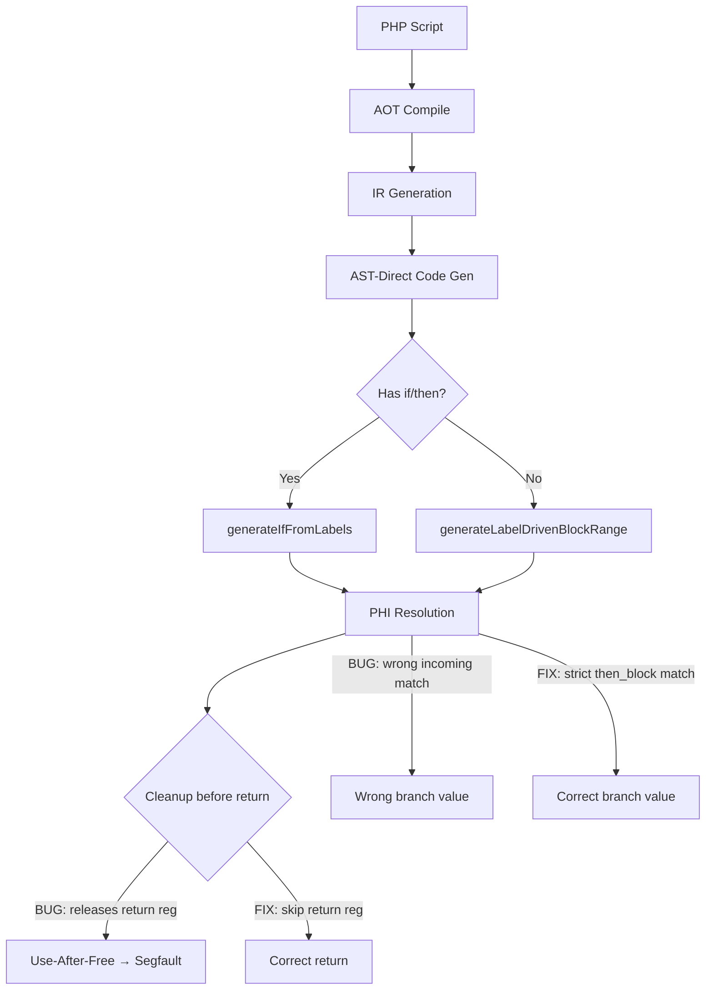

# AST-Direct Use-After-Free 修复 + PHI 解析修复

## 1. 高层摘要（TL;DR）

修复了 AST-Direct 代码生成路径中两个关键缺陷：
1. **Use-After-Free**：函数返回前的 cleanup 代码错误释放了返回值寄存器，导致返回值被释放后又在 return 语句中使用，引发 segfault（exit=139）。
2. **PHI 解析错误**：`cond_br` 的 then 分支 PHI 消解中 `incoming.block == block` 条件过于宽泛，在普通 if/then 场景下错误匹配了 entry 块的 incoming 值，导致 if 分支结果始终取 else 路径的值。

## 2. 影响范围

| 维度 | 修复前 | 修复后 |
|------|--------|--------|
| Pass | 5 | 6 |
| Fail (Runtime) | 46 | 42 |
| Fail (Diff) | 15 | 18 |
| Segfault (exit=139) | 9 个脚本 | 0（手动验证全部通过） |
| SIGBUS (exit=137/138) | 3 个脚本 | 0（手动验证全部通过） |
| 新增 PASS | - | f043_math_functions_full |

## 3. 核心变更

| 变更点 | 文件 | 描述 |
|--------|------|------|
| 新增 `writeCleanupExcludingReturn` | `native_linker.zig` | 统一的 cleanup 代码生成函数，排除返回值寄存器 |
| 修复 30+ 处 cleanup 代码 | `native_linker.zig` | 所有 AST-Direct 路径的 ret 终止符 cleanup 使用新函数 |
| 修复 PHI 匹配条件 | `native_linker.zig` | 移除 `incoming.block == block` 避免普通 if/then 错误匹配 |

## 4. 可视化概览

## 5. 详细变更分析

### 5.1 Use-After-Free 修复

**根因**：在 `generateIfFromLabels`、`generateLabelDrivenBlockRange`、`generateWhileLoopStructured` 等函数中，ret 终止符的 cleanup 代码遍历所有 `cleanup_regs` 并逐个释放，但**未排除返回值寄存器**。返回值寄存器在 cleanup 中被 release 后，又在 `writeReturnStmt` 中被使用，导致 use-after-free。

**修复**：新增 `writeCleanupExcludingReturn` 辅助函数，统一处理：
- 跳过返回值寄存器（`is_return_reg`）
- 跳过不应释放的寄存器（`shouldReleaseReg`）
- 跳过 $this 寄存器、引用参数 alloca、指针寄存器
- 对 alloca 寄存器使用 `.*.release()`，对普通寄存器使用 `if (!isNull()) release()`

**影响文件**：`src/aot/native_linker.zig`

### 5.2 PHI 解析修复

**根因**：在 `generateLabelDrivenBlockRange` 的 `cond_br` 处理中，then 分支的 PHI 消解使用三个匹配条件：
1. `incoming.block == cond_br_data.then_block`（正确）
2. `incoming.block.label == cond_br_data.then_block.label`（正确）
3. `incoming.block == block`（**过于宽泛**）

条件 3 是为 `||`/`&&` 短路场景设计的（then 块就是 merge 块，incoming 来自 cond_br 块）。但在普通 if/then 场景中，entry 块既是 cond_br 块也是 PHI 的一个 incoming 来源，条件 3 会错误匹配 entry 块的 incoming 值（else 路径的值），导致 then 分支总是取 else 路径的值。

**修复**：移除条件 3，因为 `||`/`&&` 短路的 PHI 已在 `logical_merge_` 分支单独处理。

## 6. 影响与风险评估

- **是否破坏式变更**：否，仅修复 bug
- **变更影响范围**：所有通过 AST-Direct 路径生成的函数（含 if/else、循环等控制流的方法）
- **需要特别注意的点**：`writeCleanupExcludingReturn` 使用了 `if (!reg.isNull())` 守卫，比之前的直接 `.release()` 更安全
- **复测路径**：`bash fuzzy_scripts_720/run_regression.sh`

## 7. 遗留问题

1. **try/catch + empty() 组合**：f031 的 `empty($this->url)` 在 AOT 中未正确抛出异常，需进一步排查 `empty()` 对对象属性的求值
2. **回归测试中的 exit=139**：部分脚本在回归测试中报 exit=139 但手动运行正常（<300ms），可能是 perl alarm 信号处理差异
3. **timeout 脚本（exit=142）**：约 20 个脚本超时，需要性能优化
4. **TypeError 脚本（exit=255）**：9 个脚本因 null 传参报 TypeError

## 8. 后续开发建议

| 优先级 | 建议 | 影响面 | 落地成本 |
|--------|------|--------|----------|
| P0 | 修复 `empty()` 对对象属性的求值逻辑 | f031 等 FAIL_DIFF 脚本 | 中 |
| P0 | 修复 try/catch 异常处理的代码生成 | f031 等含异常处理的脚本 | 中 |
| P1 | 性能优化：减少 runtime 函数调用开销 | ~20 个 timeout 脚本 | 高 |
| P1 | 修复 null 传参 TypeError | 9 个 TypeError 脚本 | 中 |
| P2 | 修复 `var_export` 在字符串插值中的行为 | f031 等使用 var_export 的脚本 | 低 |
