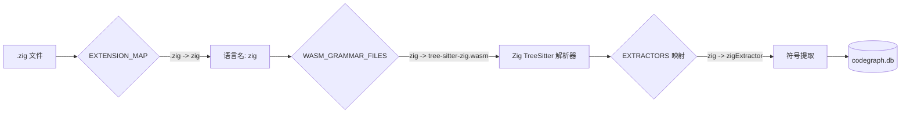

# CodeGraph Zig 语言扩展 — 打补丁与使用教学

> **适用版本**: CodeGraph v0.9.4  
> **补丁日期**: 2026-07-02  
> **项目**: PHP-Zig AOT 编译器

---

## 目录

1. [背景：为什么需要打补丁](#1-背景)
2. [补丁文件清单](#2-补丁文件清单)
3. [补丁原理详解](#3-补丁原理详解)
4. [如何打补丁（手动步骤）](#4-如何打补丁手动步骤)
5. [如何验证补丁生效](#5-如何验证补丁生效)
6. [如何扩展 Zig extractor](#6-如何扩展-zig-extractor)
7. [版本升级后的恢复流程](#7-版本升级后的恢复流程)
8. [常见问题](#8-常见问题)

---

## 1. 背景

### 为什么 CodeGraph 没有原生 Zig 支持？

CodeGraph 内置了 `tree-sitter-zig.wasm` 语法文件，但它的**扩展名映射表** (`EXTENSION_MAP`) 和 **WASM 语法文件注册表** (`WASM_GRAMMAR_FILES`) 中缺少 `.zig` 的条目，同时缺少对应的语言提取器（extractor）。

具体来说，缺少三个关键配置：

| 缺失项 | 位置 | 作用 |
|--------|------|------|
| `'.zig': 'zig'` | `extraction/grammars.js` → `EXTENSION_MAP` | 告诉 codegraph `.zig` 文件属于 `zig` 语言 |
| `zig: 'tree-sitter-zig.wasm'` | `extraction/grammars.js` → `WASM_GRAMMAR_FILES` | 告诉 codegraph 加载哪个 WASM 语法文件 |
| `zigExtractor` | `extraction/languages/` | 告诉 codegraph 如何从 Zig AST 中提取符号 |

### 技术原理



---

## 2. 补丁文件清单

本补丁涉及 **3 个已修改文件 + 1 个新增文件**：

### 2.1 已修改文件

| # | 文件路径 | 修改内容 |
|---|---------|---------|
| 1 | `.../extraction/grammars.js` | `EXTENSION_MAP` 加 `'.zig': 'zig'` |
| 2 | `.../extraction/grammars.js` | `WASM_GRAMMAR_FILES` 加 `zig: 'tree-sitter-zig.wasm'` |
| 3 | `.../extraction/languages/index.js` | `require("./zig")` + `EXTRACTORS` 加 `zig: zig_1.zigExtractor` |

### 2.2 新增文件

| # | 文件路径 | 内容 |
|---|---------|------|
| 4 | `.../extraction/languages/zig.js` | Zig 语言的树类型提取器配置 |

### 2.3 安装目录完整路径

```
/Users/tuoke/.codegraph/versions/v0.9.4/lib/dist/extraction/
├── grammars.js                          ← 修改：EXTENSION_MAP + WASM_GRAMMAR_FILES
├── languages/
│   ├── index.js                         ← 修改：注册 zigExtractor
│   └── zig.js                           ← 新增：Zig 提取器
```

---

## 3. 补丁原理详解

### 3.1 `grammars.js` — 语言注册的中心枢纽

有两个关键映射表：

**`EXTENSION_MAP`** — 文件扩展名 → 语言名的映射，是 codegraph 判断"是否索引这个文件"的唯一依据。

```javascript
exports.EXTENSION_MAP = {
    '.ts': 'typescript',
    '.rs': 'rust',
    '.py': 'python',
    '.php': 'php',
    // ... 其他语言
    '.zig': 'zig',   // ← 新增
};
```

**`WASM_GRAMMAR_FILES`** — 语言名 → WASM 语法文件的映射，告诉 codegraph 加载哪个 tree-sitter WASM 二进制文件。

```javascript
const WASM_GRAMMAR_FILES = {
    rust: 'tree-sitter-rust.wasm',
    php: 'tree-sitter-php.wasm',
    // ... 其他语言
    zig: 'tree-sitter-zig.wasm',  // ← 新增（文件本身就存在）
};
```

### 3.2 `languages/index.js` — 提取器注册

```javascript
const zig_1 = require("./zig");                    // ← 新增导入
exports.EXTRACTORS = {
    // ... 其他语言的 extractor
    zig: zig_1.zigExtractor,                        // ← 新增注册
};
```

### 3.3 `zig.js` — Zig 提取器详解

提取器 (`LanguageExtractor`) 告诉 codegraph 如何从 Zig AST 中查找各种符号。

```javascript
exports.zigExtractor = {
    // 告诉 codegraph 哪些 AST 节点类型对应哪些符号
    functionTypes: ['function_declaration', 'test_declaration'],
    structTypes: ['struct_declaration'],
    enumTypes: ['enum_declaration', 'error_set_declaration'],
    methodTypes: ['function_declaration'],
    variableTypes: ['variable_declaration'],
    fieldTypes: ['container_field'],
    importTypes: ['using_namespace_declaration'],
    callTypes: ['call_expression'],
    interfaceTypes: ['opaque_declaration'],
    // ... 其他配置
};
```

#### 当前 tree-sitter-zig 的 AST 节点类型

| 符号类别 | AST 节点类型 | 说明 |
|---------|-------------|------|
| 函数 | `function_declaration` | `fn foo() void { }` |
| 测试 | `test_declaration` | `test "desc" { }` |
| 结构体 | `struct_declaration` | `const Foo = struct { }` |
| 枚举 | `enum_declaration` | `const Foo = enum { }` |
| 联合体 | `union_declaration` | `const Foo = union { }` |
| 不透明类型 | `opaque_declaration` | `const Foo = opaque { }` |
| 变量 | `variable_declaration` | `const x = 1;` / `var x: i32 = 1;` |
| 结构体字段 | `container_field` | struct/enum/union 内部的字段 |
| 导入 | `using_namespace_declaration` | `usingnamespace @import("foo");` |
| 函数调用 | `call_expression` | `foo()` |

---

## 4. 如何打补丁（手动步骤）

### 4.1 确定 CodeGraph 安装路径

```bash
which codegraph
# → /Users/tuoke/.local/bin/codegraph
# 这是一个 symlink
readlink -f $(which codegraph)
# → /Users/tuoke/.codegraph/versions/v0.9.4/bin/codegraph
```

### 4.2 找到语言相关文件

```bash
CODEGRAPH_HOME="/Users/tuoke/.codegraph/versions/v0.9.4"
ls $CODEGRAPH_HOME/lib/dist/extraction/
# → grammars.js  languages/  tree-sitter.js  wasm/  ...
```

### 4.3 编辑 `grammars.js`

在 `WASM_GRAMMAR_FILES` 对象末尾添加：

```javascript
const WASM_GRAMMAR_FILES = {
    // ... 已有语言 ...
    lua: 'tree-sitter-lua.wasm',
    luau: 'tree-sitter-luau.wasm',
    zig: 'tree-sitter-zig.wasm',   // ← 新增
};
```

在 `EXTENSION_MAP` 对象末尾添加：

```javascript
exports.EXTENSION_MAP = {
    // ... 已有扩展名 ...
    '.lua': 'lua',
    '.luau': 'luau',
    '.zig': 'zig',                  // ← 新增
};
```

### 4.4 创建 `zig.js` 提取器

创建 `$CODEGRAPH_HOME/lib/dist/extraction/languages/zig.js`：

```javascript
"use strict";
Object.defineProperty(exports, "__esModule", { value: true });
exports.zigExtractor = void 0;
const tree_sitter_helpers_1 = require("../tree-sitter-helpers");
exports.zigExtractor = {
    functionTypes: ['function_declaration', 'test_declaration'],
    classTypes: [],
    methodTypes: ['function_declaration'],
    interfaceTypes: ['opaque_declaration', 'anyframe_type'],
    structTypes: ['struct_declaration'],
    enumTypes: ['enum_declaration', 'error_set_declaration'],
    enumMemberTypes: ['container_field'],
    typeAliasTypes: ['error_set_declaration'],
    importTypes: ['using_namespace_declaration'],
    callTypes: ['call_expression'],
    variableTypes: ['variable_declaration'],
    fieldTypes: ['container_field'],
    nameField: 'name',
    bodyField: 'body',
    paramsField: 'parameters',
    returnField: 'return_type',
    // ... 可选：getSignature, getVisibility, getReceiverType, extractImport
};
```

### 4.5 编辑 `languages/index.js`

```javascript
// 1. 在文件顶部添加 require
const zig_1 = require("./zig");

// 2. 在 EXTRACTORS 对象末尾添加
exports.EXTRACTORS = {
    // ... 已有语言 ...
    lua: lua_1.luaExtractor,
    luau: luau_1.luauExtractor,
    zig: zig_1.zigExtractor,       // ← 新增
};
```

### 4.6 重新索引

```bash
codegraph uninit -f          # 清除旧索引
codegraph init -i -v         # 重新初始化并索引
```

---

## 5. 如何验证补丁生效

### 5.1 快速验证命令

```bash
# 查看索引统计
codegraph status
# 预期输出：
#   Files by Language:
#     zig             342   ← 必须有 zig
#     php             26

# 查询 Zig 符号
codegraph query "main" --kind function --limit 5
# 预期能找到 src/main.zig 中的 main 函数

# 查看文件列表（确认有 zig 文件）
codegraph files 2>&1 | grep "\.zig" | wc -l
# 预期输出：342（或项目实际 zig 文件数）
```

### 5.2 底层检查

```bash
# 检查扩展映射
grep "'.zig'" $CODEGRAPH_HOME/lib/dist/extraction/grammars.js
# 预期输出：'.zig': 'zig',

# 检查 WASM 语法
grep "zig:" $CODEGRAPH_HOME/lib/dist/extraction/grammars.js
# 预期输出：zig: 'tree-sitter-zig.wasm',

# 检查 extractor 注册
grep "zig" $CODEGRAPH_HOME/lib/dist/extraction/languages/index.js
# 预期输出包含：
#   const zig_1 = require("./zig");
#   zig: zig_1.zigExtractor,

# 检查 WASM 文件存在
ls $CODEGRAPH_HOME/lib/node_modules/tree-sitter-wasms/out/tree-sitter-zig.wasm
```

---

## 6. 如何扩展 Zig extractor

### 6.1 当前限制

当前的提取器是**基础版**，部分功能未实现：

| 功能 | 状态 | 说明 |
|------|------|------|
| 函数签名提取 | ✅ 基础版 | `getSignature` 提取参数+返回类型 |
| 可见性识别 | ⚠️ 简化版 | 始终返回 `public`，未解析 `pub` 关键字 |
| receiver 类型 | ✅ 基础版 | 识别 struct/enum/union 中的方法 |
| 导入模块名 | ⚠️ 简化版 | 返回完整导入文本而非模块名 |
| 异步检测 | ✅ 空实现 | Zig 的 async 语义不同，返回 false |

### 6.2 优化函数签名提取

`getSignature` 函数用于在 codegraph 搜索结果中显示函数签名。当前实现：

```javascript
getSignature: (node, source) => {
    const params = getChildByField(node, 'parameters');
    const returnType = getChildByField(node, 'return_type');
    if (!params) return undefined;
    let sig = getNodeText(params, source);
    if (returnType) {
        sig += ' -> ' + getNodeText(returnType, source);
    }
    return sig;
},
```

可以优化为包含函数名：

```javascript
getSignature: (node, source) => {
    const name = getChildByField(node, 'name');
    const params = getChildByField(node, 'parameters');
    const returnType = getChildByField(node, 'return_type');
    if (!name) return undefined;
    let sig = getNodeText(name, source);
    if (params) sig += getNodeText(params, source);
    if (returnType) sig += ': ' + getNodeText(returnType, source);
    return sig;
},
```

### 6.3 优化可见性识别

Zig 的可见性通过 `pub` 关键字控制，但 tree-sitter-zig 的 AST 中 `pub` 是一个修饰符，不是 `visibility_modifier` 节点。可以这样检查：

```javascript
getVisibility: (node) => {
    // 检查函数/变量/类型声明前是否有 pub 关键字
    for (let i = 0; i < node.childCount; i++) {
        const child = node.child(i);
        if (child?.type === 'builtin_identifier' && child.text === 'pub') {
            return 'public';
        }
    }
    // Zig 中未标记 pub 的默认为私有
    return 'private';
},
```

### 6.4 添加自定义提取逻辑（visitNode）

如果标准提取不能满足需求，可以实现 `visitNode` 进行自定义符号提取：

```javascript
visitNode: (node, ctx) => {
    // 示例：提取 comptime 块中的符号
    if (node.type === 'comptime_declaration') {
        // 自定义处理
        return true; // 已处理，跳过默认逻辑
    }
    return false; // 未处理，交给默认逻辑
},
```

### 6.5 完整可用的 extractor 配置参考

以下是可以配置的所有字段（参考 [CodeGraph 源码类型定义](https://github.com/opentool-ai/codegraph/blob/main/dist/extraction/types.d.ts)）：

| 字段 | 类型 | 用途 |
|------|------|------|
| `functionTypes` | `string[]` | 函数定义节点类型 |
| `classTypes` | `string[]` | 类定义节点类型 |
| `methodTypes` | `string[]` | 方法定义节点类型 |
| `interfaceTypes` | `string[]` | 接口定义节点类型 |
| `structTypes` | `string[]` | 结构体节点类型 |
| `enumTypes` | `string[]` | 枚举节点类型 |
| `enumMemberTypes` | `string[]` | 枚举成员节点类型 |
| `typeAliasTypes` | `string[]` | 类型别名节点类型 |
| `importTypes` | `string[]` | 导入声明节点类型 |
| `callTypes` | `string[]` | 函数调用表达式节点类型 |
| `variableTypes` | `string[]` | 变量声明节点类型 |
| `nameField` | `string` | 名称子节点字段名 |
| `bodyField` | `string` | 体部子节点字段名 |
| `paramsField` | `string` | 参数子节点字段名 |
| `returnField` | `string` | 返回类型子节点字段名 |
| `getSignature` | `function` | 提取符号签名 |
| `getVisibility` | `function` | 提取可见性 |
| `getReceiverType` | `function` | 提取方法的接收者类型 |
| `extractImport` | `function` | 提取导入的模块名 |
| `isAsync` | `function` | 判断是否为异步 |
| `visitNode` | `function` | 自定义节点访问器 |
| `classifyClassNode` | `function` | 分类类节点类型 |

---

## 7. 版本升级后的恢复流程

### 7.1 检测升级

```bash
# 查看已安装版本
ls /Users/tuoke/.codegraph/versions/
# → v0.9.4/

# 如果出现 v0.9.5/ 或更新版本，说明已升级
```

### 7.2 检查新版本是否原生支持 Zig

```bash
# 检查新版本
grep "'.zig'" /Users/tuoke/.codegraph/versions/v0.9.5/lib/dist/extraction/grammars.js

# 如果返回 '.zig': 'zig', 则新版本已支持，无需补丁
# 如果空，则需要重新打补丁
```

### 7.3 重新打补丁

```bash
# 设置新版本路径
export CG_NEW="/Users/tuoke/.codegraph/versions/v0.9.5"

# 1. 修改 grammars.js
# 在 WASM_GRAMMAR_FILES 末尾加: zig: 'tree-sitter-zig.wasm'
# 在 EXTENSION_MAP 末尾加: '.zig': 'zig'

# 2. 创建 zig.js
cp /path/to/backup/zig.js $CG_NEW/lib/dist/extraction/languages/zig.js

# 3. 修改 index.js
# 加 require("./zig") 和 zig: zig_1.zigExtractor

# 4. 重新索引
codegraph uninit -f && codegraph init -i -v
```

### 7.4 自动化恢复脚本

脚本文件：**`scripts/patch-codegraph-zig.sh`**

```bash
# 自动检测最新版本打补丁
./scripts/patch-codegraph-zig.sh

# 指定版本打补丁
./scripts/patch-codegraph-zig.sh v0.9.4

# 脚本是幂等的 — 重复执行安全，已打过的补丁会自动跳过
```

脚本会按顺序执行以下操作：

1. 检测 CodeGraph 安装版本
2. 检查补丁是否已存在（已存在则跳过）
3. 在 `grammars.js` 的 `WASM_GRAMMAR_FILES` 注册 `zig: 'tree-sitter-zig.wasm'`
4. 在 `grammars.js` 的 `EXTENSION_MAP` 注册 `'.zig': 'zig'`
5. 创建 `languages/zig.js` 提取器
6. 在 `languages/index.js` 注册 `zigExtractor`
7. 提示重新索引命令

---

## 8. 常见问题

### Q1: 为什么改了文件但索引还是只有 PHP？

**可能原因**：
1. 改错文件了（不是安装目录下的）
2. 改完后没重新初始化（`codegraph uninit -f` + `codegraph init -i -v`）
3. `.gitignore` 排除了 `.zig` 文件（检查项目根目录的 `.gitignore`）

### Q2: 为什么索引后有 node count 但边缘很少？

CodeGraph 的边缘（edges）来自调用关系解析。Zig extractor 当前的 `callTypes: ['call_expression']` 可能不够精确，可以检查 tree-sitter-zig 的 AST 中函数调用的实际节点名。

### Q3: 如何查看 tree-sitter-zig AST 的节点结构？

```bash
# 使用 node 加载 WASM 解析一个简单 Zig 文件
node -e "
const Parser = require('web-tree-sitter');
const fs = require('fs');
async function main() {
    await Parser.init();
    const lang = await Parser.Language.load(
        '/Users/tuoke/.codegraph/versions/v0.9.4/lib/node_modules/tree-sitter-wasms/out/tree-sitter-zig.wasm'
    );
    const parser = new Parser();
    parser.setLanguage(lang);
    const tree = parser.parse('const x: i32 = 1;\nfn foo() void {}');
    console.log(tree.rootNode.toString());
}
main();
"
```

### Q4: 补丁会影响其他项目吗？

**不会**。补丁是对 codegraph CLI 工具的修改，**全局生效**——所有使用该 codegraph 安装版本的项目都能索引 Zig 文件。

### Q5: 如果 codegraph 原生支持 Zig 了，怎么清理？

```bash
# 删除补丁文件
rm /Users/tuoke/.codegraph/versions/v0.9.4/lib/dist/extraction/languages/zig.js

# 恢复 grammars.js（从备份或重新安装 codegraph）
# 注意：没有备份的话需要手动还原
```

---

## 附录：tree-sitter-zig WASM 文件信息

| 属性 | 内容 |
|------|------|
| 文件路径 | `.../tree-sitter-wasms/out/tree-sitter-zig.wasm` |
| 语言名（内部） | `tree_sitter_zig` |
| 节点类型总数 | ~120 种 |
| 来源 | [tree-sitter-zig](https://github.com/maxxnino/tree-sitter-zig) 社区语法 |
| CodeGraph 集成位置 | `.../lib/node_modules/tree-sitter-wasms/out/` |
