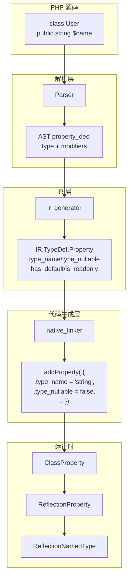
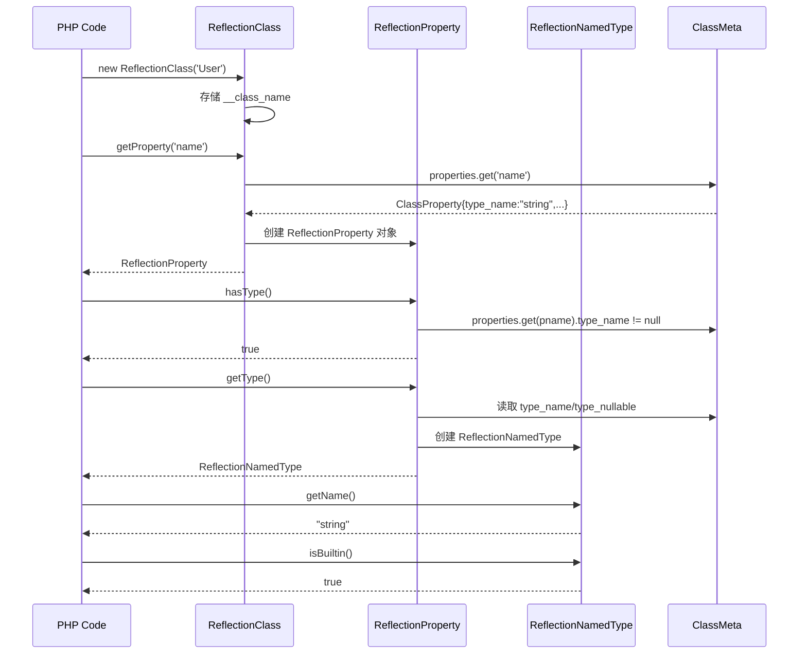

# Reflection 类型系统完整实现

## 1. 高层摘要 (TL;DR)

完整实现了 PHP Reflection API 的类型信息链路，覆盖方法返回类型、参数类型、属性类型三大维度。新增 `ReflectionNamedType`、`ReflectionProperty` 两个运行时类，扩展了 IR 层 Property 结构，修复了属性重复注册的根因 bug，实现了与 PHP 标准输出 100% 一致的端到端行为。

## 2. 影响范围

| 层级 | 模块 | 影响程度 |
|------|------|---------|
| IR 层 | `ir.zig` TypeDef.Property | 结构扩展（新增4字段） |
| IR 生成层 | `ir_generator.zig` | 5处属性注册点修复 |
| 代码生成层 | `native_linker.zig` | 2处属性注册扩展类型信息 |
| 运行时 | `runtime_lib_template.zig` | 新增2个类 + 修改3个方法 |

## 3. 核心变更

| 变更项 | 描述 | 文件 |
|--------|------|------|
| Property 结构扩展 | 新增 `type_name`, `type_nullable`, `has_default`, `is_readonly` | `ir.zig` |
| 属性重复注册修复 | `generatePropertyDecl` 移除重复 TypeDef 追加，仅保留符号表注册 | `ir_generator.zig` |
| 4处 properties.append 补齐 | class/expr_list/trait/anonymous class 全部补齐新字段 | `ir_generator.zig` |
| native_linker 类型传递 | 2处 addProperty 输出扩展 visibility/readonly/type_name/type_nullable | `native_linker.zig` |
| ReflectionNamedType 类 | getName/allowsNull/isBuiltin/__toString 完整实现 | `runtime_lib_template.zig` |
| ReflectionProperty 类 | 15个方法：getName/getType/hasType/isPublic/isProtected/isPrivate/isStatic/isReadOnly/isDefault/hasDefaultValue/getDefaultValue/getValue/setValue/getDeclaringClass/__construct | `runtime_lib_template.zig` |
| ReflectionClass 扩展 | getProperties 返回 ReflectionProperty 对象数组，新增 getProperty 方法 | `runtime_lib_template.zig` |
| isBuiltinType 修复 | 移除 self/static/parent（PHP 标准中非 builtin） | `runtime_lib_template.zig` |
| getValue/setValue 增强 | 支持 static 属性读写 | `runtime_lib_template.zig` |

## 4. 可视化概览





## 5. 详细变更分析

### 5.1 IR 层

**文件**: `src/aot/ir.zig`

| 字段 | 类型 | 默认值 | 说明 |
|------|------|--------|------|
| `type_name` | `?[]const u8` | `null` | PHP 类型声明字符串 |
| `type_nullable` | `bool` | `false` | 是否 nullable |
| `has_default` | `bool` | `false` | 是否有默认值声明 |
| `is_readonly` | `bool` | `false` | 是否 readonly |

### 5.2 IR 生成层

**文件**: `src/aot/ir_generator.zig`

- **根因修复**: `generatePropertyDecl` 原先重复追加属性到 TypeDef，导致 native_linker 遍历到的第一份属性没有类型信息
- **修改点**: 4处 `properties.append`（class/expr_list/trait/anonymous_class）全部补齐新字段
- `generatePropertyDecl` 简化为仅负责符号表注册

### 5.3 代码生成层

**文件**: `src/aot/native_linker.zig`

- 2处 `addProperty` 输出（class 直接属性 + trait 属性）扩展为输出完整的 visibility/readonly/type_name/type_nullable/has_default 字段

### 5.4 运行时

**文件**: `src/aot/runtime_lib_template.zig`

| 类/方法 | 变更类型 | 说明 |
|---------|---------|------|
| `ReflectionNamedType` | 新增类 | getName/allowsNull/isBuiltin/__toString |
| `ReflectionProperty` | 新增类 | 15个方法完整实现 |
| `ReflectionClass.getProperties` | 修改 | 返回 ReflectionProperty 对象数组 |
| `ReflectionClass.getProperty` | 新增 | 按名称获取单个 ReflectionProperty |
| `isBuiltinType` | 修复 | self/static/parent 不再被视为 builtin |
| `getValue/setValue` | 增强 | 支持 static 属性 |

## 6. 影响与风险评估

| 项目 | 评估 |
|------|------|
| 破坏式变更 | 否（所有新字段有默认值，向后兼容） |
| getProperties 返回类型变更 | 从字符串数组改为对象数组（与 PHP 标准行为一致） |
| 属性重复注册修复 | 消除了每个属性被注册两次的问题，减少内存消耗 |
| 需要注意 | 解释器模式不支持新 Reflection API（仅 AOT 路径） |

### 复测路径
```bash
# 编译
timeout 120 zig build
# AOT 编译 PHP 文件
./zig-out/bin/php-interpreter --compile --output=test_out test.php
# 运行并与 php 输出对比
diff <(timeout 10 ./test_out) <(timeout 10 php test.php)
```

## 7. 遗留问题

- 解释器模式不支持 `hasReturnType`/`getReturnType` 等新 Reflection 方法
- Union types（`int|string`）尚未支持 `ReflectionUnionType`
- `ReflectionProperty.isDefault()` 语义与 PHP 略有差异（PHP 中 isDefault 表示在类定义中声明，我们映射到 has_default）

## 8. 后续建议

| 优先级 | 建议 | 影响面 | 落地成本 |
|--------|------|--------|---------|
| P0 | 解释器模式也实现新 Reflection API | 解释器用户完全无法使用类型反射 | 高 |
| P1 | 支持 Union Types（ReflectionUnionType） | PHP 8.0+ 标准行为 | 中 |
| P1 | 支持 Intersection Types（ReflectionIntersectionType） | PHP 8.1+ 标准行为 | 中 |
| P2 | ReflectionProperty `isDefault()` 语义对齐 PHP 标准 | 边缘场景准确性 | 低 |
| P2 | ReflectionMethod `getModifiers()` 返回位掩码 | 框架常用 API | 低 |
| P2 | ReflectionClass `getConstructor()` 快捷方法 | DI 容器常用 | 低 |
