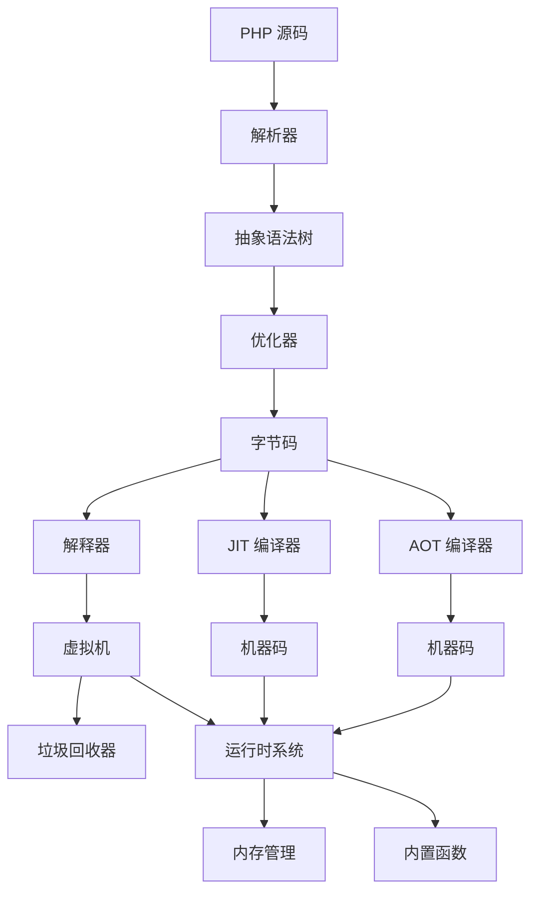
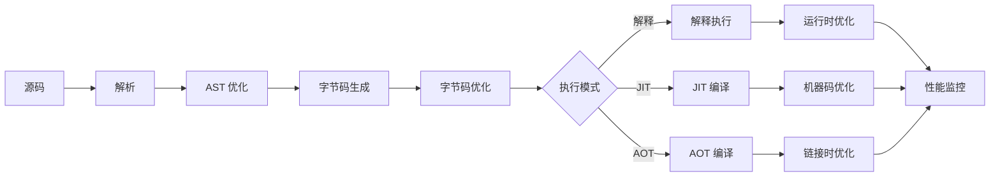

# 设计文档：高级编译器优化

## 概述

本设计文档描述了 zig-php 项目的深度性能优化方案。优化涵盖内存管理、编译器、运行时、JIT、AOT 等多个层面，目标是将解释器性能提升 2-3 倍，JIT 性能提升 5-10 倍，AOT 性能接近 C/Rust，同时减少 GC 停顿时间 50% 和内存占用 30%。

### 设计原则

1. **性能优先**：所有优化以性能提升为首要目标
2. **内存安全**：保持 Zig 的内存安全保证
3. **语义兼容**：完全兼容 PHP 8.5 语义
4. **可测量**：所有优化效果可通过基准测试验证
5. **渐进式**：支持多级优化，可根据场景选择
6. **可维护**：代码清晰，避免过度优化导致的复杂性

## 架构

### 整体架构



### 优化流水线



## 组件和接口

### 1. 内存管理子系统

#### 1.1 分代垃圾回收器

```zig
/// 分代 GC 配置
pub const GenerationalGC = struct {
    /// 年轻代（Eden + Survivor）
    young_gen: YoungGeneration,
    /// 老年代
    old_gen: OldGeneration,
    /// 写屏障，记录跨代引用
    write_barrier: WriteBarrier,
    /// GC 统计信息
    stats: GCStats,
    
    /// 执行 Minor GC（年轻代）
    pub fn minorGC(self: *GenerationalGC) !void;
    
    /// 执行 Major GC（老年代）
    pub fn majorGC(self: *GenerationalGC) !void;
    
    /// 执行增量 GC 步骤
    pub fn incrementalStep(self: *GenerationalGC, time_budget_ns: u64) !bool;
};

/// 年轻代结构
pub const YoungGeneration = struct {
    eden: Region,
    survivor_from: Region,
    survivor_to: Region,
    age_threshold: u8 = 15,
};

/// 老年代结构
pub const OldGeneration = struct {
    regions: std.ArrayList(Region),
    free_list: FreeList,
    compaction_threshold: f32 = 0.3,
};
```

#### 1.2 内存池分配器

```zig
/// 内存池，用于小对象分配
pub const MemoryPool = struct {
    /// 对象大小类别（8, 16, 32, 64, 128, 256 字节）
    size_classes: [6]SizeClass,
    /// 线程本地缓存
    thread_cache: ThreadLocalCache,
    
    pub fn alloc(self: *MemoryPool, size: usize) !*anyopaque;
    pub fn free(self: *MemoryPool, ptr: *anyopaque) void;
};

/// Arena 分配器，用于临时对象
pub const ArenaAllocator = struct {
    current_chunk: *Chunk,
    chunks: std.ArrayList(*Chunk),
    
    pub fn alloc(self: *ArenaAllocator, size: usize) ![]u8;
    pub fn reset(self: *ArenaAllocator) void;
};
```

#### 1.3 Copy-on-Write 优化

```zig
/// CoW 字符串
pub const CowString = struct {
    data: []const u8,
    ref_count: *std.atomic.Atomic(u32),
    
    /// 获取可写副本
    pub fn makeMutable(self: *CowString, allocator: Allocator) ![]u8;
    
    /// 共享只读数据
    pub fn share(self: *CowString) CowString;
};

/// CoW 数组
pub const CowArray = struct {
    elements: []Value,
    ref_count: *std.atomic.Atomic(u32),
    
    pub fn makeMutable(self: *CowArray, allocator: Allocator) ![]Value;
    pub fn share(self: *CowArray) CowArray;
};
```


### 2. 编译器优化子系统

#### 2.1 优化器架构

```zig
/// 编译器优化器
pub const Optimizer = struct {
    /// 优化级别（0-3）
    level: OptimizationLevel,
    /// 优化 Pass 管理器
    pass_manager: PassManager,
    
    pub fn optimize(self: *Optimizer, ast: *AST) !*AST;
    pub fn optimizeBytecode(self: *Optimizer, code: []Opcode) ![]Opcode;
};

/// 优化级别
pub const OptimizationLevel = enum {
    O0, // 无优化
    O1, // 基础优化
    O2, // 标准优化
    O3, // 激进优化
};

/// Pass 管理器
pub const PassManager = struct {
    passes: std.ArrayList(Pass),
    
    pub fn addPass(self: *PassManager, pass: Pass) void;
    pub fn run(self: *PassManager, ir: *IR) !void;
};
```

#### 2.2 常量折叠和传播

```zig
/// 常量折叠 Pass
pub const ConstantFolding = struct {
    pub fn run(self: *ConstantFolding, ast: *AST) !void {
        // 遍历 AST，计算常量表达式
        // 例如：2 + 3 * 4 -> 14
    }
};

/// 常量传播 Pass
pub const ConstantPropagation = struct {
    constants: std.StringHashMap(Value),
    
    pub fn run(self: *ConstantPropagation, ast: *AST) !void {
        // 传播已知常量值
        // 例如：$x = 5; $y = $x + 1; -> $y = 6;
    }
};
```

#### 2.3 死代码消除

```zig
/// 死代码消除 Pass
pub const DeadCodeElimination = struct {
    live_vars: std.AutoHashMap(*Var, void),
    
    pub fn run(self: *DeadCodeElimination, cfg: *ControlFlowGraph) !void {
        // 1. 标记活跃变量
        self.markLiveVars(cfg);
        // 2. 删除未使用的赋值
        self.removeDeadAssignments(cfg);
        // 3. 删除不可达代码块
        self.removeUnreachableBlocks(cfg);
    }
    
    fn markLiveVars(self: *DeadCodeElimination, cfg: *ControlFlowGraph) void;
    fn removeDeadAssignments(self: *DeadCodeElimination, cfg: *ControlFlowGraph) void;
    fn removeUnreachableBlocks(self: *DeadCodeElimination, cfg: *ControlFlowGraph) void;
};
```

#### 2.4 逃逸分析

```zig
/// 逃逸分析 Pass
pub const EscapeAnalysis = struct {
    escape_info: std.AutoHashMap(*Allocation, EscapeStatus),
    
    pub fn run(self: *EscapeAnalysis, cfg: *ControlFlowGraph) !void {
        // 分析对象是否逃逸到堆
        for (cfg.allocations.items) |alloc| {
            const status = self.analyzeEscape(alloc);
            try self.escape_info.put(alloc, status);
        }
    }
    
    fn analyzeEscape(self: *EscapeAnalysis, alloc: *Allocation) EscapeStatus {
        // 检查对象是否：
        // 1. 被返回
        // 2. 被存储到全局变量
        // 3. 被传递给其他函数
        // 4. 生命周期超过当前函数
    }
};

pub const EscapeStatus = enum {
    NoEscape,    // 不逃逸，可栈分配
    ArgEscape,   // 逃逸到参数
    GlobalEscape, // 逃逸到全局
};
```

#### 2.5 循环优化

```zig
/// 循环优化 Pass
pub const LoopOptimization = struct {
    pub fn run(self: *LoopOptimization, cfg: *ControlFlowGraph) !void {
        for (cfg.loops.items) |loop| {
            // 1. 循环不变量外提
            try self.hoistInvariants(loop);
            // 2. 循环展开
            if (self.shouldUnroll(loop)) {
                try self.unrollLoop(loop);
            }
            // 3. 循环向量化
            if (self.canVectorize(loop)) {
                try self.vectorizeLoop(loop);
            }
        }
    }
    
    fn hoistInvariants(self: *LoopOptimization, loop: *Loop) !void;
    fn shouldUnroll(self: *LoopOptimization, loop: *Loop) bool;
    fn unrollLoop(self: *LoopOptimization, loop: *Loop) !void;
    fn canVectorize(self: *LoopOptimization, loop: *Loop) bool;
    fn vectorizeLoop(self: *LoopOptimization, loop: *Loop) !void;
};
```

#### 2.6 函数内联

```zig
/// 函数内联 Pass
pub const Inlining = struct {
    inline_threshold: usize = 50, // 字节码大小阈值
    
    pub fn run(self: *Inlining, cfg: *ControlFlowGraph) !void {
        for (cfg.call_sites.items) |call| {
            if (self.shouldInline(call)) {
                try self.inlineCall(call);
            }
        }
    }
    
    fn shouldInline(self: *Inlining, call: *CallSite) bool {
        const callee = call.target;
        // 检查：
        // 1. 函数大小 < 阈值
        // 2. 非递归调用
        // 3. 调用频率高
        return callee.bytecode_size < self.inline_threshold and
               !callee.is_recursive and
               call.frequency > 100;
    }
    
    fn inlineCall(self: *Inlining, call: *CallSite) !void;
};
```

#### 2.7 尾调用优化

```zig
/// 尾调用优化 Pass
pub const TailCallOptimization = struct {
    pub fn run(self: *TailCallOptimization, cfg: *ControlFlowGraph) !void {
        for (cfg.functions.items) |func| {
            for (func.basic_blocks.items) |bb| {
                if (self.isTailCall(bb)) {
                    try self.optimizeTailCall(bb);
                }
            }
        }
    }
    
    fn isTailCall(self: *TailCallOptimization, bb: *BasicBlock) bool {
        // 检查最后一条指令是否为 call + return
        if (bb.instructions.items.len < 2) return false;
        const last = bb.instructions.items[bb.instructions.items.len - 1];
        const second_last = bb.instructions.items[bb.instructions.items.len - 2];
        return second_last.opcode == .Call and last.opcode == .Return;
    }
    
    fn optimizeTailCall(self: *TailCallOptimization, bb: *BasicBlock) !void {
        // 将 call + return 转换为 jump
        // 复用当前栈帧
    }
};
```

### 3. 运行时优化子系统

#### 3.1 NaN-Boxing 值表示

```zig
/// NaN-Boxing 值类型
/// 使用 64 位浮点数的 NaN 位模式存储类型标签
pub const Value = packed struct {
    bits: u64,
    
    // 类型标签（使用 NaN 的高位）
    const TAG_MASK: u64 = 0xFFFF_0000_0000_0000;
    const TAG_INT: u64 = 0xFFF8_0000_0000_0000;
    const TAG_BOOL: u64 = 0xFFF9_0000_0000_0000;
    const TAG_NULL: u64 = 0xFFFA_0000_0000_0000;
    const TAG_OBJ: u64 = 0xFFFB_0000_0000_0000;
    const TAG_STR: u64 = 0xFFFC_0000_0000_0000;
    
    pub fn makeInt(val: i32) Value {
        return .{ .bits = TAG_INT | @as(u64, @bitCast(@as(i64, val))) };
    }
    
    pub fn makeFloat(val: f64) Value {
        return .{ .bits = @bitCast(val) };
    }
    
    pub fn makeObject(ptr: *Object) Value {
        return .{ .bits = TAG_OBJ | @intFromPtr(ptr) };
    }
    
    pub fn isInt(self: Value) bool {
        return (self.bits & TAG_MASK) == TAG_INT;
    }
    
    pub fn asInt(self: Value) i32 {
        return @truncate(@as(i64, @bitCast(self.bits)));
    }
};
```

#### 3.2 SIMD 优化

```zig
/// SIMD 加速的字符串操作
pub const SimdString = struct {
    /// 使用 SIMD 查找字符
    pub fn findChar(haystack: []const u8, needle: u8) ?usize {
        const vec_size = 16; // SSE: 128 位 = 16 字节
        var i: usize = 0;
        
        // SIMD 处理对齐部分
        while (i + vec_size <= haystack.len) : (i += vec_size) {
            const chunk: @Vector(vec_size, u8) = haystack[i..][0..vec_size].*;
            const needle_vec: @Vector(vec_size, u8) = @splat(needle);
            const mask = chunk == needle_vec;
            
            if (@reduce(.Or, mask)) {
                // 找到匹配，精确定位
                for (0..vec_size) |j| {
                    if (mask[j]) return i + j;
                }
            }
        }
        
        // 处理剩余部分
        while (i < haystack.len) : (i += 1) {
            if (haystack[i] == needle) return i;
        }
        
        return null;
    }
    
    /// 使用 SIMD 比较字符串
    pub fn compare(a: []const u8, b: []const u8) bool {
        if (a.len != b.len) return false;
        
        const vec_size = 16;
        var i: usize = 0;
        
        while (i + vec_size <= a.len) : (i += vec_size) {
            const va: @Vector(vec_size, u8) = a[i..][0..vec_size].*;
            const vb: @Vector(vec_size, u8) = b[i..][0..vec_size].*;
            if (!@reduce(.And, va == vb)) return false;
        }
        
        while (i < a.len) : (i += 1) {
            if (a[i] != b[i]) return false;
        }
        
        return true;
    }
};

/// SIMD 加速的数组操作
pub const SimdArray = struct {
    /// 使用 SIMD 求和
    pub fn sum(arr: []const i32) i64 {
        const vec_size = 4; // SSE: 128 位 = 4 个 i32
        var result: i64 = 0;
        var i: usize = 0;
        
        var acc: @Vector(vec_size, i32) = @splat(0);
        
        while (i + vec_size <= arr.len) : (i += vec_size) {
            const chunk: @Vector(vec_size, i32) = arr[i..][0..vec_size].*;
            acc += chunk;
        }
        
        // 归约向量
        for (0..vec_size) |j| {
            result += acc[j];
        }
        
        // 处理剩余元素
        while (i < arr.len) : (i += 1) {
            result += arr[i];
        }
        
        return result;
    }
};
```


#### 3.3 内联缓存

```zig
/// 内联缓存，用于优化动态调用
pub const InlineCache = struct {
    /// 缓存条目
    pub const Entry = struct {
        /// 类型标识
        type_id: u32,
        /// 目标地址（方法或属性偏移）
        target: union(enum) {
            method: *Function,
            property_offset: u32,
        },
        /// 命中次数
        hit_count: u32,
    };
    
    /// 单态缓存（1 个条目）
    pub const Monomorphic = struct {
        entry: ?Entry = null,
        
        pub fn lookup(self: *Monomorphic, type_id: u32) ?Entry {
            if (self.entry) |e| {
                if (e.type_id == type_id) {
                    return e;
                }
            }
            return null;
        }
        
        pub fn update(self: *Monomorphic, type_id: u32, target: Entry.Target) void {
            self.entry = .{ .type_id = type_id, .target = target, .hit_count = 1 };
        }
    };
    
    /// 多态缓存（4 个条目）
    pub const Polymorphic = struct {
        entries: [4]?Entry = [_]?Entry{null} ** 4,
        
        pub fn lookup(self: *Polymorphic, type_id: u32) ?Entry {
            for (self.entries) |maybe_entry| {
                if (maybe_entry) |e| {
                    if (e.type_id == type_id) {
                        return e;
                    }
                }
            }
            return null;
        }
        
        pub fn update(self: *Polymorphic, type_id: u32, target: Entry.Target) void {
            // 查找空槽或最少使用的槽
            var min_idx: usize = 0;
            var min_hits: u32 = std.math.maxInt(u32);
            
            for (self.entries, 0..) |maybe_entry, i| {
                if (maybe_entry == null) {
                    min_idx = i;
                    break;
                }
                if (maybe_entry.?.hit_count < min_hits) {
                    min_hits = maybe_entry.?.hit_count;
                    min_idx = i;
                }
            }
            
            self.entries[min_idx] = .{ .type_id = type_id, .target = target, .hit_count = 1 };
        }
    };
};
```

#### 3.4 对象池

```zig
/// 对象池，复用频繁创建的对象
pub const ObjectPool = struct {
    /// 池化对象类型
    pub const PooledType = enum {
        Array,
        String,
        Object,
        Closure,
    };
    
    /// 对象池
    pools: std.EnumArray(PooledType, Pool),
    
    pub const Pool = struct {
        free_list: std.ArrayList(*Object),
        max_size: usize = 1024,
        
        pub fn acquire(self: *Pool, allocator: Allocator) !*Object {
            if (self.free_list.popOrNull()) |obj| {
                return obj;
            }
            return try allocator.create(Object);
        }
        
        pub fn release(self: *Pool, obj: *Object) !void {
            if (self.free_list.items.len < self.max_size) {
                // 重置对象状态
                obj.reset();
                try self.free_list.append(obj);
            } else {
                // 池已满，直接释放
                obj.deinit();
            }
        }
    };
};
```

### 4. JIT 优化子系统

#### 4.1 热点检测

```zig
/// 热点检测器
pub const HotspotDetector = struct {
    /// 函数执行计数器
    function_counters: std.AutoHashMap(*Function, u32),
    /// 循环执行计数器
    loop_counters: std.AutoHashMap(*Loop, u32),
    /// 热点阈值
    function_threshold: u32 = 1000,
    loop_threshold: u32 = 10000,
    
    pub fn recordFunctionCall(self: *HotspotDetector, func: *Function) !bool {
        const entry = try self.function_counters.getOrPut(func);
        if (!entry.found_existing) {
            entry.value_ptr.* = 0;
        }
        entry.value_ptr.* += 1;
        
        return entry.value_ptr.* >= self.function_threshold;
    }
    
    pub fn recordLoopIteration(self: *HotspotDetector, loop: *Loop) !bool {
        const entry = try self.loop_counters.getOrPut(loop);
        if (!entry.found_existing) {
            entry.value_ptr.* = 0;
        }
        entry.value_ptr.* += 1;
        
        return entry.value_ptr.* >= self.loop_threshold;
    }
};
```

#### 4.2 寄存器分配

```zig
/// 寄存器分配器（图着色算法）
pub const RegisterAllocator = struct {
    /// 干涉图
    interference_graph: InterferenceGraph,
    /// 可用寄存器数量
    num_registers: u32,
    /// 分配结果
    allocation: std.AutoHashMap(*VirtualReg, PhysicalReg),
    
    pub fn allocate(self: *RegisterAllocator, cfg: *ControlFlowGraph) !void {
        // 1. 构建干涉图
        try self.buildInterferenceGraph(cfg);
        
        // 2. 图着色
        const coloring = try self.colorGraph();
        
        // 3. 处理溢出（spill）
        try self.handleSpills(coloring);
        
        // 4. 生成分配结果
        try self.generateAllocation(coloring);
    }
    
    fn buildInterferenceGraph(self: *RegisterAllocator, cfg: *ControlFlowGraph) !void {
        // 活跃变量分析
        const liveness = try LivenessAnalysis.analyze(cfg);
        
        // 构建干涉边
        for (cfg.basic_blocks.items) |bb| {
            var live = liveness.live_out.get(bb).?;
            
            for (bb.instructions.items) |inst| {
                if (inst.def) |def| {
                    // def 与所有活跃变量干涉
                    for (live.items) |live_var| {
                        if (def != live_var) {
                            try self.interference_graph.addEdge(def, live_var);
                        }
                    }
                }
                
                // 更新活跃集合
                if (inst.def) |def| {
                    _ = live.remove(def);
                }
                for (inst.uses) |use| {
                    try live.put(use, {});
                }
            }
        }
    }
    
    fn colorGraph(self: *RegisterAllocator) !Coloring {
        // Chaitin 图着色算法
        var stack = std.ArrayList(*VirtualReg).init(self.allocator);
        var graph = self.interference_graph.clone();
        
        // 简化阶段：移除度数 < K 的节点
        while (graph.nodes.count() > 0) {
            var removed = false;
            var it = graph.nodes.iterator();
            while (it.next()) |entry| {
                const node = entry.key_ptr.*;
                const degree = graph.degree(node);
                
                if (degree < self.num_registers) {
                    try stack.append(node);
                    graph.removeNode(node);
                    removed = true;
                    break;
                }
            }
            
            // 如果无法简化，选择溢出节点
            if (!removed) {
                const spill_node = try self.selectSpillNode(&graph);
                try stack.append(spill_node);
                graph.removeNode(spill_node);
            }
        }
        
        // 着色阶段：从栈中恢复节点并分配颜色
        var coloring = Coloring.init(self.allocator);
        while (stack.popOrNull()) |node| {
            const color = try self.selectColor(node, &coloring);
            try coloring.put(node, color);
        }
        
        return coloring;
    }
};

/// 物理寄存器
pub const PhysicalReg = enum(u8) {
    rax, rbx, rcx, rdx, rsi, rdi, r8, r9, r10, r11, r12, r13, r14, r15,
    xmm0, xmm1, xmm2, xmm3, xmm4, xmm5, xmm6, xmm7,
};
```

#### 4.3 OSR（栈上替换）

```zig
/// OSR 管理器
pub const OSRManager = struct {
    /// OSR 点
    pub const OSRPoint = struct {
        /// 字节码偏移
        bytecode_offset: u32,
        /// 编译后的机器码入口
        compiled_entry: *const fn() callconv(.C) void,
        /// 栈映射（解释器栈 -> 编译代码栈）
        stack_map: StackMap,
    };
    
    /// 栈映射
    pub const StackMap = struct {
        /// 局部变量映射
        locals: []LocalMapping,
        /// 操作数栈映射
        operand_stack: []OperandMapping,
    };
    
    pub fn performOSR(
        self: *OSRManager,
        interpreter_frame: *InterpreterFrame,
        osr_point: *OSRPoint,
    ) !void {
        // 1. 保存解释器状态
        const state = try self.captureInterpreterState(interpreter_frame);
        
        // 2. 构建编译代码栈帧
        const compiled_frame = try self.buildCompiledFrame(state, osr_point.stack_map);
        
        // 3. 跳转到编译代码
        osr_point.compiled_entry();
    }
};
```

#### 4.4 类型特化

```zig
/// 类型特化编译器
pub const TypeSpecializer = struct {
    /// 类型反馈
    pub const TypeFeedback = struct {
        /// 观察到的类型
        observed_types: std.ArrayList(Type),
        /// 类型稳定性
        stability: f32,
    };
    
    pub fn specialize(
        self: *TypeSpecializer,
        func: *Function,
        feedback: *TypeFeedback,
    ) !*SpecializedFunction {
        // 如果类型稳定，生成特化版本
        if (feedback.stability > 0.95) {
            return try self.generateSpecialized(func, feedback.observed_types.items[0]);
        }
        
        return error.TypeUnstable;
    }
    
    fn generateSpecialized(
        self: *TypeSpecializer,
        func: *Function,
        specialized_type: Type,
    ) !*SpecializedFunction {
        // 生成针对特定类型的优化代码
        // 例如：整数加法 vs 浮点加法 vs 字符串连接
    }
};
```

#### 4.5 分层编译

```zig
/// 分层编译系统
pub const TieredCompilation = struct {
    /// 编译层级
    pub const Tier = enum {
        Interpreter,  // 解释执行
        BaselineJIT,  // 基础 JIT（快速编译）
        OptimizingJIT, // 优化 JIT（慢速编译，高性能）
    };
    
    /// 函数编译状态
    pub const CompilationState = struct {
        current_tier: Tier,
        execution_count: u32,
        compiled_code: ?*CompiledCode,
    };
    
    pub fn shouldUpgrade(self: *TieredCompilation, state: *CompilationState) bool {
        return switch (state.current_tier) {
            .Interpreter => state.execution_count > 100,
            .BaselineJIT => state.execution_count > 10000,
            .OptimizingJIT => false,
        };
    }
    
    pub fn upgrade(
        self: *TieredCompilation,
        func: *Function,
        state: *CompilationState,
    ) !void {
        const next_tier: Tier = switch (state.current_tier) {
            .Interpreter => .BaselineJIT,
            .BaselineJIT => .OptimizingJIT,
            .OptimizingJIT => return,
        };
        
        const compiled = try self.compile(func, next_tier);
        state.compiled_code = compiled;
        state.current_tier = next_tier;
    }
};
```


### 5. AOT 优化子系统

#### 5.1 全程序优化（WPO）

```zig
/// 全程序优化器
pub const WholeProgramOptimizer = struct {
    /// 调用图
    call_graph: CallGraph,
    /// 数据流图
    data_flow_graph: DataFlowGraph,
    
    pub fn optimize(self: *WholeProgramOptimizer, program: *Program) !void {
        // 1. 构建调用图
        try self.buildCallGraph(program);
        
        // 2. 跨过程常量传播
        try self.interprocConstantPropagation();
        
        // 3. 跨过程死代码消除
        try self.interprocDeadCodeElimination();
        
        // 4. 函数特化
        try self.functionSpecialization();
        
        // 5. 去虚化
        try self.devirtualization();
    }
    
    fn interprocConstantPropagation(self: *WholeProgramOptimizer) !void {
        // 跨函数边界传播常量
        for (self.call_graph.edges.items) |edge| {
            const caller = edge.from;
            const callee = edge.to;
            
            // 如果调用点的参数是常量，传播到被调用函数
            for (edge.arguments, 0..) |arg, i| {
                if (arg.isConstant()) {
                    try callee.parameters[i].setConstant(arg.value);
                }
            }
        }
    }
    
    fn devirtualization(self: *WholeProgramOptimizer) !void {
        // 分析虚方法调用，如果只有一个可能的目标，去虚化
        for (self.call_graph.virtual_calls.items) |vcall| {
            const targets = try self.findPossibleTargets(vcall);
            if (targets.len == 1) {
                // 替换为直接调用
                vcall.replaceWithDirectCall(targets[0]);
            }
        }
    }
};
```

#### 5.2 链接时优化（LTO）

```zig
/// 链接时优化器
pub const LinkTimeOptimizer = struct {
    /// 模块列表
    modules: std.ArrayList(*Module),
    
    pub fn optimize(self: *LinkTimeOptimizer) !*LinkedProgram {
        // 1. 合并所有模块
        const merged = try self.mergeModules();
        
        // 2. 全局优化
        try self.globalOptimization(merged);
        
        // 3. 代码布局优化
        try self.codeLayoutOptimization(merged);
        
        // 4. 生成最终二进制
        return try self.generateBinary(merged);
    }
    
    fn mergeModules(self: *LinkTimeOptimizer) !*MergedModule {
        var merged = MergedModule.init(self.allocator);
        
        for (self.modules.items) |module| {
            try merged.merge(module);
        }
        
        return merged;
    }
    
    fn globalOptimization(self: *LinkTimeOptimizer, module: *MergedModule) !void {
        // 跨模块内联
        try self.crossModuleInlining(module);
        
        // 全局死代码消除
        try self.globalDeadCodeElimination(module);
        
        // 常量合并
        try self.constantMerging(module);
    }
};
```

#### 5.3 配置文件引导优化（PGO）

```zig
/// PGO 优化器
pub const ProfileGuidedOptimizer = struct {
    /// 性能配置文件
    profile: *Profile,
    
    pub const Profile = struct {
        /// 函数执行频率
        function_frequencies: std.StringHashMap(u64),
        /// 分支执行频率
        branch_frequencies: std.AutoHashMap(*Branch, BranchProfile),
        /// 调用边频率
        call_edge_frequencies: std.AutoHashMap(*CallEdge, u64),
    };
    
    pub const BranchProfile = struct {
        taken_count: u64,
        not_taken_count: u64,
        
        pub fn probability(self: BranchProfile) f64 {
            const total = self.taken_count + self.not_taken_count;
            if (total == 0) return 0.5;
            return @as(f64, @floatFromInt(self.taken_count)) / @as(f64, @floatFromInt(total));
        }
    };
    
    pub fn optimize(self: *ProfileGuidedOptimizer, program: *Program) !void {
        // 1. 基于频率的代码布局
        try self.frequencyBasedLayout(program);
        
        // 2. 基于分支预测的优化
        try self.branchPredictionOptimization(program);
        
        // 3. 基于调用频率的内联决策
        try self.profileGuidedInlining(program);
    }
    
    fn frequencyBasedLayout(self: *ProfileGuidedOptimizer, program: *Program) !void {
        // 将热代码放在一起，提高指令缓存命中率
        var hot_functions = std.ArrayList(*Function).init(self.allocator);
        defer hot_functions.deinit();
        
        var it = self.profile.function_frequencies.iterator();
        while (it.next()) |entry| {
            if (entry.value_ptr.* > 1000) {
                const func = program.findFunction(entry.key_ptr.*);
                try hot_functions.append(func);
            }
        }
        
        // 按频率排序
        std.sort.pdq(*Function, hot_functions.items, {}, struct {
            fn lessThan(_: void, a: *Function, b: *Function) bool {
                return a.frequency > b.frequency;
            }
        }.lessThan);
        
        // 重新布局
        try program.reorderFunctions(hot_functions.items);
    }
    
    fn branchPredictionOptimization(self: *ProfileGuidedOptimizer, program: *Program) !void {
        // 根据分支概率优化代码布局
        for (program.functions.items) |func| {
            for (func.basic_blocks.items) |bb| {
                if (bb.terminator) |term| {
                    if (term == .Branch) {
                        const profile = self.profile.branch_frequencies.get(&term.Branch) orelse continue;
                        
                        // 如果分支高度偏向一侧，调整布局
                        if (profile.probability() > 0.9) {
                            // taken 分支是热路径，放在顺序位置
                            try bb.reorderSuccessors(.taken_first);
                        } else if (profile.probability() < 0.1) {
                            // not_taken 分支是热路径
                            try bb.reorderSuccessors(.not_taken_first);
                        }
                    }
                }
            }
        }
    }
};
```

### 6. 算法优化

#### 6.1 Robin Hood 哈希表

```zig
/// Robin Hood 哈希表实现
pub fn RobinHoodHashMap(comptime K: type, comptime V: type) type {
    return struct {
        const Self = @This();
        
        pub const Entry = struct {
            key: K,
            value: V,
            psl: u32, // Probe Sequence Length
        };
        
        entries: []?Entry,
        len: usize,
        capacity: usize,
        load_factor: f32 = 0.75,
        
        pub fn init(allocator: Allocator, capacity: usize) !Self {
            const entries = try allocator.alloc(?Entry, capacity);
            @memset(entries, null);
            
            return Self{
                .entries = entries,
                .len = 0,
                .capacity = capacity,
            };
        }
        
        pub fn put(self: *Self, key: K, value: V) !void {
            if (@as(f32, @floatFromInt(self.len)) / @as(f32, @floatFromInt(self.capacity)) > self.load_factor) {
                try self.resize();
            }
            
            var entry = Entry{ .key = key, .value = value, .psl = 0 };
            var idx = self.hash(key) % self.capacity;
            
            while (true) {
                if (self.entries[idx]) |*existing| {
                    if (std.meta.eql(existing.key, key)) {
                        // 更新现有键
                        existing.value = value;
                        return;
                    }
                    
                    // Robin Hood: 如果当前条目的 PSL 更小，交换
                    if (existing.psl < entry.psl) {
                        const temp = existing.*;
                        existing.* = entry;
                        entry = temp;
                    }
                    
                    entry.psl += 1;
                    idx = (idx + 1) % self.capacity;
                } else {
                    // 找到空槽
                    self.entries[idx] = entry;
                    self.len += 1;
                    return;
                }
            }
        }
        
        pub fn get(self: *Self, key: K) ?V {
            var idx = self.hash(key) % self.capacity;
            var psl: u32 = 0;
            
            while (self.entries[idx]) |entry| {
                if (std.meta.eql(entry.key, key)) {
                    return entry.value;
                }
                
                // 如果 PSL 超过了条目的 PSL，键不存在
                if (psl > entry.psl) {
                    return null;
                }
                
                psl += 1;
                idx = (idx + 1) % self.capacity;
            }
            
            return null;
        }
    };
}
```

#### 6.2 Boyer-Moore 字符串搜索

```zig
/// Boyer-Moore 字符串搜索算法
pub const BoyerMoore = struct {
    /// 坏字符表
    bad_char_table: [256]usize,
    /// 好后缀表
    good_suffix_table: []usize,
    /// 模式串
    pattern: []const u8,
    
    pub fn init(allocator: Allocator, pattern: []const u8) !BoyerMoore {
        var self = BoyerMoore{
            .bad_char_table = undefined,
            .good_suffix_table = try allocator.alloc(usize, pattern.len),
            .pattern = pattern,
        };
        
        try self.buildBadCharTable();
        try self.buildGoodSuffixTable();
        
        return self;
    }
    
    fn buildBadCharTable(self: *BoyerMoore) !void {
        // 初始化为模式长度
        @memset(&self.bad_char_table, self.pattern.len);
        
        // 填充每个字符最后出现的位置
        for (self.pattern, 0..) |c, i| {
            self.bad_char_table[c] = self.pattern.len - 1 - i;
        }
    }
    
    fn buildGoodSuffixTable(self: *BoyerMoore) !void {
        const m = self.pattern.len;
        var suffix = try self.allocator.alloc(usize, m);
        defer self.allocator.free(suffix);
        
        // 计算后缀数组
        suffix[m - 1] = m;
        var g = m - 1;
        var f: usize = 0;
        
        var i: usize = m - 2;
        while (i >= 0) : (i -= 1) {
            if (i > g and suffix[i + m - 1 - f] < i - g) {
                suffix[i] = suffix[i + m - 1 - f];
            } else {
                if (i < g) g = i;
                f = i;
                while (g >= 0 and self.pattern[g] == self.pattern[g + m - 1 - f]) {
                    g -= 1;
                }
                suffix[i] = f - g;
            }
            if (i == 0) break;
        }
        
        // 构建好后缀表
        for (self.good_suffix_table) |*entry| {
            entry.* = m;
        }
        
        i = 0;
        while (i < m - 1) : (i += 1) {
            self.good_suffix_table[m - 1 - suffix[i]] = m - 1 - i;
        }
    }
    
    pub fn search(self: *BoyerMoore, text: []const u8) ?usize {
        const m = self.pattern.len;
        const n = text.len;
        
        if (m > n) return null;
        
        var i: usize = 0;
        while (i <= n - m) {
            var j: usize = m - 1;
            
            while (j >= 0 and self.pattern[j] == text[i + j]) {
                if (j == 0) return i;
                j -= 1;
            }
            
            // 计算跳跃距离
            const bad_char_shift = self.bad_char_table[text[i + j]];
            const good_suffix_shift = self.good_suffix_table[j];
            i += @max(bad_char_shift, good_suffix_shift);
        }
        
        return null;
    }
};
```

#### 6.3 Slab 分配器

```zig
/// Slab 分配器，用于固定大小对象
pub fn SlabAllocator(comptime T: type) type {
    return struct {
        const Self = @This();
        const slab_size = 64; // 每个 slab 包含 64 个对象
        
        pub const Slab = struct {
            objects: [slab_size]T,
            free_bitmap: u64, // 位图标记空闲对象
            next: ?*Slab,
        };
        
        head: ?*Slab,
        allocator: Allocator,
        
        pub fn init(allocator: Allocator) Self {
            return Self{
                .head = null,
                .allocator = allocator,
            };
        }
        
        pub fn alloc(self: *Self) !*T {
            // 查找有空闲对象的 slab
            var current = self.head;
            while (current) |slab| {
                if (slab.free_bitmap != 0) {
                    // 找到空闲位
                    const idx = @ctz(slab.free_bitmap);
                    slab.free_bitmap &= ~(@as(u64, 1) << @intCast(idx));
                    return &slab.objects[idx];
                }
                current = slab.next;
            }
            
            // 没有空闲对象，分配新 slab
            const new_slab = try self.allocator.create(Slab);
            new_slab.* = .{
                .objects = undefined,
                .free_bitmap = ~@as(u64, 0), // 全部标记为空闲
                .next = self.head,
            };
            self.head = new_slab;
            
            // 分配第一个对象
            new_slab.free_bitmap &= ~@as(u64, 1);
            return &new_slab.objects[0];
        }
        
        pub fn free(self: *Self, ptr: *T) void {
            // 查找对象所属的 slab
            var current = self.head;
            while (current) |slab| {
                const slab_start = @intFromPtr(&slab.objects[0]);
                const slab_end = slab_start + @sizeOf(T) * slab_size;
                const ptr_addr = @intFromPtr(ptr);
                
                if (ptr_addr >= slab_start and ptr_addr < slab_end) {
                    const idx = (ptr_addr - slab_start) / @sizeOf(T);
                    slab.free_bitmap |= @as(u64, 1) << @intCast(idx);
                    return;
                }
                
                current = slab.next;
            }
        }
    };
}
```


### 7. 性能监控子系统

#### 7.1 性能分析器

```zig
/// 实时性能分析器
pub const Profiler = struct {
    /// 采样间隔（微秒）
    sample_interval_us: u64 = 1000,
    /// 函数统计信息
    function_stats: std.StringHashMap(FunctionStats),
    /// 采样线程
    sampler_thread: ?std.Thread = null,
    /// 是否正在运行
    running: std.atomic.Atomic(bool),
    
    pub const FunctionStats = struct {
        name: []const u8,
        call_count: u64,
        total_time_ns: u64,
        self_time_ns: u64,
        
        pub fn avgTime(self: FunctionStats) u64 {
            if (self.call_count == 0) return 0;
            return self.total_time_ns / self.call_count;
        }
    };
    
    pub fn start(self: *Profiler) !void {
        self.running.store(true, .seq_cst);
        self.sampler_thread = try std.Thread.spawn(.{}, samplerLoop, .{self});
    }
    
    pub fn stop(self: *Profiler) void {
        self.running.store(false, .seq_cst);
        if (self.sampler_thread) |thread| {
            thread.join();
        }
    }
    
    fn samplerLoop(self: *Profiler) void {
        while (self.running.load(.seq_cst)) {
            // 采样当前调用栈
            const stack_trace = captureStackTrace();
            
            // 更新统计信息
            for (stack_trace.frames) |frame| {
                const entry = self.function_stats.getOrPut(frame.function_name) catch continue;
                if (!entry.found_existing) {
                    entry.value_ptr.* = .{
                        .name = frame.function_name,
                        .call_count = 0,
                        .total_time_ns = 0,
                        .self_time_ns = 0,
                    };
                }
                entry.value_ptr.call_count += 1;
            }
            
            // 休眠
            std.time.sleep(self.sample_interval_us * 1000);
        }
    }
    
    pub fn generateFlameGraph(self: *Profiler, writer: anytype) !void {
        // 生成火焰图数据（Folded Stack 格式）
        var it = self.function_stats.iterator();
        while (it.next()) |entry| {
            const stats = entry.value_ptr.*;
            try writer.print("{s} {d}\n", .{ stats.name, stats.total_time_ns });
        }
    }
};
```

#### 7.2 内存泄漏检测器

```zig
/// 内存泄漏检测器
pub const LeakDetector = struct {
    /// 分配记录
    allocations: std.AutoHashMap(usize, AllocationInfo),
    /// 是否启用
    enabled: bool = false,
    /// 互斥锁
    mutex: std.Thread.Mutex = .{},
    
    pub const AllocationInfo = struct {
        size: usize,
        stack_trace: []usize,
        timestamp: i64,
    };
    
    pub fn recordAllocation(
        self: *LeakDetector,
        ptr: usize,
        size: usize,
    ) !void {
        if (!self.enabled) return;
        
        self.mutex.lock();
        defer self.mutex.unlock();
        
        const stack_trace = try captureStackTrace();
        try self.allocations.put(ptr, .{
            .size = size,
            .stack_trace = stack_trace,
            .timestamp = std.time.milliTimestamp(),
        });
    }
    
    pub fn recordDeallocation(self: *LeakDetector, ptr: usize) void {
        if (!self.enabled) return;
        
        self.mutex.lock();
        defer self.mutex.unlock();
        
        _ = self.allocations.remove(ptr);
    }
    
    pub fn checkLeaks(self: *LeakDetector, writer: anytype) !void {
        self.mutex.lock();
        defer self.mutex.unlock();
        
        if (self.allocations.count() == 0) {
            try writer.writeAll("No memory leaks detected.\n");
            return;
        }
        
        try writer.print("Detected {d} memory leaks:\n", .{self.allocations.count()});
        
        var it = self.allocations.iterator();
        while (it.next()) |entry| {
            const info = entry.value_ptr.*;
            try writer.print("\nLeak at 0x{x}:\n", .{entry.key_ptr.*});
            try writer.print("  Size: {d} bytes\n", .{info.size});
            try writer.print("  Allocated at:\n", .{});
            
            for (info.stack_trace) |addr| {
                const symbol = resolveSymbol(addr);
                try writer.print("    {s}\n", .{symbol});
            }
        }
    }
};
```

#### 7.3 热点分析器

```zig
/// 热点分析器
pub const HotspotAnalyzer = struct {
    /// 基本块执行计数
    block_counters: std.AutoHashMap(*BasicBlock, u64),
    /// 边执行计数
    edge_counters: std.AutoHashMap(*Edge, u64),
    
    pub fn recordBlockExecution(self: *HotspotAnalyzer, block: *BasicBlock) !void {
        const entry = try self.block_counters.getOrPut(block);
        if (!entry.found_existing) {
            entry.value_ptr.* = 0;
        }
        entry.value_ptr.* += 1;
    }
    
    pub fn recordEdgeExecution(self: *HotspotAnalyzer, edge: *Edge) !void {
        const entry = try self.edge_counters.getOrPut(edge);
        if (!entry.found_existing) {
            entry.value_ptr.* = 0;
        }
        entry.value_ptr.* += 1;
    }
    
    pub fn findHotPaths(self: *HotspotAnalyzer, threshold: u64) ![]Path {
        var hot_paths = std.ArrayList(Path).init(self.allocator);
        
        // 使用动态规划找到执行频率最高的路径
        var it = self.block_counters.iterator();
        while (it.next()) |entry| {
            if (entry.value_ptr.* >= threshold) {
                const path = try self.tracePath(entry.key_ptr.*);
                try hot_paths.append(path);
            }
        }
        
        return hot_paths.toOwnedSlice();
    }
    
    pub fn generateReport(self: *HotspotAnalyzer, writer: anytype) !void {
        try writer.writeAll("=== Hotspot Analysis Report ===\n\n");
        
        // 按执行次数排序基本块
        var blocks = std.ArrayList(struct { *BasicBlock, u64 }).init(self.allocator);
        defer blocks.deinit();
        
        var it = self.block_counters.iterator();
        while (it.next()) |entry| {
            try blocks.append(.{ entry.key_ptr.*, entry.value_ptr.* });
        }
        
        std.sort.pdq(@TypeOf(blocks.items[0]), blocks.items, {}, struct {
            fn lessThan(_: void, a: @TypeOf(blocks.items[0]), b: @TypeOf(blocks.items[0])) bool {
                return a[1] > b[1];
            }
        }.lessThan);
        
        // 输出前 20 个热点
        try writer.writeAll("Top 20 Hot Basic Blocks:\n");
        for (blocks.items[0..@min(20, blocks.items.len)], 0..) |item, i| {
            try writer.print("{d}. Block {s}: {d} executions\n", .{
                i + 1,
                item[0].name,
                item[1],
            });
        }
    }
};
```

#### 7.4 性能回归检测器

```zig
/// 性能回归检测器
pub const RegressionDetector = struct {
    /// 基准测试结果
    baseline: BenchmarkResults,
    /// 回归阈值（百分比）
    threshold: f64 = 0.05, // 5%
    
    pub const BenchmarkResults = struct {
        benchmarks: std.StringHashMap(BenchmarkResult),
    };
    
    pub const BenchmarkResult = struct {
        name: []const u8,
        mean_time_ns: u64,
        std_dev_ns: u64,
        iterations: u32,
    };
    
    pub fn compare(
        self: *RegressionDetector,
        current: BenchmarkResults,
        writer: anytype,
    ) !bool {
        var has_regression = false;
        
        try writer.writeAll("=== Performance Regression Report ===\n\n");
        
        var it = current.benchmarks.iterator();
        while (it.next()) |entry| {
            const name = entry.key_ptr.*;
            const current_result = entry.value_ptr.*;
            
            const baseline_result = self.baseline.benchmarks.get(name) orelse {
                try writer.print("NEW: {s}\n", .{name});
                continue;
            };
            
            const change = @as(f64, @floatFromInt(current_result.mean_time_ns)) /
                          @as(f64, @floatFromInt(baseline_result.mean_time_ns)) - 1.0;
            
            if (change > self.threshold) {
                has_regression = true;
                try writer.print("REGRESSION: {s}\n", .{name});
                try writer.print("  Baseline: {d} ns\n", .{baseline_result.mean_time_ns});
                try writer.print("  Current:  {d} ns\n", .{current_result.mean_time_ns});
                try writer.print("  Change:   {d:.2}%\n\n", .{change * 100});
            } else if (change < -self.threshold) {
                try writer.print("IMPROVEMENT: {s}\n", .{name});
                try writer.print("  Baseline: {d} ns\n", .{baseline_result.mean_time_ns});
                try writer.print("  Current:  {d} ns\n", .{current_result.mean_time_ns});
                try writer.print("  Change:   {d:.2}%\n\n", .{change * 100});
            }
        }
        
        return has_regression;
    }
};
```

## 数据模型

### 值表示

```zig
/// 优化后的值表示（NaN-Boxing）
pub const Value = packed struct {
    bits: u64,
    
    // 类型判断（内联）
    pub inline fn isInt(self: Value) bool {
        return (self.bits & TAG_MASK) == TAG_INT;
    }
    
    pub inline fn isFloat(self: Value) bool {
        return (self.bits & TAG_MASK) != TAG_MASK;
    }
    
    pub inline fn isObject(self: Value) bool {
        return (self.bits & TAG_MASK) == TAG_OBJ;
    }
    
    // 类型转换（内联）
    pub inline fn asInt(self: Value) i32 {
        return @truncate(@as(i64, @bitCast(self.bits)));
    }
    
    pub inline fn asFloat(self: Value) f64 {
        return @bitCast(self.bits);
    }
    
    pub inline fn asObject(self: Value) *Object {
        return @ptrFromInt(self.bits & ~TAG_MASK);
    }
};
```

### 对象模型

```zig
/// 优化的对象表示
pub const Object = struct {
    /// 对象头（16 字节）
    header: ObjectHeader,
    /// 对象数据
    data: ObjectData,
    
    pub const ObjectHeader = packed struct {
        /// 类型 ID（4 字节）
        type_id: u32,
        /// GC 标记位（1 字节）
        gc_mark: u8,
        /// 对象年龄（1 字节）
        age: u8,
        /// 引用计数（2 字节）
        ref_count: u16,
        /// 对象大小（8 字节）
        size: u64,
    };
    
    pub const ObjectData = union(enum) {
        array: Array,
        string: String,
        hash_table: HashTable,
        closure: Closure,
    };
};
```

### 中间表示

```zig
/// 优化器使用的中间表示
pub const IR = struct {
    /// 基本块列表
    basic_blocks: std.ArrayList(*BasicBlock),
    /// 控制流图
    cfg: ControlFlowGraph,
    /// 支配树
    dominator_tree: DominatorTree,
    
    pub const BasicBlock = struct {
        id: u32,
        instructions: std.ArrayList(Instruction),
        predecessors: std.ArrayList(*BasicBlock),
        successors: std.ArrayList(*BasicBlock),
        dominator: ?*BasicBlock,
    };
    
    pub const Instruction = struct {
        opcode: Opcode,
        operands: []Operand,
        result: ?*VirtualReg,
        metadata: InstructionMetadata,
    };
    
    pub const InstructionMetadata = struct {
        /// 源码位置
        source_location: SourceLocation,
        /// 类型信息
        type_info: ?TypeInfo,
        /// 优化标记
        flags: InstructionFlags,
    };
};
```


## 正确性属性

*属性是一个特征或行为，应该在系统的所有有效执行中保持为真——本质上是关于系统应该做什么的形式化陈述。属性作为人类可读规范和机器可验证正确性保证之间的桥梁。*

### 属性 1：GC 停顿时间限制

*对于任意*内存分配模式，当触发 GC 时，Minor GC 的停顿时间应不超过 5ms，Major GC 的停顿时间应不超过 20ms。

**验证：需求 1.2, 1.3**

### 属性 2：内存碎片压缩

*对于任意*内存状态，当碎片率超过 30% 时，GC 应执行内存压缩，压缩后碎片率应降低到 10% 以下。

**验证：需求 1.4**

### 属性 3：Copy-on-Write 延迟复制

*对于任意*共享对象，当对象被修改时，应创建新副本而不是直接修改原对象，原对象应保持不变。

**验证：需求 1.5**

### 属性 4：常量折叠正确性

*对于任意*包含常量表达式的程序，编译器优化后的结果应与运行时计算的结果相同。

**验证：需求 2.1**

### 属性 5：死代码消除正确性

*对于任意*包含不可达代码的程序，优化后不可达代码应被移除，且程序行为保持不变。

**验证：需求 2.2**

### 属性 6：逃逸分析正确性

*对于任意*函数，未逃逸的对象应分配在栈上，逃逸的对象应分配在堆上，且程序行为保持不变。

**验证：需求 2.3**

### 属性 7：循环不变量外提

*对于任意*包含循环不变量的循环，优化后不变量应被外提到循环外，且循环执行结果保持不变。

**验证：需求 2.4**

### 属性 8：循环展开正确性

*对于任意*小循环（迭代次数已知且 < 10），优化后循环应被展开，且执行结果保持不变。

**验证：需求 2.5**

### 属性 9：函数内联正确性

*对于任意*小函数（字节码 < 50），优化后函数调用应被内联，且执行结果保持不变。

**验证：需求 2.6**

### 属性 10：尾调用优化正确性

*对于任意*尾调用，优化后应转换为跳转指令，且执行结果保持不变，栈空间不增长。

**验证：需求 2.7**

### 属性 11：SIMD 向量化正确性

*对于任意*可向量化的循环，优化后应生成 SIMD 指令，且执行结果保持不变。

**验证：需求 2.8**

### 属性 12：NaN-Boxing 往返一致性

*对于任意*值（整数、浮点、对象、布尔、null），经过 NaN-Boxing 编码后再解码，应得到等价的原始值。

**验证：需求 3.1**

### 属性 13：字符串共享正确性

*对于任意*两个内容相同的不可变字符串，它们应共享相同的底层数据，且修改其中一个不影响另一个。

**验证：需求 3.7**

### 属性 14：类型特化正确性

*对于任意*类型稳定的函数（类型稳定性 > 95%），JIT 生成的类型特化代码应与通用代码产生相同结果。

**验证：需求 4.5**

### 属性 15：去虚化正确性

*对于任意*只有单一目标的虚方法调用，优化后应去虚化为直接调用，且执行结果保持不变。

**验证：需求 4.6, 5.6**

### 属性 16：去优化正确性

*对于任意*优化代码，当类型假设失效时，应正确去优化回退到解释器，且程序状态保持一致。

**验证：需求 4.8**

### 属性 17：跨模块内联正确性

*对于任意*跨模块的函数调用，AOT 优化后内联的代码应与原始调用产生相同结果。

**验证：需求 5.5**

### 属性 18：边界检查消除正确性

*对于任意*可证明安全的数组访问，AOT 优化后应消除边界检查，且不产生越界访问。

**验证：需求 5.7**

### 属性 19：哈希表往返一致性

*对于任意*键值对序列，插入到哈希表后再查询，应得到相同的值。

**验证：需求 6.1**

### 属性 20：哈希表自动扩容

*对于任意*哈希表，当负载因子超过 0.75 时，应自动扩容，且所有键值对保持可访问。

**验证：需求 6.2**

### 属性 21：字符串搜索正确性

*对于任意*字符串和模式，Boyer-Moore 搜索的结果应与朴素搜索的结果相同。

**验证：需求 6.3**

### 属性 22：排序正确性

*对于任意*数组，排序后的数组应满足：(1) 元素有序，(2) 包含所有原始元素，(3) 元素数量不变。

**验证：需求 6.5**

### 属性 23：性能分析器记录准确性

*对于任意*函数调用序列，性能分析器记录的调用次数应与实际调用次数相同。

**验证：需求 7.2**

### 属性 24：内存泄漏检测准确性

*对于任意*内存分配和释放序列，泄漏检测器应准确跟踪所有未释放的分配。

**验证：需求 7.4**

### 属性 25：热点识别准确性

*对于任意*代码执行序列，热点分析器识别的热点应是执行频率最高的代码路径。

**验证：需求 7.6**

### 属性 26：性能回归检测准确性

*对于任意*基准测试结果对，当性能下降超过 5% 时，回归检测器应发出警告。

**验证：需求 7.7**

### 属性 27：优化语义等价性（核心属性）

*对于任意*PHP 程序，优化后的代码应与未优化的代码产生完全相同的可观察行为（输出、副作用、异常）。

**验证：需求 8.2**

## 错误处理

### 错误类型

```zig
/// 优化器错误类型
pub const OptimizerError = error{
    /// 内存不足
    OutOfMemory,
    /// 优化失败
    OptimizationFailed,
    /// 不支持的优化
    UnsupportedOptimization,
    /// 类型不匹配
    TypeMismatch,
    /// 无效的 IR
    InvalidIR,
    /// 寄存器溢出
    RegisterSpill,
    /// 编译超时
    CompilationTimeout,
};
```

### 错误处理策略

1. **优化失败回退**：当优化失败时，回退到未优化版本
2. **内存不足处理**：触发 GC，如果仍不足则返回错误
3. **编译超时**：设置编译时间限制，超时则使用基础优化
4. **类型假设失效**：执行去优化，回退到解释器
5. **寄存器溢出**：将部分变量溢出到栈上

### 错误恢复

```zig
/// 优化错误恢复
pub fn optimizeWithFallback(
    optimizer: *Optimizer,
    code: []Opcode,
) ![]Opcode {
    return optimizer.optimize(code) catch |err| {
        std.log.warn("Optimization failed: {}, falling back to unoptimized code", .{err});
        return code; // 返回未优化的代码
    };
}

/// JIT 编译错误恢复
pub fn compileWithFallback(
    jit: *JIT,
    func: *Function,
) !*CompiledCode {
    return jit.compile(func) catch |err| {
        std.log.warn("JIT compilation failed: {}, using interpreter", .{err});
        return error.FallbackToInterpreter;
    };
}
```

## 测试策略

### 双重测试方法

本项目采用**单元测试**和**基于属性的测试**相结合的方法，以确保全面覆盖：

- **单元测试**：验证特定示例、边缘情况和错误条件
- **基于属性的测试**：验证所有输入的通用属性
- 两者互补且都是必需的（单元测试捕获具体错误，属性测试验证通用正确性）

### 单元测试策略

单元测试应专注于：
- 特定示例，展示正确行为
- 组件之间的集成点
- 边缘情况和错误条件

避免编写过多单元测试——基于属性的测试处理大量输入覆盖。

### 基于属性的测试配置

- **测试库**：使用 Zig 的 `std.testing` 和自定义属性测试框架
- **迭代次数**：每个属性测试最少 100 次迭代（由于随机化）
- **标签格式**：`// Feature: advanced-compiler-optimization, Property N: [属性文本]`
- **实现要求**：每个正确性属性必须由单个基于属性的测试实现

### 测试组织

```
tests/
├── unit/
│   ├── gc_test.zig              # GC 单元测试
│   ├── optimizer_test.zig       # 优化器单元测试
│   ├── jit_test.zig             # JIT 单元测试
│   └── aot_test.zig             # AOT 单元测试
├── property/
│   ├── gc_properties.zig        # GC 属性测试
│   ├── optimizer_properties.zig # 优化器属性测试
│   ├── jit_properties.zig       # JIT 属性测试
│   └── aot_properties.zig       # AOT 属性测试
├── integration/
│   ├── end_to_end_test.zig      # 端到端测试
│   └── benchmark_test.zig       # 基准测试
└── generators/
    ├── program_generator.zig    # 随机程序生成器
    ├── value_generator.zig      # 随机值生成器
    └── memory_generator.zig     # 随机内存模式生成器
```

### 属性测试示例

```zig
// Feature: advanced-compiler-optimization, Property 27: 优化语义等价性
test "optimized code produces same results as unoptimized" {
    const allocator = std.testing.allocator;
    var optimizer = try Optimizer.init(allocator, .O2);
    defer optimizer.deinit();
    
    // 运行 100 次迭代
    var i: usize = 0;
    while (i < 100) : (i += 1) {
        // 生成随机 PHP 程序
        const program = try generateRandomProgram(allocator);
        defer program.deinit();
        
        // 执行未优化版本
        const unoptimized_result = try executeUnoptimized(program);
        defer unoptimized_result.deinit();
        
        // 执行优化版本
        const optimized_code = try optimizer.optimize(program.bytecode);
        const optimized_result = try executeOptimized(optimized_code);
        defer optimized_result.deinit();
        
        // 验证结果相同
        try std.testing.expectEqualDeep(unoptimized_result, optimized_result);
    }
}

// Feature: advanced-compiler-optimization, Property 12: NaN-Boxing 往返一致性
test "nan-boxing round trip preserves values" {
    var i: usize = 0;
    while (i < 100) : (i += 1) {
        // 生成随机值
        const original = generateRandomValue();
        
        // 编码
        const encoded = Value.encode(original);
        
        // 解码
        const decoded = encoded.decode();
        
        // 验证等价
        try std.testing.expect(original.equals(decoded));
    }
}

// Feature: advanced-compiler-optimization, Property 19: 哈希表往返一致性
test "hash table round trip preserves key-value pairs" {
    const allocator = std.testing.allocator;
    var map = try RobinHoodHashMap([]const u8, i32).init(allocator, 16);
    defer map.deinit();
    
    var i: usize = 0;
    while (i < 100) : (i += 1) {
        // 生成随机键值对
        const pairs = try generateRandomKeyValuePairs(allocator, 100);
        defer pairs.deinit();
        
        // 插入所有键值对
        for (pairs.items) |pair| {
            try map.put(pair.key, pair.value);
        }
        
        // 验证所有键值对可查询
        for (pairs.items) |pair| {
            const value = map.get(pair.key);
            try std.testing.expect(value != null);
            try std.testing.expectEqual(pair.value, value.?);
        }
        
        // 清空以进行下一次迭代
        map.clear();
    }
}
```

### 性能测试

性能测试独立于功能测试，使用基准测试框架：

```zig
const benchmark = @import("benchmark");

pub fn main() !void {
    var runner = benchmark.Runner.init();
    
    // GC 性能测试
    try runner.addBenchmark("gc_minor_pause_time", benchGCMinorPause);
    try runner.addBenchmark("gc_major_pause_time", benchGCMajorPause);
    
    // 编译器性能测试
    try runner.addBenchmark("constant_folding_speedup", benchConstantFolding);
    try runner.addBenchmark("loop_unrolling_speedup", benchLoopUnrolling);
    
    // JIT 性能测试
    try runner.addBenchmark("jit_vs_interpreter", benchJITvsInterpreter);
    
    // AOT 性能测试
    try runner.addBenchmark("aot_vs_jit", benchAOTvsJIT);
    
    try runner.run();
}
```

### 持续集成

- 所有测试在 CI 中自动运行
- 性能回归检测集成到 CI 流程
- 性能下降超过 5% 时构建失败
- 内存泄漏检测在每次提交时运行

## 实现注意事项

### 性能关键路径

以下代码路径对性能至关重要，必须高度优化：

1. **值类型操作**：NaN-Boxing 编码/解码（内联）
2. **GC 分配**：快速路径应无锁
3. **内联缓存查找**：单态缓存应为单次比较
4. **字节码解释**：使用计算跳转（computed goto）
5. **SIMD 操作**：确保向量化循环对齐

### 内存安全

- 所有指针操作必须经过边界检查
- 使用 Zig 的 `@ptrCast` 和 `@alignCast` 进行安全转换
- GC 必须正确处理循环引用
- 避免悬垂指针和 use-after-free

### 可维护性

- 代码清晰优于过度优化
- 复杂优化必须有详细注释
- 性能关键代码必须有基准测试
- 避免过早优化

### 调试支持

- 优化代码必须保留调试信息
- 支持禁用特定优化
- 提供详细的优化日志
- 支持性能分析和追踪
