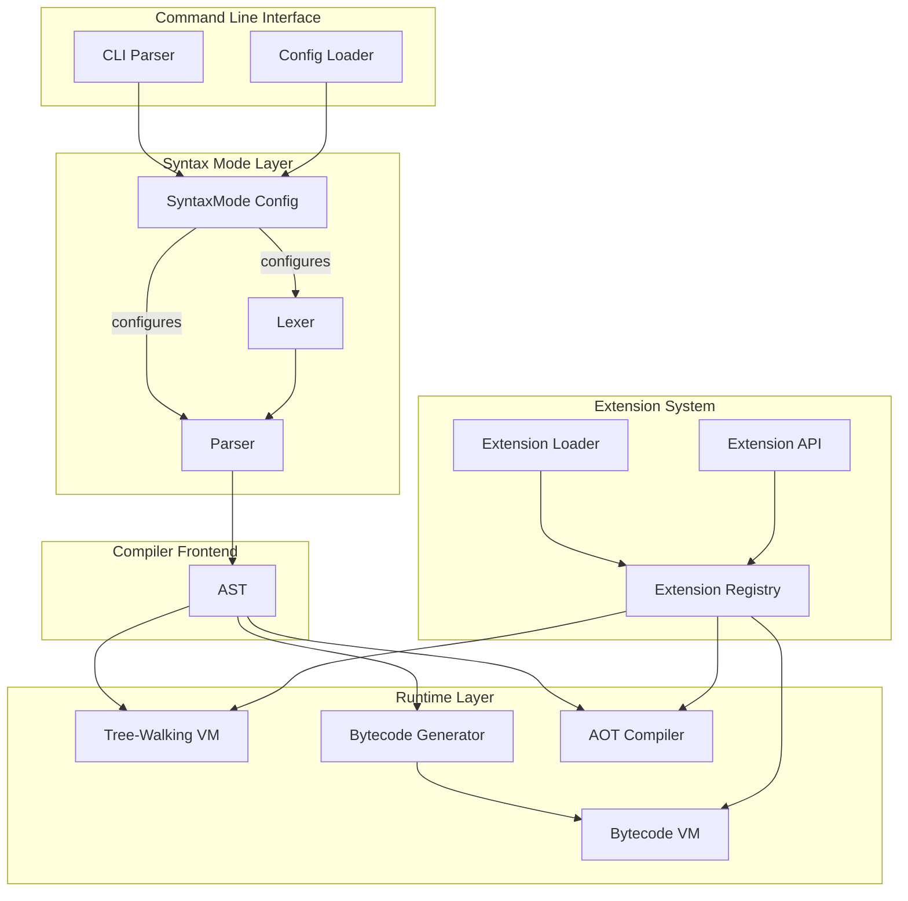

# Design Document: Multi-Syntax Mode and Extension System

## Overview

本设计文档描述了 zig-php 解释器的多语法模式支持和第三方扩展系统的技术实现。系统采用分层架构，确保语法模式在编译器前端（词法分析、语法分析）处理，而运行时（VM、字节码、AOT）保持语法无关。扩展系统通过定义良好的 API 接口，允许第三方在不修改核心代码的情况下扩展功能。

## Architecture



## Components and Interfaces

### 1. SyntaxMode 配置结构

```zig
/// 语法模式枚举
pub const SyntaxMode = enum {
    /// PHP 风格: $var, $obj->prop, $obj->method()
    php,
    /// Go 风格: var, obj.prop, obj.method()
    go,
    /// 未来可扩展: Rust 风格, Python 风格等
    // rust,
    // python,
    
    pub fn fromString(str: []const u8) ?SyntaxMode {
        if (std.mem.eql(u8, str, "php")) return .php;
        if (std.mem.eql(u8, str, "go")) return .go;
        return null;
    }
    
    pub fn toString(self: SyntaxMode) []const u8 {
        return switch (self) {
            .php => "php",
            .go => "go",
        };
    }
};

/// 语法模式配置
pub const SyntaxConfig = struct {
    mode: SyntaxMode = .php,
    /// 是否允许混合模式（文件级别切换）
    allow_mixed_mode: bool = true,
    /// 错误消息使用的语法风格
    error_display_mode: SyntaxMode = .php,
    
    pub fn init(mode: SyntaxMode) SyntaxConfig {
        return .{
            .mode = mode,
            .error_display_mode = mode,
        };
    }
};
```

### 2. 增强的 Lexer 接口

```zig
pub const Lexer = struct {
    buffer: [:0]const u8,
    pos: usize = 0,
    state: State = .initial,
    syntax_mode: SyntaxMode = .php,
    
    /// 初始化带语法模式的词法分析器
    pub fn initWithMode(buffer: [:0]const u8, mode: SyntaxMode) Lexer {
        return .{
            .buffer = buffer,
            .syntax_mode = mode,
        };
    }
    
    /// 词法分析主函数 - 根据语法模式处理
    pub fn next(self: *Lexer) Token {
        // ... 现有逻辑 ...
        
        // Go 模式特殊处理
        if (self.syntax_mode == .go) {
            return self.nextGoMode();
        }
        
        return self.nextPhpMode();
    }
    
    /// Go 模式词法分析
    fn nextGoMode(self: *Lexer) Token {
        const char = self.buffer[self.pos];
        
        // Go 模式下，标识符直接作为变量
        if (std.ascii.isAlphabetic(char) or char == '_') {
            return self.lexGoIdentifier();
        }
        
        // . 在 Go 模式下用于属性访问
        if (char == '.') {
            return self.lexGoDotAccess();
        }
        
        // $ 在 Go 模式下是非法的
        if (char == '$') {
            return .{ .tag = .invalid, .loc = .{ .start = self.pos, .end = self.pos + 1 } };
        }
        
        // 其他 token 与 PHP 模式相同
        return self.nextPhpMode();
    }
    
    /// Go 模式标识符解析
    fn lexGoIdentifier(self: *Lexer) Token {
        const start = self.pos;
        while (self.pos < self.buffer.len and 
               (std.ascii.isAlphanumeric(self.buffer[self.pos]) or self.buffer[self.pos] == '_')) {
            self.pos += 1;
        }
        
        const text = self.buffer[start..self.pos];
        
        // 检查是否是关键字
        if (self.isKeyword(text)) |keyword_tag| {
            return .{ .tag = keyword_tag, .loc = .{ .start = start, .end = self.pos } };
        }
        
        // Go 模式下，非关键字标识符作为变量
        return .{ .tag = .t_go_identifier, .loc = .{ .start = start, .end = self.pos } };
    }
    
    /// Go 模式点访问解析
    fn lexGoDotAccess(self: *Lexer) Token {
        const start = self.pos;
        self.pos += 1; // consume '.'
        
        // 检查是否是数字（浮点数）
        if (self.pos < self.buffer.len and std.ascii.isDigit(self.buffer[self.pos])) {
            self.pos = start; // 回退
            return self.lexNumber(start);
        }
        
        // 检查是否是 ... (ellipsis)
        if (self.pos + 1 < self.buffer.len and 
            self.buffer[self.pos] == '.' and self.buffer[self.pos + 1] == '.') {
            self.pos += 2;
            return .{ .tag = .ellipsis, .loc = .{ .start = start, .end = self.pos } };
        }
        
        // 属性访问 - 返回 arrow token 以保持与 PHP 模式的 AST 兼容性
        return .{ .tag = .arrow, .loc = .{ .start = start, .end = self.pos } };
    }
};
```

### 3. 增强的 Parser 接口

```zig
pub const Parser = struct {
    lexer: Lexer,
    allocator: std.mem.Allocator,
    context: *PHPContext,
    syntax_mode: SyntaxMode = .php,
    
    /// 初始化带语法模式的解析器
    pub fn initWithMode(
        allocator: std.mem.Allocator,
        context: *PHPContext,
        source: [:0]const u8,
        mode: SyntaxMode
    ) !Parser {
        var lexer = Lexer.initWithMode(source, mode);
        return Parser{
            .lexer = lexer,
            .allocator = allocator,
            .context = context,
            .syntax_mode = mode,
            .curr = lexer.next(),
            .peek = lexer.next(),
        };
    }
    
    /// 解析变量 - 根据语法模式处理
    fn parseVariable(self: *Parser) !ast.Node.Index {
        if (self.syntax_mode == .go) {
            return self.parseGoVariable();
        }
        return self.parsePhpVariable();
    }
    
    /// Go 模式变量解析
    fn parseGoVariable(self: *Parser) !ast.Node.Index {
        const token = try self.eat(.t_go_identifier);
        const raw_name = self.lexer.buffer[token.loc.start..token.loc.end];
        
        // 内部添加 $ 前缀以保持与 VM 的兼容性
        const var_name = try std.fmt.allocPrint(self.allocator, "${s}", .{raw_name});
        defer self.allocator.free(var_name);
        
        const name_id = try self.context.intern(var_name);
        return self.createNode(.{
            .tag = .variable,
            .main_token = token,
            .data = .{ .variable = .{ .name = name_id } },
        });
    }
    
    /// 解析属性访问 - 两种模式产生相同的 AST
    fn parsePropertyAccess(self: *Parser, target: ast.Node.Index) !ast.Node.Index {
        const op = try self.eat(.arrow); // Go 模式的 . 已被 lexer 转换为 arrow
        
        const member_tok = try self.eat(.t_string);
        const member_id = try self.context.intern(
            self.lexer.buffer[member_tok.loc.start..member_tok.loc.end]
        );
        
        // 检查是否是方法调用
        if (self.curr.tag == .l_paren) {
            return self.parseMethodCall(target, member_id, op);
        }
        
        return self.createNode(.{
            .tag = .property_access,
            .main_token = op,
            .data = .{ .property_access = .{
                .target = target,
                .property_name = member_id,
            }},
        });
    }
};
```

### 4. Extension API 接口

```zig
/// 扩展 API 版本
pub const EXTENSION_API_VERSION: u32 = 1;

/// 扩展信息结构
pub const ExtensionInfo = struct {
    name: []const u8,
    version: []const u8,
    api_version: u32,
    author: []const u8,
    description: []const u8,
};

/// 扩展函数签名
pub const ExtensionFunction = struct {
    name: []const u8,
    callback: *const fn (*VM, []const Value) anyerror!Value,
    min_args: u8,
    max_args: u8,
    return_type: ?[]const u8,
    param_types: []const []const u8,
};

/// 扩展类定义
pub const ExtensionClass = struct {
    name: []const u8,
    parent: ?[]const u8,
    interfaces: []const []const u8,
    methods: []const ExtensionMethod,
    properties: []const ExtensionProperty,
    constructor: ?*const fn (*VM, *Object, []const Value) anyerror!void,
    destructor: ?*const fn (*VM, *Object) void,
};

/// 扩展方法定义
pub const ExtensionMethod = struct {
    name: []const u8,
    callback: *const fn (*VM, *Object, []const Value) anyerror!Value,
    modifiers: ast.Node.Modifier,
    min_args: u8,
    max_args: u8,
};

/// 扩展属性定义
pub const ExtensionProperty = struct {
    name: []const u8,
    default_value: ?Value,
    modifiers: ast.Node.Modifier,
    type_hint: ?[]const u8,
};

/// 扩展接口 - 所有扩展必须实现
pub const Extension = struct {
    info: ExtensionInfo,
    
    /// 初始化扩展
    init_fn: *const fn (*ExtensionRegistry) anyerror!void,
    
    /// 关闭扩展
    shutdown_fn: ?*const fn (*ExtensionRegistry) void,
    
    /// 注册的函数列表
    functions: []const ExtensionFunction,
    
    /// 注册的类列表
    classes: []const ExtensionClass,
    
    /// 语法钩子（可选）
    syntax_hooks: ?*const SyntaxHooks,
};

/// 语法钩子接口
pub const SyntaxHooks = struct {
    /// 自定义关键字列表
    custom_keywords: []const []const u8,
    
    /// 语句解析钩子
    parse_statement: ?*const fn (*Parser, Token) anyerror!?ast.Node.Index,
    
    /// 表达式解析钩子
    parse_expression: ?*const fn (*Parser, u8) anyerror!?ast.Node.Index,
};
```

### 5. Extension Registry 实现

```zig
pub const ExtensionRegistry = struct {
    allocator: std.mem.Allocator,
    extensions: std.StringHashMap(*Extension),
    functions: std.StringHashMap(ExtensionFunction),
    classes: std.StringHashMap(ExtensionClass),
    syntax_hooks: std.ArrayList(*const SyntaxHooks),
    
    pub fn init(allocator: std.mem.Allocator) ExtensionRegistry {
        return .{
            .allocator = allocator,
            .extensions = std.StringHashMap(*Extension).init(allocator),
            .functions = std.StringHashMap(ExtensionFunction).init(allocator),
            .classes = std.StringHashMap(ExtensionClass).init(allocator),
            .syntax_hooks = std.ArrayList(*const SyntaxHooks).init(allocator),
        };
    }
    
    pub fn deinit(self: *ExtensionRegistry) void {
        // 调用所有扩展的 shutdown
        var ext_iter = self.extensions.iterator();
        while (ext_iter.next()) |entry| {
            if (entry.value_ptr.*.shutdown_fn) |shutdown| {
                shutdown(self);
            }
        }
        
        self.extensions.deinit();
        self.functions.deinit();
        self.classes.deinit();
        self.syntax_hooks.deinit();
    }
    
    /// 加载动态库扩展
    pub fn loadExtension(self: *ExtensionRegistry, path: []const u8) !void {
        const lib = try std.DynLib.open(path);
        errdefer lib.close();
        
        // 获取扩展入口点
        const get_extension = lib.lookup(
            *const fn () *Extension,
            "zigphp_get_extension"
        ) orelse return error.InvalidExtension;
        
        const extension = get_extension();
        
        // 验证 API 版本
        if (extension.info.api_version > EXTENSION_API_VERSION) {
            return error.IncompatibleApiVersion;
        }
        
        // 初始化扩展
        try extension.init_fn(self);
        
        // 注册函数
        for (extension.functions) |func| {
            try self.registerFunction(func);
        }
        
        // 注册类
        for (extension.classes) |class| {
            try self.registerClass(class);
        }
        
        // 注册语法钩子
        if (extension.syntax_hooks) |hooks| {
            try self.syntax_hooks.append(hooks);
        }
        
        try self.extensions.put(extension.info.name, extension);
    }
    
    /// 注册函数
    pub fn registerFunction(self: *ExtensionRegistry, func: ExtensionFunction) !void {
        if (self.functions.contains(func.name)) {
            return error.FunctionAlreadyExists;
        }
        try self.functions.put(func.name, func);
    }
    
    /// 注册类
    pub fn registerClass(self: *ExtensionRegistry, class: ExtensionClass) !void {
        if (self.classes.contains(class.name)) {
            return error.ClassAlreadyExists;
        }
        try self.classes.put(class.name, class);
    }
    
    /// 查找扩展函数
    pub fn findFunction(self: *ExtensionRegistry, name: []const u8) ?ExtensionFunction {
        return self.functions.get(name);
    }
    
    /// 查找扩展类
    pub fn findClass(self: *ExtensionRegistry, name: []const u8) ?ExtensionClass {
        return self.classes.get(name);
    }
};
```

### 6. 配置文件加载器

```zig
pub const ConfigLoader = struct {
    allocator: std.mem.Allocator,
    
    pub const Config = struct {
        syntax_mode: SyntaxMode = .php,
        extensions: []const []const u8 = &.{},
        include_paths: []const []const u8 = &.{},
        error_reporting: u32 = 0xFFFF,
    };
    
    pub fn load(self: *ConfigLoader, path: []const u8) !Config {
        const file = std.fs.cwd().openFile(path, .{}) catch |err| {
            if (err == error.FileNotFound) {
                return Config{}; // 使用默认配置
            }
            return err;
        };
        defer file.close();
        
        const content = try file.readToEndAlloc(self.allocator, 1024 * 1024);
        defer self.allocator.free(content);
        
        return self.parseJson(content);
    }
    
    fn parseJson(self: *ConfigLoader, content: []const u8) !Config {
        var config = Config{};
        
        var parser = std.json.Parser.init(self.allocator, false);
        defer parser.deinit();
        
        var tree = try parser.parse(content);
        defer tree.deinit();
        
        const root = tree.root.Object;
        
        if (root.get("syntax")) |syntax| {
            if (SyntaxMode.fromString(syntax.String)) |mode| {
                config.syntax_mode = mode;
            }
        }
        
        if (root.get("extensions")) |exts| {
            var ext_list = std.ArrayList([]const u8).init(self.allocator);
            for (exts.Array.items) |ext| {
                try ext_list.append(try self.allocator.dupe(u8, ext.String));
            }
            config.extensions = ext_list.toOwnedSlice();
        }
        
        return config;
    }
};
```

### 7. VM 扩展集成

```zig
pub const VM = struct {
    // ... 现有字段 ...
    extension_registry: *ExtensionRegistry,
    syntax_config: SyntaxConfig,
    
    /// 调用函数 - 支持扩展函数
    pub fn callFunction(self: *VM, name: []const u8, args: []const Value) !Value {
        // 首先检查扩展函数
        if (self.extension_registry.findFunction(name)) |ext_func| {
            // 验证参数数量
            if (args.len < ext_func.min_args or args.len > ext_func.max_args) {
                return error.ArgumentCountMismatch;
            }
            return ext_func.callback(self, args);
        }
        
        // 然后检查内置函数
        if (self.stdlib.getFunction(name)) |builtin| {
            return builtin(self, args);
        }
        
        // 最后检查用户定义函数
        return self.callUserFunc(name, args);
    }
    
    /// 实例化类 - 支持扩展类
    pub fn instantiateClass(self: *VM, name: []const u8, args: []const Value) !Value {
        // 首先检查扩展类
        if (self.extension_registry.findClass(name)) |ext_class| {
            return self.instantiateExtensionClass(ext_class, args);
        }
        
        // 然后检查内置类
        if (self.builtin_classes.get(name)) |builtin_class| {
            return self.instantiateBuiltinClass(builtin_class, args);
        }
        
        // 最后检查用户定义类
        return self.instantiateUserClass(name, args);
    }
    
    /// 实例化扩展类
    fn instantiateExtensionClass(self: *VM, class: ExtensionClass, args: []const Value) !Value {
        var obj = try Object.init(self.allocator);
        obj.class_name = class.name;
        
        // 设置默认属性值
        for (class.properties) |prop| {
            if (prop.default_value) |default| {
                try obj.setProperty(prop.name, default);
            }
        }
        
        // 调用构造函数
        if (class.constructor) |ctor| {
            try ctor(self, obj, args);
        }
        
        return Value.initObject(obj);
    }
    
    /// 格式化错误消息 - 语法感知
    pub fn formatError(self: *VM, message: []const u8, var_name: ?[]const u8) []const u8 {
        if (self.syntax_config.error_display_mode == .go) {
            // Go 模式：移除 $ 前缀
            if (var_name) |name| {
                if (name.len > 0 and name[0] == '$') {
                    return std.fmt.allocPrint(
                        self.allocator,
                        "{s}: {s}",
                        .{ message, name[1..] }
                    ) catch message;
                }
            }
        }
        return message;
    }
};
```

## Data Models

### Token 扩展

```zig
pub const Token = struct {
    pub const Tag = enum {
        // ... 现有 tags ...
        
        // Go 模式特有 tokens
        t_go_identifier,  // Go 模式下的标识符（变量）
        t_go_dot_access,  // Go 模式下的点访问（内部使用）
    };
};
```

### 配置文件格式

```json
{
    "syntax": "go",
    "extensions": [
        "./extensions/mysql.so",
        "./extensions/redis.so"
    ],
    "include_paths": [
        "./lib",
        "./vendor"
    ],
    "error_reporting": 32767
}
```

### 文件级语法指令

```php
// @syntax: go
// 或
<?php // @syntax: php

// 文件内容...
```


## Correctness Properties

*A property is a characteristic or behavior that should hold true across all valid executions of a system-essentially, a formal statement about what the system should do. Properties serve as the bridge between human-readable specifications and machine-verifiable correctness guarantees.*

### Property 1: Lexer Mode Configuration Consistency

*For any* valid source code and syntax mode configuration, the Lexer initialized with that mode SHALL produce tokens consistent with the specified mode's rules (PHP mode: `$` prefix for variables, `->` for property access; Go mode: no `$` prefix, `.` for property access).

**Validates: Requirements 1.1, 1.2, 1.5**

### Property 2: Go Mode Identifier Tokenization

*For any* identifier string in Go mode, the Lexer SHALL tokenize it as a variable token (t_go_identifier) unless it matches a reserved keyword.

**Validates: Requirements 2.1, 2.4**

### Property 3: Go Mode Property Access Tokenization

*For any* dot-identifier sequence (e.g., `.property`) in Go mode, the Lexer SHALL emit an arrow token followed by an identifier token, equivalent to PHP's `->property` tokenization.

**Validates: Requirements 2.2, 2.5**

### Property 4: Go Mode Dollar Sign Rejection

*For any* source code containing `$` character in Go mode, the Lexer SHALL emit an invalid token and report a syntax error.

**Validates: Requirements 2.3**

### Property 5: AST Semantic Equivalence

*For any* semantically equivalent code written in PHP mode and Go mode, the Parser SHALL produce AST nodes that are structurally equivalent (same node types, same relationships) with only internal naming differences (Go mode variables have `$` prefix added internally).

**Validates: Requirements 3.1, 3.2, 3.3, 3.4, 3.5**

### Property 6: VM Execution Determinism

*For any* valid AST, the VM SHALL produce identical execution results regardless of the original syntax mode used to generate the AST.

**Validates: Requirements 4.1, 4.2, 4.3**

### Property 7: Bytecode Generation Equivalence

*For any* semantically equivalent AST nodes (regardless of original syntax mode), the Bytecode Generator SHALL produce identical bytecode sequences.

**Validates: Requirements 5.1, 5.2, 5.3**

### Property 8: AOT Compilation Mode Independence

*For any* valid source file, the AOT Compiler SHALL produce functionally equivalent native code regardless of the syntax mode used in the source.

**Validates: Requirements 6.1, 6.2**

### Property 9: Extension Lifecycle Management

*For any* loaded extension, the Extension Registry SHALL call the init function exactly once during loading and the shutdown function exactly once during interpreter shutdown (if provided).

**Validates: Requirements 7.5, 8.2, 8.5**

### Property 10: Extension Function Invocation

*For any* registered extension function, when called from user code, the VM SHALL invoke the extension's callback with the correct arguments and return the callback's result.

**Validates: Requirements 9.2, 9.3**

### Property 11: Extension Function Conflict Detection

*For any* attempt to register a function with a name that already exists (either built-in or previously registered), the Extension Registry SHALL return an error and not overwrite the existing function.

**Validates: Requirements 9.4**

### Property 12: Extension Class Instantiation

*For any* registered extension class, when instantiated via `new ClassName()`, the VM SHALL create an object with the class's defined properties and call the constructor if provided.

**Validates: Requirements 10.2, 10.3, 10.4**

### Property 13: Syntax Hook Delegation

*For any* registered syntax hook, when the Parser encounters the hook's trigger condition, it SHALL delegate parsing to the hook's handler and incorporate the returned AST node.

**Validates: Requirements 11.3, 11.4**

### Property 14: Configuration Precedence

*For any* configuration option specified in both config file and command line, the command line value SHALL take precedence over the config file value.

**Validates: Requirements 12.2, 12.3, 12.4**

### Property 15: Cross-Mode File Inclusion

*For any* file inclusion (include/require), the System SHALL correctly parse the included file using its specified or detected syntax mode, and function calls between files of different modes SHALL work correctly.

**Validates: Requirements 13.1, 13.2, 13.3, 13.4**

### Property 16: Syntax-Aware Error Formatting

*For any* error occurring during execution, the error message SHALL format variable names and operators according to the syntax mode of the source file where the error originated.

**Validates: Requirements 14.1, 14.2, 14.3, 14.4**

### Property 17: Extension API Version Compatibility

*For any* extension with API version greater than the interpreter's supported version, the Extension Loader SHALL reject the extension and report an incompatibility error.

**Validates: Requirements 15.2, 15.3**

## Error Handling

### Syntax Mode Errors

| Error Type | Condition | Handling |
|------------|-----------|----------|
| InvalidSyntaxMode | Unknown mode specified | Display error, list valid modes, exit |
| GoModeDollarSign | `$` in Go mode source | Lexer error, suggest removing `$` |
| MixedModeConflict | Conflicting mode directives | Use first directive, warn user |

### Extension Errors

| Error Type | Condition | Handling |
|------------|-----------|----------|
| ExtensionNotFound | Path doesn't exist | Log warning, continue without extension |
| InvalidExtension | Missing entry point | Log error, continue without extension |
| IncompatibleApiVersion | Version mismatch | Log error with version info, skip extension |
| FunctionConflict | Duplicate function name | Return error during registration |
| ClassConflict | Duplicate class name | Return error during registration |
| ExtensionInitFailed | Init function throws | Log error, unload extension |

### Runtime Errors

| Error Type | Condition | Handling |
|------------|-----------|----------|
| UndefinedVariable | Variable not found | Throw exception with syntax-aware message |
| UndefinedProperty | Property not found | Throw exception with syntax-aware message |
| UndefinedMethod | Method not found | Throw exception with syntax-aware message |
| ExtensionCallFailed | Extension callback throws | Propagate exception with extension context |

## Testing Strategy

### Dual Testing Approach

本项目采用单元测试和属性测试相结合的方式：

- **单元测试**: 验证特定示例、边界情况和错误条件
- **属性测试**: 验证跨所有输入的通用属性

### Property-Based Testing Configuration

- **测试框架**: Zig 内置测试框架 + 自定义属性测试工具
- **最小迭代次数**: 每个属性测试 100 次迭代
- **标签格式**: `Feature: multi-syntax-extension-system, Property N: {property_text}`

### Test Categories

#### 1. Lexer Tests

```zig
// Property 1: Lexer Mode Configuration
test "Feature: multi-syntax-extension-system, Property 1: Lexer mode configuration" {
    // Generate random valid source code
    // Test with both PHP and Go modes
    // Verify token sequences match mode rules
}

// Property 2: Go Mode Identifier Tokenization
test "Feature: multi-syntax-extension-system, Property 2: Go mode identifier tokenization" {
    // Generate random identifiers
    // Verify non-keywords become t_go_identifier
}

// Property 4: Go Mode Dollar Sign Rejection
test "Feature: multi-syntax-extension-system, Property 4: Go mode dollar sign rejection" {
    // Generate source with $ characters
    // Verify invalid token is emitted
}
```

#### 2. Parser Tests

```zig
// Property 5: AST Semantic Equivalence
test "Feature: multi-syntax-extension-system, Property 5: AST semantic equivalence" {
    // Generate equivalent PHP and Go mode source
    // Parse both
    // Compare AST structures (ignoring internal naming)
}
```

#### 3. VM Tests

```zig
// Property 6: VM Execution Determinism
test "Feature: multi-syntax-extension-system, Property 6: VM execution determinism" {
    // Generate AST from both modes
    // Execute both
    // Compare results
}
```

#### 4. Extension Tests

```zig
// Property 9: Extension Lifecycle
test "Feature: multi-syntax-extension-system, Property 9: Extension lifecycle" {
    // Create mock extension
    // Load and unload
    // Verify init/shutdown called exactly once
}

// Property 11: Function Conflict Detection
test "Feature: multi-syntax-extension-system, Property 11: Function conflict detection" {
    // Register function
    // Attempt to register same name
    // Verify error returned
}
```

#### 5. Integration Tests

```zig
// Property 15: Cross-Mode File Inclusion
test "Feature: multi-syntax-extension-system, Property 15: Cross-mode inclusion" {
    // Create PHP mode file with function
    // Create Go mode file that includes and calls it
    // Verify correct execution
}
```

### Unit Test Examples

```zig
// Example: Default syntax mode
test "default syntax mode is PHP" {
    const config = SyntaxConfig{};
    try std.testing.expectEqual(SyntaxMode.php, config.mode);
}

// Example: Invalid syntax mode error
test "invalid syntax mode returns error" {
    const result = SyntaxMode.fromString("invalid");
    try std.testing.expect(result == null);
}

// Example: Config file loading
test "config file loads syntax mode" {
    // Create temp config file
    // Load config
    // Verify syntax mode is set
}
```

### Test Data Generators

```zig
/// 生成随机有效标识符
fn generateIdentifier(random: std.rand.Random) []const u8 {
    const first_chars = "abcdefghijklmnopqrstuvwxyzABCDEFGHIJKLMNOPQRSTUVWXYZ_";
    const rest_chars = first_chars ++ "0123456789";
    
    var buf: [32]u8 = undefined;
    buf[0] = first_chars[random.int(usize) % first_chars.len];
    
    const len = random.intRangeAtMost(usize, 1, 31);
    for (buf[1..len]) |*c| {
        c.* = rest_chars[random.int(usize) % rest_chars.len];
    }
    
    return buf[0..len];
}

/// 生成随机有效表达式
fn generateExpression(random: std.rand.Random, mode: SyntaxMode) []const u8 {
    // Generate variable access, property access, method calls, etc.
    // Based on syntax mode
}
```
