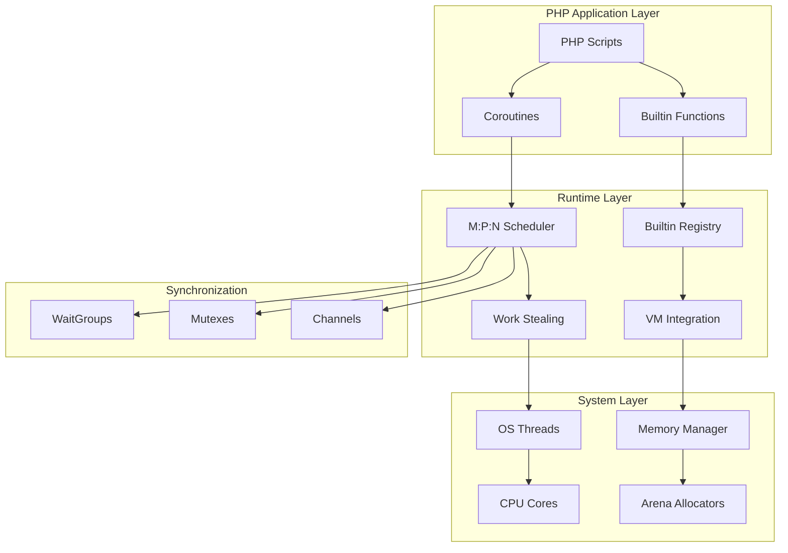
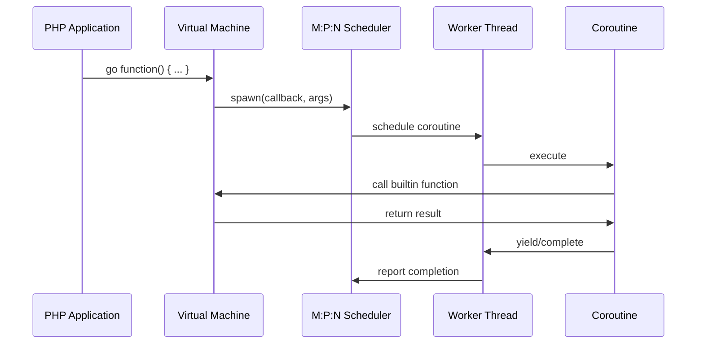

# Design Document

## Overview

This design implements a comprehensive set of PHP builtin functions and a production-grade concurrent coroutine system for the zig-php interpreter. The system provides high-performance, memory-safe implementations that match or exceed Go's runtime performance characteristics.

The design follows a modular architecture with clear separation between builtin functions, the M:P:N scheduler, synchronization primitives, and memory management. All components are designed for zero memory leaks, sub-microsecond latency, and linear scalability.

## Architecture

### High-Level Architecture



### Component Interaction



## Components and Interfaces

### 1. Builtin Function Registry

**File**: `src/runtime/builtin_registry.zig`

The builtin registry provides a centralized system for registering and dispatching native functions.

```zig
pub const BuiltinRegistry = struct {
    functions: std.StringHashMap(BuiltinFunction),
    allocator: std.mem.Allocator,
    
    pub const BuiltinFunction = struct {
        name: []const u8,
        category: Category,
        handler: *const fn(*VM, []Value) anyerror!Value,
        min_args: u8,
        max_args: u8,
        is_variadic: bool,
    };
    
    pub const Category = enum {
        time,
        math,
        random,
        string,
        array,
        bigdecimal,
    };
    
    pub fn init(allocator: std.mem.Allocator) BuiltinRegistry;
    pub fn register(self: *BuiltinRegistry, func: BuiltinFunction) !void;
    pub fn call(self: *BuiltinRegistry, vm: *VM, name: []const u8, args: []Value) !Value;
    pub fn exists(self: *BuiltinRegistry, name: []const u8) bool;
};
```

### 2. Time and Sleep Functions

**File**: `src/runtime/builtin_time.zig`

Implements coroutine-aware time functions with high precision.

```zig
pub const TimeBuiltins = struct {
    pub fn time(vm: *VM, args: []Value) !Value;
    pub fn microtime(vm: *VM, args: []Value) !Value;
    pub fn sleep(vm: *VM, args: []Value) !Value;
    pub fn usleep(vm: *VM, args: []Value) !Value;
    pub fn date(vm: *VM, args: []Value) !Value;
    
    // Coroutine-aware sleep implementation
    fn coSleep(vm: *VM, duration_us: u64) !void;
};
```

**Key Features**:
- Coroutine-aware sleep that yields to scheduler
- Microsecond precision timing
- Timezone-aware date formatting
- Integration with scheduler's timer wheel

### 3. Mathematical Functions

**File**: `src/runtime/builtin_math.zig`

High-performance mathematical operations with proper error handling.

```zig
pub const MathBuiltins = struct {
    pub fn abs(vm: *VM, args: []Value) !Value;
    pub fn ceil(vm: *VM, args: []Value) !Value;
    pub fn floor(vm: *VM, args: []Value) !Value;
    pub fn round(vm: *VM, args: []Value) !Value;
    pub fn sqrt(vm: *VM, args: []Value) !Value;
    pub fn pow(vm: *VM, args: []Value) !Value;
    pub fn sin(vm: *VM, args: []Value) !Value;
    pub fn cos(vm: *VM, args: []Value) !Value;
    pub fn tan(vm: *VM, args: []Value) !Value;
    pub fn log(vm: *VM, args: []Value) !Value;
    pub fn log10(vm: *VM, args: []Value) !Value;
    pub fn min(vm: *VM, args: []Value) !Value;
    pub fn max(vm: *VM, args: []Value) !Value;
};
```

### 4. Random Number Generation

**File**: `src/runtime/builtin_random.zig`

Thread-safe random number generation with multiple algorithms.

```zig
pub const RandomBuiltins = struct {
    rng: std.Random.DefaultPrng,
    mt_rng: std.Random.Xoshiro256,
    crypto_rng: std.crypto.random,
    mutex: std.Thread.Mutex,
    
    pub fn init(allocator: std.mem.Allocator) RandomBuiltins;
    pub fn rand(vm: *VM, args: []Value) !Value;
    pub fn mt_rand(vm: *VM, args: []Value) !Value;
    pub fn srand(vm: *VM, args: []Value) !Value;
    pub fn mt_srand(vm: *VM, args: []Value) !Value;
    pub fn random_int(vm: *VM, args: []Value) !Value;
    pub fn random_bytes(vm: *VM, args: []Value) !Value;
};
```

### 5. BigDecimal Implementation

**File**: `src/runtime/bigdecimal.zig`

High-precision decimal arithmetic for financial calculations.

```zig
pub const BigDecimal = struct {
    digits: []u8,
    scale: u32,
    sign: bool, // true for positive, false for negative
    allocator: std.mem.Allocator,
    
    pub fn init(allocator: std.mem.Allocator, value: []const u8) !*BigDecimal;
    pub fn fromInt(allocator: std.mem.Allocator, value: i64) !*BigDecimal;
    pub fn fromFloat(allocator: std.mem.Allocator, value: f64) !*BigDecimal;
    
    pub fn add(self: *BigDecimal, other: *BigDecimal) !*BigDecimal;
    pub fn subtract(self: *BigDecimal, other: *BigDecimal) !*BigDecimal;
    pub fn multiply(self: *BigDecimal, other: *BigDecimal) !*BigDecimal;
    pub fn divide(self: *BigDecimal, other: *BigDecimal) !*BigDecimal;
    pub fn compare(self: *BigDecimal, other: *BigDecimal) i8;
    
    pub fn toString(self: *BigDecimal) ![]u8;
    pub fn setScale(self: *BigDecimal, scale: u32) void;
    pub fn deinit(self: *BigDecimal) void;
};
```

### 6. M:P:N Scheduler

**File**: `src/runtime/scheduler.zig`

Production-grade scheduler implementing Go's runtime model.

```zig
pub const Scheduler = struct {
    config: SchedulerConfig,
    processors: []Processor,
    workers: []Worker,
    global_queue: GlobalQueue,
    timer_wheel: TimerWheel,
    netpoller: NetPoller,
    allocator: std.mem.Allocator,
    running: std.atomic.Value(bool),
    
    pub const SchedulerConfig = struct {
        num_processors: u32,
        num_workers: u32,
        stack_size: usize,
        time_slice_us: u32,
        enable_preemption: bool,
        enable_work_stealing: bool,
        gc_trigger_threshold: usize,
    };
    
    pub fn init(allocator: std.mem.Allocator, config: SchedulerConfig) !Scheduler;
    pub fn start(self: *Scheduler) !void;
    pub fn stop(self: *Scheduler) void;
    pub fn spawn(self: *Scheduler, callback: Value, args: []Value) !u64;
    pub fn yield(self: *Scheduler, coroutine_id: u64) void;
    pub fn park(self: *Scheduler, coroutine_id: u64, reason: ParkReason) void;
    pub fn unpark(self: *Scheduler, coroutine_id: u64) void;
    pub fn deinit(self: *Scheduler) void;
};
```

### 7. Processor (P)

**File**: `src/runtime/processor.zig`

Logical processor managing local run queues and work stealing.

```zig
pub const Processor = struct {
    id: u32,
    local_queue: LocalQueue,
    current_coroutine: ?*Coroutine,
    worker: ?*Worker,
    scheduler: *Scheduler,
    rng: std.Random.DefaultPrng,
    
    pub const LocalQueue = struct {
        queues: [5]std.ArrayListUnmanaged(*Coroutine), // Priority queues
        head: [5]u32,
        tail: [5]u32,
        
        pub fn push(self: *LocalQueue, coro: *Coroutine, priority: u8) !void;
        pub fn pop(self: *LocalQueue) ?*Coroutine;
        pub fn steal(self: *LocalQueue, victim: *LocalQueue) ?*Coroutine;
        pub fn isEmpty(self: *LocalQueue) bool;
    };
    
    pub fn init(id: u32, scheduler: *Scheduler) Processor;
    pub fn schedule(self: *Processor) !void;
    pub fn execute(self: *Processor, coro: *Coroutine) !void;
    pub fn preempt(self: *Processor) void;
    pub fn deinit(self: *Processor) void;
};
```

### 8. Worker Thread (M)

**File**: `src/runtime/worker.zig`

OS thread that executes coroutines on processors.

```zig
pub const Worker = struct {
    id: u32,
    thread: std.Thread,
    processor: ?*Processor,
    scheduler: *Scheduler,
    parked: std.atomic.Value(bool),
    
    pub fn init(id: u32, scheduler: *Scheduler) Worker;
    pub fn start(self: *Worker) !void;
    pub fn park(self: *Worker) void;
    pub fn unpark(self: *Worker) void;
    pub fn handoff(self: *Worker, new_processor: *Processor) void;
    
    fn workerLoop(self: *Worker) void;
    fn findWork(self: *Worker) ?*Coroutine;
    fn stealWork(self: *Worker) ?*Coroutine;
};
```

### 9. Coroutine (G)

**File**: `src/runtime/coroutine_new.zig`

Lightweight execution context with stack and state management.

```zig
pub const Coroutine = struct {
    id: u64,
    state: State,
    stack: Stack,
    context: Context,
    callback: Value,
    args: []Value,
    result: ?Value,
    priority: u8,
    created_at: i64,
    
    pub const State = enum(u8) {
        created,
        ready,
        running,
        yielded,
        waiting,
        completed,
        cancelled,
    };
    
    pub const Stack = struct {
        data: []u8,
        size: usize,
        sp: usize, // Stack pointer
        bp: usize, // Base pointer
        
        pub fn init(allocator: std.mem.Allocator, size: usize) !Stack;
        pub fn deinit(self: *Stack, allocator: std.mem.Allocator) void;
        pub fn push(self: *Stack, value: Value) !void;
        pub fn pop(self: *Stack) ?Value;
    };
    
    pub const Context = struct {
        ip: usize, // Instruction pointer
        registers: [16]Value,
        locals: std.StringHashMap(Value),
        
        pub fn save(self: *Context, vm: *VM) !void;
        pub fn restore(self: *Context, vm: *VM) !void;
    };
    
    pub fn init(allocator: std.mem.Allocator, id: u64, callback: Value, args: []Value) !*Coroutine;
    pub fn execute(self: *Coroutine, vm: *VM) !void;
    pub fn yield(self: *Coroutine) void;
    pub fn complete(self: *Coroutine, result: Value) void;
    pub fn deinit(self: *Coroutine, allocator: std.mem.Allocator) void;
};
```

### 10. Channel Implementation

**File**: `src/runtime/channel_new.zig`

Go-compatible channel implementation with select support.

```zig
pub const Channel = struct {
    buffer: ?[]Value,
    capacity: usize,
    size: std.atomic.Value(usize),
    head: std.atomic.Value(usize),
    tail: std.atomic.Value(usize),
    closed: std.atomic.Value(bool),
    send_queue: WaitQueue,
    recv_queue: WaitQueue,
    mutex: std.Thread.Mutex,
    allocator: std.mem.Allocator,
    
    pub const WaitQueue = struct {
        waiters: std.ArrayListUnmanaged(Waiter),
        
        pub const Waiter = struct {
            coroutine_id: u64,
            value: ?*Value,
            ready: std.atomic.Value(bool),
        };
    };
    
    pub fn init(allocator: std.mem.Allocator, capacity: usize) !*Channel;
    pub fn send(self: *Channel, value: Value, coroutine_id: u64) !void;
    pub fn recv(self: *Channel, coroutine_id: u64) !?Value;
    pub fn trySend(self: *Channel, value: Value) bool;
    pub fn tryRecv(self: *Channel) ?Value;
    pub fn close(self: *Channel) void;
    pub fn isClosed(self: *Channel) bool;
    pub fn deinit(self: *Channel) void;
};
```

### 11. Select Statement

**File**: `src/runtime/select.zig`

Go-style select statement for non-deterministic channel operations.

```zig
pub const Select = struct {
    cases: []Case,
    default_case: ?*const fn() void,
    allocator: std.mem.Allocator,
    
    pub const Case = struct {
        channel: *Channel,
        operation: Operation,
        value: ?Value,
        handler: *const fn(?Value) void,
        
        pub const Operation = enum {
            send,
            recv,
        };
    };
    
    pub fn init(allocator: std.mem.Allocator) Select;
    pub fn addSendCase(self: *Select, channel: *Channel, value: Value, handler: *const fn(?Value) void) !void;
    pub fn addRecvCase(self: *Select, channel: *Channel, handler: *const fn(?Value) void) !void;
    pub fn setDefault(self: *Select, handler: *const fn() void) void;
    pub fn execute(self: *Select, coroutine_id: u64) !void;
    pub fn deinit(self: *Select) void;
};
```

### 12. Synchronization Primitives

**File**: `src/runtime/sync_new.zig`

Coroutine-aware synchronization primitives.

```zig
pub const Mutex = struct {
    locked: std.atomic.Value(bool),
    owner: std.atomic.Value(u64),
    wait_queue: WaitQueue,
    
    pub fn init(allocator: std.mem.Allocator) Mutex;
    pub fn lock(self: *Mutex, coroutine_id: u64) void;
    pub fn unlock(self: *Mutex, coroutine_id: u64) void;
    pub fn tryLock(self: *Mutex, coroutine_id: u64) bool;
    pub fn deinit(self: *Mutex) void;
};

pub const RWMutex = struct {
    readers: std.atomic.Value(u32),
    writer: std.atomic.Value(u64),
    read_wait_queue: WaitQueue,
    write_wait_queue: WaitQueue,
    
    pub fn init(allocator: std.mem.Allocator) RWMutex;
    pub fn readLock(self: *RWMutex, coroutine_id: u64) void;
    pub fn readUnlock(self: *RWMutex, coroutine_id: u64) void;
    pub fn writeLock(self: *RWMutex, coroutine_id: u64) void;
    pub fn writeUnlock(self: *RWMutex, coroutine_id: u64) void;
    pub fn deinit(self: *RWMutex) void;
};

pub const WaitGroup = struct {
    counter: std.atomic.Value(i32),
    wait_queue: WaitQueue,
    
    pub fn init(allocator: std.mem.Allocator) WaitGroup;
    pub fn add(self: *WaitGroup, delta: i32) void;
    pub fn done(self: *WaitGroup) void;
    pub fn wait(self: *WaitGroup, coroutine_id: u64) void;
    pub fn deinit(self: *WaitGroup) void;
};
```

## Data Models

### Value System Integration

The builtin functions integrate seamlessly with the existing Value system:

```zig
// Extended Value types for new builtins
pub const ValueType = enum(u8) {
    // Existing types...
    integer,
    float,
    string,
    array,
    object,
    
    // New types
    bigdecimal,
    channel,
    coroutine,
    mutex,
    rwmutex,
    waitgroup,
};

// BigDecimal value wrapper
pub fn initBigDecimal(bd: *BigDecimal) Value {
    return Value{
        .tag = .bigdecimal,
        .data = .{ .bigdecimal = bd },
    };
}

// Channel value wrapper
pub fn initChannel(ch: *Channel) Value {
    return Value{
        .tag = .channel,
        .data = .{ .channel = ch },
    };
}
```

### Memory Layout Optimization

```zig
// Optimized coroutine layout for cache efficiency
pub const Coroutine = struct {
    // Hot fields (frequently accessed) - first cache line
    id: u64,                    // 8 bytes
    state: State,               // 1 byte
    priority: u8,               // 1 byte
    _padding1: [6]u8,          // 6 bytes padding
    
    // Second cache line
    stack_ptr: *u8,            // 8 bytes
    stack_size: usize,         // 8 bytes
    context_ptr: *Context,     // 8 bytes
    scheduler_ptr: *Scheduler, // 8 bytes
    
    // Cold fields (less frequently accessed)
    callback: Value,
    args: []Value,
    result: ?Value,
    created_at: i64,
    
    // Ensure 64-byte alignment for cache line optimization
} align(64);
```

## Correctness Properties

*A property is a characteristic or behavior that should hold true across all valid executions of a system-essentially, a formal statement about what the system should do. Properties serve as the bridge between human-readable specifications and machine-verifiable correctness guarantees.*

### Time Function Properties

**Property 1: Time function returns valid timestamps**
*For any* call to time(), the returned value should be an integer within a reasonable range of the current system timestamp (within 1 second)
**Validates: Requirements 1.1**

**Property 2: Sleep duration accuracy**
*For any* positive sleep duration, the actual sleep time should be within 10% of the requested duration for sleep() and within 1% for usleep()
**Validates: Requirements 1.2, 1.3**

**Property 3: Microtime precision and format**
*For any* call to microtime(), the returned value should contain microsecond precision, and microtime(true) should return a float
**Validates: Requirements 1.4, 1.5**

**Property 4: Coroutine sleep yields execution**
*For any* coroutine that calls sleep() or usleep(), other coroutines should continue executing during the sleep period
**Validates: Requirements 1.6**

### Random Number Properties

**Property 5: Random number bounds**
*For any* call to rand() or rand(min, max), the returned value should be within the specified bounds (0 to RAND_MAX, or min to max inclusive)
**Validates: Requirements 2.1, 2.2**

**Property 6: Random distribution uniformity**
*For any* large sample of random numbers, the distribution should be approximately uniform across the specified range
**Validates: Requirements 2.1, 2.2**

### Mathematical Function Properties

**Property 7: Mathematical function correctness**
*For any* valid input to mathematical functions (abs, ceil, floor, round, sqrt, pow, sin, cos, tan, log, log10), the output should match the mathematical definition within floating-point precision
**Validates: Requirements 3.1, 3.2, 3.3, 3.4, 3.5, 3.6, 3.7, 3.8, 3.9, 3.10**

**Property 8: Min/max function correctness**
*For any* set of comparable values, min() should return the smallest value and max() should return the largest value
**Validates: Requirements 3.11, 3.12**

### BigDecimal Properties

**Property 9: BigDecimal precision preservation**
*For any* BigDecimal creation and arithmetic operation, the precision should be maintained without loss
**Validates: Requirements 4.1, 4.2, 4.3, 4.4, 4.5**

**Property 10: BigDecimal arithmetic properties**
*For any* BigDecimal values a, b, c: addition should be commutative (a+b = b+a) and associative ((a+b)+c = a+(b+c))
**Validates: Requirements 4.2**

**Property 11: BigDecimal comparison consistency**
*For any* BigDecimal values a, b: if a.compare(b) returns 0, then a and b should be mathematically equal
**Validates: Requirements 4.6**

### Concurrency Properties

**Property 12: Coroutine parallel execution**
*For any* multiple coroutines created with go keyword, they should execute in true parallel on available worker threads
**Validates: Requirements 5.1, 5.2**

**Property 13: Scheduler thread management**
*For any* scheduler initialization, exactly M=GOMAXPROCS worker threads and P=GOMAXPROCS logical processors should be created
**Validates: Requirements 6.1**

**Property 14: Work stealing load balancing**
*For any* uneven work distribution, the scheduler should rebalance load through work stealing within 100 microseconds
**Validates: Requirements 6.3, 6.4**

### Channel Properties

**Property 15: Unbuffered channel synchronization**
*For any* unbuffered channel, send operations should block until a corresponding receive operation occurs
**Validates: Requirements 7.1, 7.2**

**Property 16: Buffered channel capacity**
*For any* buffered channel with capacity N, exactly N send operations should succeed without blocking before the channel is full
**Validates: Requirements 7.2**

**Property 17: Channel close semantics**
*For any* closed channel, receive operations should return null for empty channels, and send operations should throw exceptions
**Validates: Requirements 7.7, 7.8**

### Synchronization Properties

**Property 18: Mutex mutual exclusion**
*For any* mutex, only one coroutine should be able to hold the lock at any given time
**Validates: Requirements 8.1, 8.2**

**Property 19: RWMutex reader-writer semantics**
*For any* RWMutex, multiple readers can hold read locks simultaneously, but write locks are exclusive
**Validates: Requirements 8.5, 8.6, 8.7**

**Property 20: WaitGroup synchronization**
*For any* WaitGroup, wait() should block until the counter reaches zero through done() calls
**Validates: Requirements 8.8, 8.9, 8.10, 8.11**

### Memory Management Properties

**Property 21: Memory leak prevention**
*For any* sequence of coroutine creation and destruction, memory usage should remain constant over time
**Validates: Requirements 9.1, 9.2**

**Property 22: Coroutine memory efficiency**
*For any* created coroutine, memory overhead should not exceed 4KB including stack space
**Validates: Requirements 10.1**

### Error Handling Properties

**Property 23: Error isolation**
*For any* coroutine that panics or throws an exception, other coroutines should continue executing normally
**Validates: Requirements 11.1**

**Property 24: Graceful error handling**
*For any* invalid input to builtin functions, appropriate exceptions should be thrown with meaningful error messages
**Validates: Requirements 11.8**

### Integration Properties

**Property 25: VM integration consistency**
*For any* builtin function call, the behavior should be indistinguishable from regular PHP function calls from the caller's perspective
**Validates: Requirements 12.1**

**Property 26: Thread-safe VM access**
*For any* concurrent access to VM state from multiple coroutines, data races should be prevented and consistency maintained
**Validates: Requirements 12.2**

## Error Handling

### Exception Hierarchy

```zig
pub const ConcurrencyError = error{
    ChannelClosed,
    DeadlockDetected,
    CoroutineTimeout,
    StackOverflow,
    InvalidPriority,
    SchedulerNotRunning,
};

pub const BuiltinError = error{
    InvalidArgument,
    DivisionByZero,
    MathDomainError,
    RandomSeedError,
    BigDecimalOverflow,
    TimeFormatError,
};
```

### Error Recovery Strategies

1. **Coroutine Isolation**: Panics in one coroutine don't affect others
2. **Graceful Degradation**: System continues operating with reduced functionality
3. **Resource Cleanup**: Automatic cleanup of resources when errors occur
4. **Error Propagation**: Structured error propagation through the call stack

## Testing Strategy

### Dual Testing Approach

The system uses both unit tests and property-based tests for comprehensive coverage:

**Unit Tests**:
- Specific examples and edge cases
- Integration points between components
- Error conditions and exception handling
- Performance benchmarks

**Property-Based Tests**:
- Universal properties across all inputs
- Comprehensive input coverage through randomization
- Concurrency correctness verification
- Memory safety validation

### Property-Based Testing Configuration

- **Minimum 1000 iterations** per property test for statistical significance
- **Concurrent test execution** to verify thread safety
- **Memory leak detection** integrated into all tests
- **Performance regression testing** with automated benchmarks

### Test Categories

1. **Builtin Function Tests**: Verify mathematical correctness and edge cases
2. **Concurrency Tests**: Verify scheduler behavior and synchronization
3. **Memory Tests**: Verify leak-free operation and efficiency
4. **Performance Tests**: Verify scalability and latency requirements
5. **Integration Tests**: Verify seamless VM integration
6. **Stress Tests**: Verify behavior under extreme load

Each property test must reference its design document property using the format:
**Feature: php-builtin-functions-concurrency, Property N: [property text]**

Now let me use the prework tool to analyze the acceptance criteria before writing the correctness properties:

<function_calls>
<invoke name="prework">
<parameter name="featureName">php-builtin-functions-concurrency