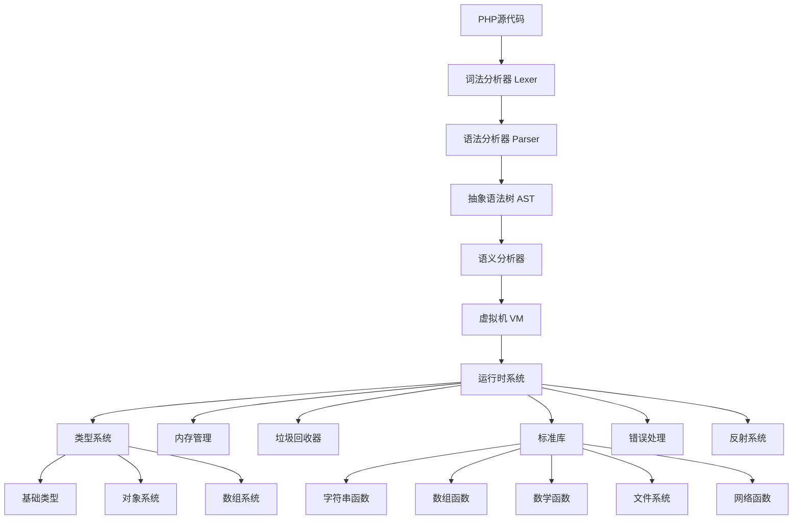

# PHP解释器增强设计文档

## 概述

本设计文档描述了如何将现有的PHP解释器增强为功能完整的PHP 8.5兼容解释器。设计基于现有的Zig实现，采用模块化架构，支持完整的PHP语言特性、标准库、错误处理、垃圾回收等核心功能。

## 架构

### 整体架构图



### 核心组件

1. **编译器前端**: 词法分析器、语法分析器、AST构建
2. **类型系统**: 动态类型管理、类型转换、类型检查
3. **虚拟机**: 指令执行、调用栈管理、作用域管理
4. **运行时系统**: 内存管理、垃圾回收、错误处理
5. **标准库**: 内置函数、扩展模块
6. **反射系统**: 运行时类型信息、动态调用

## 组件和接口

### 1. 增强的类型系统

#### 当前类型系统分析
现有的`Value`结构体支持基础类型，但缺少完整的PHP类型支持。

#### 新的类型系统设计

```zig
pub const Value = struct {
    tag: Tag,
    data: Data,
    
    pub const Tag = enum {
        // 基础类型
        null,
        boolean,
        integer,
        float,
        string,
        
        // 复合类型
        array,
        object,
        resource,
        
        // 可调用类型
        builtin_function,
        user_function,
        closure,
        
        // PHP 8.5 新特性
        enum_value,
        readonly_property,
    };
    
    pub const Data = union {
        null: void,
        boolean: bool,
        integer: i64,
        float: f64,
        string: *gc.Box(PHPString),
        array: *gc.Box(PHPArray),
        object: *gc.Box(PHPObject),
        resource: *gc.Box(PHPResource),
        builtin_function: *const BuiltinFunction,
        user_function: *gc.Box(UserFunction),
        closure: *gc.Box(Closure),
        enum_value: *gc.Box(EnumValue),
        readonly_property: *gc.Box(ReadonlyProperty),
    };
};
```

#### PHP字符串系统

```zig
pub const PHPString = struct {
    data: []u8,
    length: usize,
    encoding: Encoding,
    
    pub const Encoding = enum {
        utf8,
        ascii,
        binary,
    };
    
    pub fn concat(self: *PHPString, other: *PHPString, allocator: Allocator) !*PHPString;
    pub fn substring(self: *PHPString, start: i64, length: ?i64) !*PHPString;
    pub fn indexOf(self: *PHPString, needle: *PHPString) i64;
    pub fn replace(self: *PHPString, search: *PHPString, replace: *PHPString) !*PHPString;
};
```

#### PHP数组系统

```zig
pub const PHPArray = struct {
    elements: std.ArrayHashMap(ArrayKey, Value, ArrayContext, false),
    next_index: i64,
    
    pub const ArrayKey = union(enum) {
        integer: i64,
        string: *PHPString,
    };
    
    pub fn get(self: *PHPArray, key: ArrayKey) ?Value;
    pub fn set(self: *PHPArray, key: ArrayKey, value: Value) !void;
    pub fn push(self: *PHPArray, value: Value) !void;
    pub fn count(self: *PHPArray) usize;
    pub fn keys(self: *PHPArray) ![]ArrayKey;
    pub fn values(self: *PHPArray) ![]Value;
};
```

### 2. 对象系统

#### 类定义系统

```zig
pub const PHPClass = struct {
    name: *PHPString,
    parent: ?*PHPClass,
    interfaces: []const *PHPInterface,
    traits: []const *PHPTrait,
    
    properties: std.StringHashMap(Property),
    methods: std.StringHashMap(Method),
    constants: std.StringHashMap(Value),
    
    modifiers: ClassModifiers,
    attributes: []const Attribute,
    
    pub const ClassModifiers = packed struct {
        is_abstract: bool = false,
        is_final: bool = false,
        is_readonly: bool = false,
    };
};

pub const Property = struct {
    name: *PHPString,
    type: ?TypeInfo,
    default_value: ?Value,
    modifiers: PropertyModifiers,
    attributes: []const Attribute,
    hooks: []const PropertyHook,
    
    pub const PropertyModifiers = packed struct {
        visibility: Visibility = .public,
        is_static: bool = false,
        is_readonly: bool = false,
        is_final: bool = false,
    };
    
    pub const Visibility = enum { public, protected, private };
};

// PHP 8.4 Property Hooks
pub const PropertyHook = struct {
    type: HookType,
    body: ?*ast.Node,
    
    pub const HookType = enum { get, set };
};
```

#### 对象实例

```zig
pub const PHPObject = struct {
    class: *PHPClass,
    properties: std.StringHashMap(Value),
    
    pub fn getProperty(self: *PHPObject, name: []const u8) !Value;
    pub fn setProperty(self: *PHPObject, name: []const u8, value: Value) !void;
    pub fn callMethod(self: *PHPObject, name: []const u8, args: []const Value) !Value;
    pub fn hasMethod(self: *PHPObject, name: []const u8) bool;
};
```

### 3. 函数和闭包系统

#### 用户定义函数

```zig
pub const UserFunction = struct {
    name: *PHPString,
    parameters: []const Parameter,
    return_type: ?TypeInfo,
    body: *ast.Node,
    attributes: []const Attribute,
    
    pub const Parameter = struct {
        name: *PHPString,
        type: ?TypeInfo,
        default_value: ?Value,
        is_variadic: bool = false,
        is_reference: bool = false,
        is_promoted: bool = false,
        modifiers: PropertyModifiers,
    };
};
```

#### 闭包系统

```zig
pub const Closure = struct {
    function: UserFunction,
    captured_vars: std.StringHashMap(Value),
    is_static: bool,
    
    pub fn call(self: *Closure, args: []const Value) !Value;
    pub fn bindTo(self: *Closure, object: ?*PHPObject, scope: ?*PHPClass) !*Closure;
};
```

### 4. 错误处理系统

#### 异常层次结构

```zig
pub const PHPException = struct {
    message: *PHPString,
    code: i64,
    file: *PHPString,
    line: u32,
    trace: []const StackFrame,
    previous: ?*PHPException,
    
    pub fn throw(self: *PHPException) !void;
    pub fn getTraceAsString(self: *PHPException) !*PHPString;
};

pub const ErrorType = enum {
    // Fatal errors
    parse_error,
    fatal_error,
    compile_error,
    
    // Recoverable errors
    warning,
    notice,
    strict,
    deprecated,
    
    // User errors
    user_error,
    user_warning,
    user_notice,
    user_deprecated,
};

pub const ErrorHandler = struct {
    handlers: std.EnumMap(ErrorType, ?ErrorCallback),
    exception_handler: ?ExceptionCallback,
    
    pub fn handleError(self: *ErrorHandler, error_type: ErrorType, message: []const u8, file: []const u8, line: u32) !void;
    pub fn handleException(self: *ErrorHandler, exception: *PHPException) !void;
};
```

### 5. 垃圾回收系统

#### 引用计数和循环检测

```zig
pub const GarbageCollector = struct {
    root_buffer: std.ArrayList(*gc.Box(anyopaque)),
    cycle_buffer: std.ArrayList(*gc.Box(anyopaque)),
    
    pub fn collect(self: *GarbageCollector) u32;
    pub fn addRoot(self: *GarbageCollector, root: *gc.Box(anyopaque)) !void;
    pub fn removeRoot(self: *GarbageCollector, root: *gc.Box(anyopaque)) void;
    
    fn detectCycles(self: *GarbageCollector) ![]const *gc.Box(anyopaque);
    fn markRoots(self: *GarbageCollector) void;
    fn scanRoots(self: *GarbageCollector) void;
    fn collectRoots(self: *GarbageCollector) u32;
};

pub fn Box(comptime T: type) type {
    return struct {
        ref_count: u32,
        gc_info: GCInfo,
        data: T,
        
        pub const GCInfo = packed struct {
            color: Color = .white,
            buffered: bool = false,
            
            pub const Color = enum(u2) {
                white = 0,
                gray = 1,
                black = 2,
                purple = 3,
            };
        };
        
        pub fn retain(self: *@This()) *@This();
        pub fn release(self: *@This()) void;
    };
}
```

### 6. 标准库系统

#### 函数注册和调用

```zig
pub const StandardLibrary = struct {
    functions: std.StringHashMap(*const BuiltinFunction),
    
    pub fn init(allocator: Allocator) !StandardLibrary;
    pub fn registerFunction(self: *StandardLibrary, name: []const u8, func: *const BuiltinFunction) !void;
    pub fn getFunction(self: *StandardLibrary, name: []const u8) ?*const BuiltinFunction;
    
    // 核心函数组
    pub fn registerArrayFunctions(self: *StandardLibrary) !void;
    pub fn registerStringFunctions(self: *StandardLibrary) !void;
    pub fn registerMathFunctions(self: *StandardLibrary) !void;
    pub fn registerFileFunctions(self: *StandardLibrary) !void;
    pub fn registerNetworkFunctions(self: *StandardLibrary) !void;
    pub fn registerDateTimeFunctions(self: *StandardLibrary) !void;
    pub fn registerJsonFunctions(self: *StandardLibrary) !void;
    pub fn registerHashFunctions(self: *StandardLibrary) !void;
};

pub const BuiltinFunction = struct {
    name: []const u8,
    min_args: u8,
    max_args: u8,
    handler: *const fn(*VM, []const Value) anyerror!Value,
    
    pub fn call(self: *const BuiltinFunction, vm: *VM, args: []const Value) !Value;
};
```

### 7. 反射系统

#### 反射API

```zig
pub const ReflectionClass = struct {
    class: *PHPClass,
    
    pub fn getName(self: *ReflectionClass) *PHPString;
    pub fn getMethods(self: *ReflectionClass) ![]const ReflectionMethod;
    pub fn getProperties(self: *ReflectionClass) ![]const ReflectionProperty;
    pub fn getConstants(self: *ReflectionClass) !std.StringHashMap(Value);
    pub fn newInstance(self: *ReflectionClass, args: []const Value) !*PHPObject;
    pub fn hasMethod(self: *ReflectionClass, name: []const u8) bool;
    pub fn getMethod(self: *ReflectionClass, name: []const u8) !ReflectionMethod;
};

pub const ReflectionMethod = struct {
    method: *Method,
    class: *PHPClass,
    
    pub fn invoke(self: *ReflectionMethod, object: ?*PHPObject, args: []const Value) !Value;
    pub fn invokeArgs(self: *ReflectionMethod, object: ?*PHPObject, args: []const Value) !Value;
    pub fn getParameters(self: *ReflectionMethod) []const ReflectionParameter;
    pub fn getReturnType(self: *ReflectionMethod) ?ReflectionType;
};
```

### 8. PHP 8.5 新特性支持

#### 管道操作符

```zig
pub const PipeOperator = struct {
    pub fn evaluate(vm: *VM, left: Value, right: Value) !Value {
        // 实现 |> 操作符逻辑
        // left |> right 等价于 right(left)
        switch (right.tag) {
            .builtin_function => {
                const func = right.data.builtin_function;
                return func.call(vm, &[_]Value{left});
            },
            .user_function => {
                const func = right.data.user_function;
                return vm.callUserFunction(func, &[_]Value{left});
            },
            .closure => {
                const closure = right.data.closure;
                return closure.call(&[_]Value{left});
            },
            else => return error.InvalidPipeTarget,
        }
    }
};
```

#### Clone With 语法

```zig
pub const CloneWith = struct {
    pub fn cloneWithProperties(vm: *VM, object: *PHPObject, properties: *PHPArray) !*PHPObject {
        const new_object = try vm.allocator.create(PHPObject);
        new_object.* = PHPObject{
            .class = object.class,
            .properties = try object.properties.clone(vm.allocator),
        };
        
        // 更新指定的属性
        var iterator = properties.elements.iterator();
        while (iterator.next()) |entry| {
            const key = entry.key_ptr.*;
            const value = entry.value_ptr.*;
            
            switch (key) {
                .string => |prop_name| {
                    try new_object.setProperty(prop_name.data, value);
                },
                else => return error.InvalidPropertyKey,
            }
        }
        
        return new_object;
    }
};
```

#### URI 扩展

```zig
pub const URIExtension = struct {
    pub const Uri = struct {
        scheme: ?*PHPString,
        host: ?*PHPString,
        port: ?u16,
        path: ?*PHPString,
        query: ?*PHPString,
        fragment: ?*PHPString,
        
        pub fn parse(uri_string: *PHPString) !Uri;
        pub fn toString(self: *Uri) !*PHPString;
        pub fn getHost(self: *Uri) ?*PHPString;
        pub fn getPath(self: *Uri) ?*PHPString;
        pub fn resolve(self: *Uri, relative: *PHPString) !Uri;
    };
};
```

## 数据模型

### 类型转换矩阵

| 源类型 | 目标类型 | 转换规则 |
|--------|----------|----------|
| null | bool | false |
| null | int | 0 |
| null | float | 0.0 |
| null | string | "" |
| bool | int | true->1, false->0 |
| bool | string | true->"1", false->"" |
| int | bool | 0->false, 其他->true |
| int | float | 直接转换 |
| int | string | 数字字符串 |
| float | bool | 0.0->false, 其他->true |
| float | int | 截断小数部分 |
| string | bool | ""和"0"->false, 其他->true |
| string | int | 解析数字前缀 |
| array | bool | 空数组->false, 其他->true |
| object | bool | 总是true |

### 内存布局

```zig
// 对象内存布局
pub const ObjectLayout = struct {
    // 对象头部 (16 bytes)
    header: ObjectHeader,
    
    // 属性存储
    properties: []Value,
    
    pub const ObjectHeader = packed struct {
        class_ptr: u64,      // 8 bytes - 指向类定义
        ref_count: u32,      // 4 bytes - 引用计数
        gc_flags: u32,       // 4 bytes - GC标志
    };
};

// 数组内存布局
pub const ArrayLayout = struct {
    header: ArrayHeader,
    elements: []ArrayElement,
    
    pub const ArrayHeader = packed struct {
        size: u32,           // 4 bytes - 元素数量
        capacity: u32,       // 4 bytes - 容量
        next_index: i64,     // 8 bytes - 下一个数字索引
        flags: u32,          // 4 bytes - 数组标志
    };
    
    pub const ArrayElement = struct {
        key: ArrayKey,       // 键
        value: Value,        // 值
        hash: u32,          // 哈希值
    };
};
```

## 错误处理

### 错误分类和处理策略

1. **编译时错误**
   - 语法错误: 立即报告并停止编译
   - 类型错误: 根据严格模式决定是否报告
   - 未定义符号: 延迟到运行时检查

2. **运行时错误**
   - 致命错误: 终止执行，输出错误信息和堆栈跟踪
   - 警告: 输出警告信息，继续执行
   - 通知: 在开发模式下输出，生产模式忽略

3. **异常处理**
   - 支持try-catch-finally语句
   - 异常链和嵌套异常
   - 自定义异常类

### 错误恢复机制

```zig
pub const ErrorRecovery = struct {
    pub fn recoverFromParseError(parser: *Parser) !void {
        // 跳过到下一个语句边界
        while (parser.curr.tag != .semicolon and parser.curr.tag != .eof) {
            parser.nextToken();
        }
        if (parser.curr.tag == .semicolon) {
            parser.nextToken();
        }
    }
    
    pub fn recoverFromRuntimeError(vm: *VM, error_type: ErrorType) !void {
        // 根据错误类型决定恢复策略
        switch (error_type) {
            .fatal_error => return error.FatalError,
            .warning, .notice => {
                // 记录错误但继续执行
                try vm.error_handler.logError(error_type);
            },
            else => {},
        }
    }
};
```

## 测试策略

### 双重测试方法

我们采用单元测试和基于属性的测试相结合的方法来确保全面覆盖：

- **单元测试**: 验证具体示例、边界情况和错误条件
- **属性测试**: 验证跨所有输入的通用属性
- 两者互补且都是全面覆盖所必需的

### 单元测试重点

单元测试应专注于：
- 演示正确行为的具体示例
- 组件之间的集成点
- 边界情况和错误条件

避免编写过多的单元测试 - 基于属性的测试处理大量输入的覆盖。

### 基于属性的测试配置

- **测试库**: 使用Zig的测试框架结合自定义属性测试生成器
- **最小迭代次数**: 每个属性测试100次迭代（由于随机化）
- **测试标记**: 每个属性测试必须引用其设计文档属性
- **标记格式**: **功能: php-interpreter-enhancement, 属性 {编号}: {属性文本}**
- **实现要求**: 每个正确性属性必须由单个基于属性的测试实现

### 测试实现示例

```zig
// 属性测试示例
test "属性 1: 整数存储和操作一致性" {
    // **功能: php-interpreter-enhancement, 属性 1: 整数存储和操作一致性**
    const allocator = std.testing.allocator;
    var vm = try VM.init(allocator);
    defer vm.deinit();
    
    // 生成随机整数值进行测试
    var prng = std.rand.DefaultPrng.init(0);
    const random = prng.random();
    
    for (0..100) |_| {
        const test_value = random.int(i64);
        const value = Value{ .tag = .integer, .data = .{ .integer = test_value } };
        
        // 测试存储
        try vm.global.set("test_var", value);
        const retrieved = vm.global.get("test_var").?;
        
        // 验证存储一致性
        try std.testing.expect(retrieved.tag == .integer);
        try std.testing.expectEqual(test_value, retrieved.data.integer);
        
        // 测试基本运算
        const doubled = try vm.evaluateBinaryOp(.plus, value, value);
        try std.testing.expect(doubled.tag == .integer);
        try std.testing.expectEqual(test_value * 2, doubled.data.integer);
    }
}

// 单元测试示例
test "整数溢出处理" {
    const allocator = std.testing.allocator;
    var vm = try VM.init(allocator);
    defer vm.deinit();
    
    const max_int = Value{ .tag = .integer, .data = .{ .integer = std.math.maxInt(i64) } };
    const one = Value{ .tag = .integer, .data = .{ .integer = 1 } };
    
    // 测试溢出行为
    const result = vm.evaluateBinaryOp(.plus, max_int, one);
    try std.testing.expectError(error.IntegerOverflow, result);
}
```

### 集成测试

- **PHP兼容性测试**: 运行PHP官方测试套件的子集
- **端到端测试**: 执行完整的PHP程序并验证输出
- **性能基准测试**: 测量关键操作的性能
- **内存泄漏检测**: 使用工具检测内存泄漏

### 测试数据生成

为属性测试实现智能生成器：

```zig
pub const TestGenerators = struct {
    pub fn generatePHPValue(random: std.rand.Random, allocator: Allocator) !Value {
        const value_type = random.enumValue(Value.Tag);
        return switch (value_type) {
            .null => Value.initNull(),
            .boolean => Value{ .tag = .boolean, .data = .{ .boolean = random.boolean() } },
            .integer => Value{ .tag = .integer, .data = .{ .integer = random.int(i64) } },
            .float => Value{ .tag = .float, .data = .{ .float = random.float(f64) } },
            .string => try generateRandomString(random, allocator),
            .array => try generateRandomArray(random, allocator),
            else => Value.initNull(), // 简化版本
        };
    }
    
    pub fn generateValidPHPCode(random: std.rand.Random, allocator: Allocator) ![]const u8 {
        // 生成语法正确的PHP代码
        const templates = [_][]const u8{
            "<?php $x = {d}; echo $x;",
            "<?php $arr = [{d}, {d}]; echo count($arr);",
            "<?php function test() {{ return {d}; }} echo test();",
        };
        
        const template = templates[random.uintLessThan(usize, templates.len)];
        return try std.fmt.allocPrint(allocator, template, .{random.int(i32)});
    }
    
    pub fn generateInvalidPHPCode(random: std.rand.Random, allocator: Allocator) ![]const u8 {
        // 生成语法错误的PHP代码用于错误处理测试
        const invalid_patterns = [_][]const u8{
            "<?php $x = ;",           // 缺少值
            "<?php function() {}",    // 缺少函数名
            "<?php class {}",         // 缺少类名
            "<?php $x = [;",          // 不匹配的括号
        };
        
        return try allocator.dupe(u8, invalid_patterns[random.uintLessThan(usize, invalid_patterns.len)]);
    }
};
```

### 测试覆盖率目标

- **代码覆盖率**: 目标90%以上的行覆盖率
- **分支覆盖率**: 目标85%以上的分支覆盖率
- **属性覆盖率**: 所有定义的正确性属性都必须有对应的测试
- **错误路径覆盖**: 所有错误处理路径都必须被测试

### 持续集成测试

- **构建验证**: 每次提交都必须通过编译
- **测试套件**: 所有测试必须通过
- **性能回归**: 检测性能显著下降
- **内存检查**: 检测内存泄漏和使用错误

## 正确性属性

*属性是一个特征或行为，应该在系统的所有有效执行中保持为真——本质上是关于系统应该做什么的正式声明。属性作为人类可读规范和机器可验证正确性保证之间的桥梁。*

基于需求分析，以下是PHP解释器必须满足的正确性属性：

### 类型系统属性

**属性 1: 整数存储和操作一致性**
*对于任何* 64位有符号整数值，创建变量并执行基本数学运算应该保持数值的正确性和类型不变性
**验证: 需求 1.1**

**属性 2: 浮点数精度保持**
*对于任何* 双精度浮点数值，存储和数学运算应该在IEEE 754标准范围内保持精度
**验证: 需求 1.2**

**属性 3: UTF-8字符串操作正确性**
*对于任何* 有效的UTF-8字符串，连接、子串、搜索等操作应该保持字符编码的完整性
**验证: 需求 1.3**

**属性 4: 布尔类型转换一致性**
*对于任何* PHP值，到布尔类型的转换应该遵循PHP规范的转换规则
**验证: 需求 1.4**

**属性 5: 数组操作完整性**
*对于任何* 数组（索引或关联），添加、删除、访问操作应该保持数组结构的一致性
**验证: 需求 1.5**

**属性 6: 对象实例化和属性访问**
*对于任何* 有效的类定义，实例化对象并访问属性应该遵循可见性规则和类型约束
**验证: 需求 1.6**

**属性 7: 资源生命周期管理**
*对于任何* 资源对象，其生命周期应该与引用计数正确关联，资源释放应该调用适当的清理函数
**验证: 需求 1.7**

**属性 8: Null值处理一致性**
*对于任何* 涉及null值的操作，应该按照PHP规范正确处理null合并、类型转换和比较
**验证: 需求 1.8**

### 错误处理属性

**属性 9: 语法错误异常抛出**
*对于任何* 包含语法错误的PHP代码，解析器应该抛出ParseError异常并提供准确的错误位置信息
**验证: 需求 2.1**

**属性 10: 运行时错误类型匹配**
*对于任何* 运行时错误情况，应该抛出对应的异常类型（TypeError、ValueError等）
**验证: 需求 2.2**

**属性 11: 异常捕获完整性**
*对于任何* try-catch语句，匹配的异常应该被正确捕获，不匹配的异常应该继续传播
**验证: 需求 2.3**

**属性 12: 自定义异常支持**
*对于任何* 用户定义的异常类，抛出和捕获应该与内置异常类行为一致
**验证: 需求 2.4**

**属性 13: Finally块执行保证**
*对于任何* 包含finally块的try语句，无论是否发生异常，finally块都应该执行
**验证: 需求 2.6**

### 函数参数处理属性

**属性 14: 可变参数收集**
*对于任何* 使用...语法的函数，超出固定参数的所有参数应该被收集到数组中
**验证: 需求 3.1**

**属性 15: 具名参数匹配**
*对于任何* 使用具名参数的函数调用，参数应该根据名称正确匹配到对应的形参
**验证: 需求 3.2**

**属性 16: 默认参数值应用**
*对于任何* 有默认值的参数，当调用时未提供该参数，应该使用默认值
**验证: 需求 3.3**

**属性 17: 参数类型验证**
*对于任何* 有类型声明的参数，传入不匹配的类型应该抛出TypeError
**验证: 需求 3.4**

**属性 18: 引用参数语义**
*对于任何* 引用参数，函数内的修改应该影响原始变量
**验证: 需求 3.5**

**属性 19: 返回类型验证**
*对于任何* 有返回类型声明的函数，返回不匹配的类型应该抛出TypeError
**验证: 需求 3.6**

### 闭包系统属性

**属性 20: 闭包对象创建**
*对于任何* 匿名函数定义，应该创建有效的闭包对象，包含函数体和捕获的变量
**验证: 需求 4.1**

**属性 21: 变量捕获正确性**
*对于任何* 使用use语句的闭包，应该正确捕获指定的外部变量值
**验证: 需求 4.2**

**属性 22: 引用捕获语义**
*对于任何* 使用引用捕获的闭包，修改捕获的变量应该影响原始变量
**验证: 需求 4.3**

**属性 23: 箭头函数等价性**
*对于任何* 箭头函数，其行为应该等价于相应的匿名函数（自动捕获变量）
**验证: 需求 4.4**

**属性 24: Callable类型检查**
*对于任何* 声明为callable的参数，只有可调用的值（函数、方法、闭包）应该被接受
**验证: 需求 4.5**

**属性 25: 动态函数调用**
*对于任何* call_user_func调用，应该正确调用指定的函数并传递参数
**验证: 需求 4.6**

### 标准库属性

**属性 26: 数组函数行为一致性**
*对于任何* 数组和回调函数，array_map、array_filter等函数应该按照PHP规范处理每个元素
**验证: 需求 5.1**

**属性 27: 字符串函数正确性**
*对于任何* 字符串输入，strlen、substr、str_replace等函数应该返回符合PHP规范的结果
**验证: 需求 5.2**

**属性 28: 数学函数精度**
*对于任何* 数值输入，abs、round、sqrt、pow等函数应该返回数学上正确的结果
**验证: 需求 5.3**

**属性 29: 日期时间处理一致性**
*对于任何* 有效的日期时间输入，date、time、strtotime等函数应该正确解析和格式化
**验证: 需求 5.4**

**属性 30: 文件系统操作安全性**
*对于任何* 文件路径，file_get_contents、file_put_contents等函数应该正确处理文件操作和错误
**验证: 需求 5.5**

**属性 31: JSON序列化往返一致性**
*对于任何* 可序列化的PHP值，json_encode然后json_decode应该产生等价的值
**验证: 需求 5.6**

**属性 32: 哈希函数确定性**
*对于任何* 输入字符串，相同的哈希算法应该总是产生相同的哈希值
**验证: 需求 5.7**

### 反射系统属性

**属性 33: 类反射信息准确性**
*对于任何* 类定义，ReflectionClass应该提供准确的类名、方法、属性和常量信息
**验证: 需求 6.1**

**属性 34: 方法反射调用等价性**
*对于任何* 方法，通过ReflectionMethod调用应该与直接调用产生相同的结果
**验证: 需求 6.2**

**属性 35: 属性反射访问一致性**
*对于任何* 属性，通过ReflectionProperty的访问应该遵循可见性规则
**验证: 需求 6.3**

**属性 36: 函数反射信息完整性**
*对于任何* 函数，ReflectionFunction应该提供准确的参数、返回类型和属性信息
**验证: 需求 6.4**

**属性 37: 动态调用正确性**
*对于任何* 方法调用，invoke和invokeArgs应该正确传递参数并返回结果
**验证: 需求 6.5**

**属性 38: 类型检查准确性**
*对于任何* 类型检查操作，反射系统应该提供与运行时类型检查一致的结果
**验证: 需求 6.6**

### 属性系统属性

**属性 39: 属性定义语法支持**
*对于任何* 使用#[Attribute]的类定义，应该被正确识别为属性类
**验证: 需求 7.1**

**属性 40: 类属性解析存储**
*对于任何* 在类上使用的属性，应该被正确解析并存储在类的元数据中
**验证: 需求 7.2**

**属性 41: 方法属性支持**
*对于任何* 在方法上使用的属性，应该被正确关联到该方法
**验证: 需求 7.3**

**属性 42: 属性级别属性支持**
*对于任何* 在属性上使用的属性，应该被正确关联到该属性
**验证: 需求 7.4**

**属性 43: 属性反射访问**
*对于任何* 属性，应该能够通过反射API正确读取其属性信息
**验证: 需求 7.5**

**属性 44: 属性参数解析**
*对于任何* 带参数的属性，参数应该被正确解析并存储
**验证: 需求 7.6**

### 垃圾回收属性

**属性 45: 对象自动回收**
*对于任何* 不再被引用的对象，垃圾回收器应该在适当的时机自动回收其内存
**验证: 需求 8.1**

**属性 46: 循环引用检测回收**
*对于任何* 循环引用的对象组，垃圾回收器应该能够检测并回收这些对象
**验证: 需求 8.2**

**属性 47: 内存阈值触发机制**
*对于任何* 内存使用情况，当达到设定阈值时应该自动触发垃圾回收
**验证: 需求 8.3**

**属性 48: 手动垃圾回收响应**
*对于任何* gc_collect_cycles调用，应该立即执行垃圾回收并返回回收的对象数量
**验证: 需求 8.4**

**属性 49: 析构函数调用时机**
*对于任何* 被回收的对象，如果有析构函数应该在回收前被调用
**验证: 需求 8.5**

**属性 50: 外部资源释放**
*对于任何* 包含外部资源的对象，垃圾回收时应该正确释放这些资源
**验证: 需求 8.6**

### 魔法方法属性

**属性 51: 构造函数自动调用**
*对于任何* 对象实例化，如果类定义了__construct方法，应该自动调用
**验证: 需求 9.1**

**属性 52: 析构函数自动调用**
*对于任何* 对象销毁，如果类定义了__destruct方法，应该自动调用
**验证: 需求 9.2**

**属性 53: 魔法属性访问**
*对于任何* 不存在的属性访问，应该调用__get或__set方法（如果定义）
**验证: 需求 9.3**

**属性 54: 魔法方法调用**
*对于任何* 不存在的方法调用，应该调用__call方法（如果定义）
**验证: 需求 9.4**

**属性 55: 字符串化转换**
*对于任何* 对象到字符串的转换，应该调用__toString方法（如果定义）
**验证: 需求 9.5**

**属性 56: 序列化往返一致性**
*对于任何* 对象，序列化然后反序列化应该产生等价的对象状态
**验证: 需求 9.6**

**属性 57: 克隆方法调用**
*对于任何* 对象克隆操作，应该调用__clone方法（如果定义）
**验证: 需求 9.7**

**属性 58: 可调用对象调用**
*对于任何* 实现__invoke的对象，应该能够像函数一样被调用
**验证: 需求 9.8**

### 内存管理属性

**属性 59: 内存泄漏预防**
*对于任何* 程序执行，不应该产生无法回收的内存泄漏
**验证: 需求 10.4**