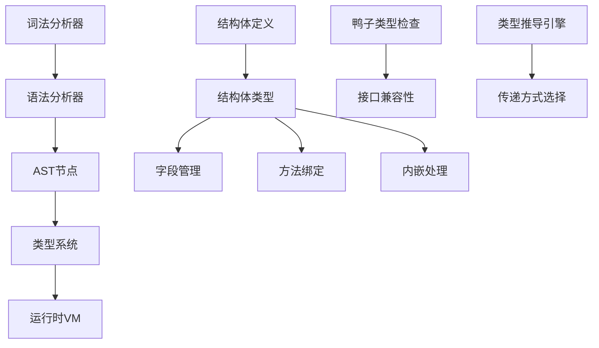

# PHP结构体支持功能设计文档

## 概述

本设计文档描述了为PHP解析器添加Go风格结构体功能的技术实现方案。该功能将引入`struct`关键字，支持鸭子类型、内嵌继承和智能类型推导，为PHP带来更强大的数据结构定义能力。

## 架构

### 核心组件



### 语法扩展

#### 结构体定义语法
```php
struct Point {
    public int $x;
    public int $y;
    
    public function __construct(int $x = 0, int $y = 0) {
        $this->x = $x;
        $this->y = $y;
    }
    
    public function distance(): float {
        return sqrt($this->x * $this->x + $this->y * $this->y);
    }
}
```

#### 内嵌结构体语法
```php
struct Person {
    public string $name;
    public int $age;
}

struct Employee {
    Person;  // 内嵌Person结构体
    public string $department;
    public float $salary;
}
```

#### 接口实现语法
```php
interface Drawable {
    public function draw(): void;
}

struct Circle implements Drawable {
    public float $radius;
    
    public function draw(): void {
        echo "Drawing circle with radius: " . $this->radius;
    }
}
```

## 组件和接口

### 1. 词法分析器扩展

**新增Token类型：**
- `k_struct`: struct关键字
- `t_struct_name`: 结构体名称标识符

**修改文件：** `src/compiler/token.zig`

### 2. 语法分析器扩展

**新增AST节点类型：**
- `struct_decl`: 结构体声明节点
- `struct_field`: 结构体字段节点
- `struct_method`: 结构体方法节点
- `struct_embedding`: 结构体内嵌节点
- `struct_instantiation`: 结构体实例化节点

**修改文件：** `src/compiler/ast.zig`, `src/compiler/parser.zig`

### 3. 类型系统扩展

**新增类型定义：**
```zig
pub const PHPStruct = struct {
    name: *PHPString,
    fields: std.StringHashMap(StructField),
    methods: std.StringHashMap(Method),
    embedded_structs: []const *PHPStruct,
    interfaces: []const *PHPInterface,
    type_info: StructTypeInfo,
    
    pub const StructField = struct {
        name: *PHPString,
        type: TypeInfo,
        default_value: ?Value,
        modifiers: FieldModifiers,
        offset: usize, // 用于内存布局优化
    };
    
    pub const StructTypeInfo = struct {
        is_value_type: bool,
        size: usize,
        alignment: usize,
        has_pointers: bool,
    };
};
```

**修改文件：** `src/runtime/types.zig`

### 4. 运行时VM扩展

**新增VM方法：**
- `evaluateStructDeclaration`: 处理结构体声明
- `evaluateStructInstantiation`: 处理结构体实例化
- `evaluateStructFieldAccess`: 处理字段访问
- `evaluateStructMethodCall`: 处理方法调用
- `checkDuckTypeCompatibility`: 检查鸭子类型兼容性
- `inferStructPassingMode`: 推导结构体传递方式

**修改文件：** `src/runtime/vm.zig`

## 数据模型

### 结构体实例表示

```zig
pub const StructInstance = struct {
    struct_type: *PHPStruct,
    fields: std.StringHashMap(Value),
    embedded_instances: []const StructInstance,
    
    pub fn getField(self: *StructInstance, name: []const u8) !Value {
        // 首先查找直接字段
        if (self.fields.get(name)) |value| {
            return value;
        }
        
        // 然后查找内嵌结构体字段
        for (self.embedded_instances) |embedded| {
            if (embedded.getField(name)) |value| {
                return value;
            } else |_| {}
        }
        
        return error.FieldNotFound;
    }
    
    pub fn callMethod(self: *StructInstance, vm: *VM, name: []const u8, args: []const Value) !Value {
        // 查找直接方法
        if (self.struct_type.methods.get(name)) |method| {
            return vm.callStructMethod(self, method, args);
        }
        
        // 查找内嵌结构体方法
        for (self.embedded_instances) |embedded| {
            if (embedded.callMethod(vm, name, args)) |result| {
                return result;
            } else |_| {}
        }
        
        return error.MethodNotFound;
    }
};
```

### 类型推导算法

```zig
pub fn inferPassingMode(struct_type: *PHPStruct) PassingMode {
    const size_threshold = 64; // 字节
    const pointer_penalty = 8; // 每个指针的额外权重
    
    var total_size: usize = 0;
    var pointer_count: usize = 0;
    
    // 计算结构体大小和复杂度
    var field_iter = struct_type.fields.iterator();
    while (field_iter.next()) |entry| {
        const field = entry.value_ptr.*;
        total_size += getTypeSize(field.type);
        if (isPointerType(field.type)) {
            pointer_count += 1;
        }
    }
    
    // 考虑内嵌结构体
    for (struct_type.embedded_structs) |embedded| {
        const embedded_mode = inferPassingMode(embedded);
        if (embedded_mode == .reference) {
            return .reference;
        }
        total_size += embedded.type_info.size;
    }
    
    // 决策逻辑
    const weighted_size = total_size + (pointer_count * pointer_penalty);
    
    if (weighted_size <= size_threshold and !struct_type.type_info.has_pointers) {
        return .value;
    } else {
        return .reference;
    }
}
```

## 正确性属性

*属性是应该在系统的所有有效执行中保持为真的特征或行为——本质上是关于系统应该做什么的正式陈述。属性作为人类可读规范和机器可验证正确性保证之间的桥梁。*

### 属性1：结构体定义一致性
*对于任何*有效的结构体定义，解析后的AST应该准确反映源代码中的字段、方法和内嵌关系
**验证：需求1.1, 1.2, 1.3**

### 属性2：字段访问正确性
*对于任何*结构体实例和有效字段名，字段访问应该返回正确的值或通过内嵌查找找到该字段
**验证：需求2.1, 2.3, 4.3**

### 属性3：方法调用一致性
*对于任何*结构体实例和有效方法名，方法调用应该执行正确的方法实现，包括继承的方法
**验证：需求3.1, 3.2, 4.4**

### 属性4：内嵌继承传递性
*对于任何*具有多层内嵌的结构体，字段和方法的访问应该遵循继承链的传递性
**验证：需求4.1, 4.2, 4.5**

### 属性5：鸭子类型兼容性
*对于任何*两个具有相同方法签名的结构体，它们应该在需要该行为的上下文中可互换使用
**验证：需求5.1, 5.2, 5.3**

### 属性6：类型推导一致性
*对于任何*结构体类型，类型推导算法应该基于结构体的大小和复杂度一致地选择值类型或引用类型传递
**验证：需求6.1, 6.2, 6.3**

### 属性7：构造函数初始化完整性
*对于任何*结构体实例化，所有字段应该被正确初始化，要么通过构造函数参数，要么通过默认值
**验证：需求7.1, 7.3, 7.4**

### 属性8：运算符重载语义保持
*对于任何*重载的运算符，其行为应该与原始运算符的语义保持一致，并正确处理类型转换
**验证：需求8.1, 8.2, 8.3**

### 属性9：接口实现完整性
*对于任何*声称实现接口的结构体，它必须实现接口的所有方法，且方法签名完全匹配
**验证：需求9.1, 9.4**

### 属性10：内存管理安全性
*对于任何*结构体实例，其内存分配和释放应该正确管理，避免内存泄漏和悬空指针
**验证：需求10.1, 10.2, 10.5**

## 错误处理

### 编译时错误
1. **结构体定义错误**：语法错误、重复字段名、循环内嵌
2. **类型不匹配错误**：字段类型错误、方法签名不匹配
3. **接口实现错误**：未实现所有接口方法、方法签名不匹配

### 运行时错误
1. **字段访问错误**：访问不存在的字段
2. **方法调用错误**：调用不存在的方法、参数不匹配
3. **类型转换错误**：不兼容的结构体类型转换

## 测试策略

### 单元测试
- 结构体定义解析测试
- 字段访问和修改测试
- 方法调用测试
- 内嵌继承测试
- 类型推导测试

### 属性测试
- 结构体定义一致性测试（最少100次迭代）
- 字段访问正确性测试（最少100次迭代）
- 方法调用一致性测试（最少100次迭代）
- 内嵌继承传递性测试（最少100次迭代）
- 鸭子类型兼容性测试（最少100次迭代）

每个属性测试必须引用其设计文档属性，使用标签格式：**Feature: php-struct-support, Property {number}: {property_text}**

### 集成测试
- 完整的结构体使用场景测试
- 与现有PHP功能的兼容性测试
- 性能基准测试