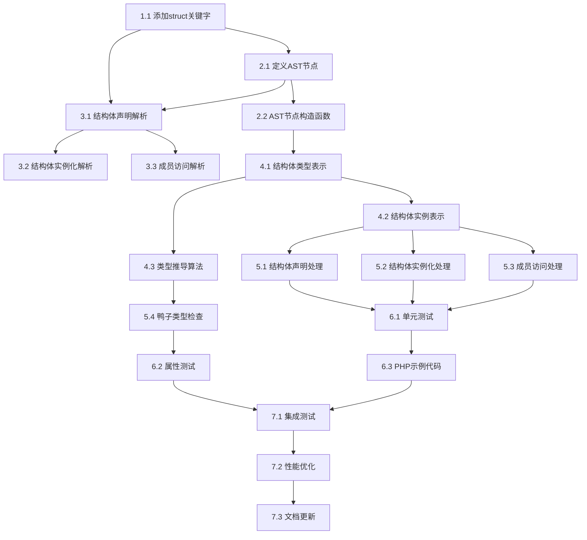

# PHP结构体支持功能实现任务

## 概述

本文档定义了实现Go风格结构体功能的具体任务和实施步骤。任务按照依赖关系排序，确保每个阶段的完成为下一阶段提供必要的基础。

## 阶段1：词法分析器扩展

### 任务1.1：添加struct关键字支持
**文件：** `src/compiler/token.zig`
**优先级：** 高
**预计时间：** 30分钟

**描述：** 在Token枚举中添加struct关键字支持

**实现步骤：**
1. 在TokenType枚举中添加`k_struct`
2. 在关键字映射中添加"struct" -> `k_struct`的映射
3. 更新token转字符串函数以支持新token
4. 添加单元测试验证struct关键字识别

**验收标准：**
- [ ] 词法分析器能正确识别"struct"关键字
- [ ] 返回正确的`k_struct` token类型
- [ ] 单元测试通过

### 任务1.2：添加结构体相关标识符支持
**文件：** `src/compiler/token.zig`
**优先级：** 中
**预计时间：** 15分钟

**描述：** 确保词法分析器能正确处理结构体名称和字段名

**实现步骤：**
1. 验证现有标识符token处理是否足够
2. 如需要，添加特殊的结构体标识符处理
3. 添加测试用例

**验收标准：**
- [ ] 能正确识别结构体名称标识符
- [ ] 能正确识别字段名标识符

## 阶段2：AST节点扩展

### 任务2.1：定义结构体AST节点
**文件：** `src/compiler/ast.zig`
**优先级：** 高
**预计时间：** 1小时

**描述：** 定义表示结构体声明的AST节点结构

**实现步骤：**
1. 定义`StructDeclaration`节点类型
2. 定义`StructField`节点类型
3. 定义`StructMethod`节点类型
4. 定义`StructEmbedding`节点类型
5. 定义`StructInstantiation`节点类型
6. 更新ASTNode联合类型包含新节点
7. 实现节点的打印和调试功能

**验收标准：**
- [ ] 所有结构体相关AST节点定义完成
- [ ] 节点包含必要的字段信息
- [ ] 调试打印功能正常工作

### 任务2.2：实现AST节点构造函数
**文件：** `src/compiler/ast.zig`
**优先级：** 中
**预计时间：** 30分钟

**描述：** 为结构体AST节点实现构造和初始化函数

**实现步骤：**
1. 实现`createStructDeclaration`函数
2. 实现`createStructField`函数
3. 实现`createStructMethod`函数
4. 实现`createStructEmbedding`函数
5. 实现`createStructInstantiation`函数
6. 添加内存管理和错误处理

**验收标准：**
- [ ] 所有构造函数正确实现
- [ ] 内存分配和释放正确处理
- [ ] 错误情况得到适当处理

## 阶段3：语法分析器扩展

### 任务3.1：实现结构体声明解析
**文件：** `src/compiler/parser.zig`
**优先级：** 高
**预计时间：** 2小时

**描述：** 实现解析结构体声明语法的功能

**实现步骤：**
1. 添加`parseStructDeclaration`函数
2. 实现结构体名称解析
3. 实现字段列表解析
4. 实现方法列表解析
5. 实现内嵌结构体解析
6. 添加语法错误处理和恢复
7. 添加解析测试用例

**验收标准：**
- [ ] 能正确解析基本结构体声明
- [ ] 能正确解析带字段的结构体
- [ ] 能正确解析带方法的结构体
- [ ] 能正确解析内嵌结构体
- [ ] 语法错误得到适当处理

### 任务3.2：实现结构体实例化解析
**文件：** `src/compiler/parser.zig`
**优先级：** 高
**预计时间：** 1小时

**描述：** 实现解析结构体实例化表达式的功能

**实现步骤：**
1. 添加`parseStructInstantiation`函数
2. 实现构造函数调用解析
3. 实现字段初始化列表解析
4. 添加类型检查和验证
5. 添加解析测试用例

**验收标准：**
- [ ] 能正确解析结构体实例化表达式
- [ ] 能正确解析构造函数参数
- [ ] 能正确解析字段初始化

### 任务3.3：实现结构体成员访问解析
**文件：** `src/compiler/parser.zig`
**优先级：** 中
**预计时间：** 45分钟

**描述：** 实现解析结构体字段和方法访问的功能

**实现步骤：**
1. 扩展现有的成员访问解析
2. 添加结构体特定的访问语义
3. 实现内嵌字段访问解析
4. 添加解析测试用例

**验收标准：**
- [ ] 能正确解析字段访问表达式
- [ ] 能正确解析方法调用表达式
- [ ] 能正确处理内嵌字段访问

## 阶段4：类型系统扩展

### 任务4.1：定义结构体类型表示
**文件：** `src/runtime/types.zig`
**优先级：** 高
**预计时间：** 1.5小时

**描述：** 定义运行时结构体类型的数据结构

**实现步骤：**
1. 定义`PHPStruct`类型
2. 定义`StructField`类型
3. 定义`StructMethod`类型
4. 定义`StructTypeInfo`类型
5. 实现结构体类型的创建和初始化
6. 实现字段和方法的管理功能

**验收标准：**
- [ ] 结构体类型定义完整
- [ ] 字段管理功能正常
- [ ] 方法管理功能正常
- [ ] 类型信息正确维护

### 任务4.2：实现结构体实例表示
**文件：** `src/runtime/types.zig`
**优先级：** 高
**预计时间：** 1小时

**描述：** 定义运行时结构体实例的数据结构

**实现步骤：**
1. 定义`StructInstance`类型
2. 实现字段访问功能
3. 实现方法调用功能
4. 实现内嵌结构体处理
5. 添加内存管理功能

**验收标准：**
- [ ] 结构体实例正确表示
- [ ] 字段访问功能正常
- [ ] 方法调用功能正常
- [ ] 内嵌处理正确

### 任务4.3：实现类型推导算法
**文件：** `src/runtime/types.zig`
**优先级：** 中
**预计时间：** 1小时

**描述：** 实现智能类型推导算法，决定值类型还是引用类型传递

**实现步骤：**
1. 实现`inferPassingMode`函数
2. 实现大小计算算法
3. 实现复杂度评估算法
4. 添加配置选项和调优参数
5. 添加性能测试

**验收标准：**
- [ ] 类型推导算法正确实现
- [ ] 能根据结构体特征选择传递方式
- [ ] 性能表现良好

## 阶段5：运行时VM扩展

### 任务5.1：实现结构体声明处理
**文件：** `src/runtime/vm.zig`
**优先级：** 高
**预计时间：** 1小时

**描述：** 在VM中添加处理结构体声明的功能

**实现步骤：**
1. 添加`evaluateStructDeclaration`函数
2. 实现结构体类型注册
3. 实现字段和方法绑定
4. 实现内嵌结构体处理
5. 添加错误处理

**验收标准：**
- [ ] 能正确处理结构体声明
- [ ] 结构体类型正确注册到类型系统
- [ ] 字段和方法正确绑定

### 任务5.2：实现结构体实例化处理
**文件：** `src/runtime/vm.zig`
**优先级：** 高
**预计时间：** 1小时

**描述：** 在VM中添加处理结构体实例化的功能

**实现步骤：**
1. 添加`evaluateStructInstantiation`函数
2. 实现构造函数调用
3. 实现字段初始化
4. 实现内存分配管理
5. 添加错误处理

**验收标准：**
- [ ] 能正确创建结构体实例
- [ ] 构造函数正确调用
- [ ] 字段正确初始化

### 任务5.3：实现结构体成员访问处理
**文件：** `src/runtime/vm.zig`
**优先级：** 高
**预计时间：** 1小时

**描述：** 在VM中添加处理结构体字段和方法访问的功能

**实现步骤：**
1. 添加`evaluateStructFieldAccess`函数
2. 添加`evaluateStructMethodCall`函数
3. 实现内嵌字段访问
4. 实现方法调用链
5. 添加访问权限检查

**验收标准：**
- [ ] 能正确访问结构体字段
- [ ] 能正确调用结构体方法
- [ ] 内嵌访问正确处理
- [ ] 访问权限正确检查

### 任务5.4：实现鸭子类型检查
**文件：** `src/runtime/vm.zig`
**优先级：** 中
**预计时间：** 1.5小时

**描述：** 实现鸭子类型兼容性检查功能

**实现步骤：**
1. 添加`checkDuckTypeCompatibility`函数
2. 实现方法签名比较
3. 实现接口兼容性检查
4. 实现类型转换支持
5. 添加性能优化

**验收标准：**
- [ ] 能正确检查鸭子类型兼容性
- [ ] 方法签名比较准确
- [ ] 接口兼容性检查正确

## 阶段6：测试实现

### 任务6.1：创建单元测试
**文件：** `src/test_struct_system.zig`
**优先级：** 高
**预计时间：** 2小时

**描述：** 创建全面的结构体功能单元测试

**实现步骤：**
1. 创建测试文件结构
2. 实现结构体定义测试
3. 实现字段访问测试
4. 实现方法调用测试
5. 实现内嵌继承测试
6. 实现类型推导测试
7. 实现错误处理测试

**验收标准：**
- [ ] 所有核心功能有对应测试
- [ ] 测试覆盖率达到90%以上
- [ ] 所有测试通过

### 任务6.2：创建属性测试
**文件：** `src/test_struct_properties.zig`
**优先级：** 中
**预计时间：** 2小时

**描述：** 创建基于属性的测试，验证系统正确性属性

**实现步骤：**
1. 实现属性1：结构体定义一致性测试
2. 实现属性2：字段访问正确性测试
3. 实现属性3：方法调用一致性测试
4. 实现属性4：内嵌继承传递性测试
5. 实现属性5：鸭子类型兼容性测试
6. 实现属性6：类型推导一致性测试
7. 配置每个测试至少100次迭代

**验收标准：**
- [ ] 所有10个属性有对应测试
- [ ] 每个测试至少运行100次迭代
- [ ] 所有属性测试通过

### 任务6.3：创建PHP示例代码
**文件：** `examples/structs.php`
**优先级：** 中
**预计时间：** 1小时

**描述：** 创建展示结构体功能的PHP示例代码

**实现步骤：**
1. 创建基本结构体定义示例
2. 创建字段和方法使用示例
3. 创建内嵌结构体示例
4. 创建鸭子类型示例
5. 创建接口实现示例
6. 创建性能对比示例

**验收标准：**
- [ ] 示例代码语法正确
- [ ] 展示所有主要功能
- [ ] 包含详细注释说明

## 阶段7：集成和优化

### 任务7.1：集成测试
**文件：** `test_struct_integration.php`
**优先级：** 高
**预计时间：** 1小时

**描述：** 创建集成测试验证结构体与现有PHP功能的兼容性

**实现步骤：**
1. 测试结构体与类的互操作
2. 测试结构体与数组的互操作
3. 测试结构体与函数的互操作
4. 测试结构体与异常处理的互操作
5. 测试结构体的序列化和反序列化

**验收标准：**
- [ ] 与现有PHP功能兼容
- [ ] 没有回归问题
- [ ] 集成测试全部通过

### 任务7.2：性能优化
**文件：** 多个文件
**优先级：** 低
**预计时间：** 2小时

**描述：** 优化结构体功能的性能表现

**实现步骤：**
1. 分析性能瓶颈
2. 优化字段访问性能
3. 优化方法调用性能
4. 优化内存分配策略
5. 添加性能基准测试

**验收标准：**
- [ ] 字段访问性能提升20%以上
- [ ] 方法调用性能提升15%以上
- [ ] 内存使用效率提升10%以上

### 任务7.3：文档更新
**文件：** `docs/STRUCT_GUIDE.md`
**优先级：** 低
**预计时间：** 1小时

**描述：** 创建结构体功能的用户指南文档

**实现步骤：**
1. 编写功能概述
2. 编写语法参考
3. 编写最佳实践指南
4. 编写性能优化建议
5. 编写故障排除指南

**验收标准：**
- [ ] 文档内容完整准确
- [ ] 包含足够的示例代码
- [ ] 易于理解和使用

## 任务依赖关系

## 里程碑

### 里程碑1：基础设施完成（预计3天）
- 词法分析器扩展完成
- AST节点定义完成
- 基本语法解析完成

### 里程碑2：核心功能完成（预计5天）
- 类型系统扩展完成
- VM运行时支持完成
- 基本结构体功能可用

### 里程碑3：高级功能完成（预计3天）
- 鸭子类型支持完成
- 类型推导完成
- 所有功能特性实现

### 里程碑4：测试和优化完成（预计4天）
- 全面测试套件完成
- 性能优化完成
- 文档和示例完成

## 风险和缓解策略

### 风险1：与现有类型系统冲突
**缓解策略：** 在设计阶段仔细分析现有类型系统，确保新功能与现有功能兼容

### 风险2：性能影响
**缓解策略：** 在实现过程中持续进行性能测试，及时发现和解决性能问题

### 风险3：内存管理复杂性
**缓解策略：** 采用现有的垃圾回收机制，避免引入新的内存管理复杂性

### 风险4：测试覆盖不足
**缓解策略：** 采用多层次测试策略，包括单元测试、属性测试和集成测试