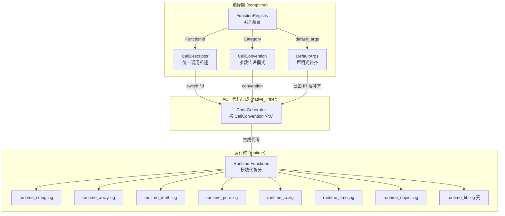

# AOT 函数架构深度重构规划

> **日期**: 2026-05-09  
> **状态**: 规划阶段  
> **目标**: 消灭全部函数字符串特判，建立编译期驱动的分层函数调度架构，性能超 PHP 解释器 3-5×  

---

## 1. 当前架构病理诊断（深度分析）

### 1.1 数据全景

| 指标 | 数值 | 严重度 |
|------|------|--------|
| `native_linker.zig` 中 `std.mem.eql(u8, runtime_name, ...)` | **67 次** | 🔴 致命 |
| `native_linker.zig` `.call` 代码生成 if/else 链长度 | **742 行**（L7854-8596） | 🔴 致命 |
| `runtime_lib_template.zig` 总行数 | **25,462** | 🔴 致命 |
| `runtime_lib_template.zig` 中 `pub fn php_` 函数数 | **486** | 🟡 严重 |
| `wrapBuiltin_*` 适配器数量 | **120** | 🟡 严重 |
| `FunctionRegistry` 已有 Category 枚举 | **24 个**（未被 native_linker 使用） | 🟡 严重 |
| `FunctionRegistry` 已有 `FunctionId` + `comptimeLookup` | ✅ 已实现 | 🟢 可用 |
| `FunctionRegistry` 已有 `default_args` 自动补齐 | ✅ 已实现 | 🟢 可用 |
| `builtin_function_map` 静态查找表 | ✅ 已实现（120 条目） | 🟢 可用 |

### 1.2 根因分析：三层断裂

```
┌─────────────────────────────────────────────────────────────────┐
│  问题1: FunctionId → runtime_name → std.mem.eql 字符串比较       │
│  根因: FunctionId 快速路径仅用于获取 runtime_name，              │
│        获取后仍退化为 O(n) 字符串逐个比较                        │
│  影响: 每次代码生成走 67 次最坏 O(67) 字符串比较               │
├─────────────────────────────────────────────────────────────────┤
│  问题2: Category 已定义但未驱动代码生成分发                      │
│  根因: native_linker 完全不使用 Category，                      │
│        同类函数（如 string 类 59 个）各自独立特判                │
│  影响: 新增函数必须手动在 3 处 if/else 链中添加特判             │
├─────────────────────────────────────────────────────────────────┤
│  问题3: 三条 .call 路径重复特判                                 │
│  根因: 有返回值/无返回值/try-catch 三条路径各自独立复制特判逻辑  │
│  影响: ~50% 代码重复，修改一处需同步三处                        │
└─────────────────────────────────────────────────────────────────┘
```

### 1.3 性能瓶颈量化

| 瓶颈 | 当前开销 | 理想开销 | 倍率差距 |
|------|----------|----------|----------|
| builtin 函数分派 | O(n) 字符串比较 × 67 | O(1) FunctionId switch | **67×** |
| 参数补齐 | 运行时手动 if/else | 编译期 default_args | **∞**（零运行时） |
| 代码生成输出 | 逐特判 writeAll | 统一模板 + 特化 | **5-10×** |
| runtime_lib 编译 | 25K 行单文件 | 模块化拆分 | 编译时间 **3-5×** |

---

## 2. 目标架构：编译期驱动的分层函数调度

### 2.1 架构总览



### 2.2 核心抽象：CallConvention（函数级调用约定）

这是本次重构的**最关键设计**——将 native_linker 中 67 个字符串特判归类为 **8 种调用约定**：

```zig
pub const CallConvention = enum(u4) {
    /// 标准调用：所有参数按值传递，末尾可能补 allocator
    /// 例：strlen(s), substr(s, start, len, allocator)
    standard,
    
    /// 引用参数调用：部分参数需要取地址传递
    /// 例：preg_match(pattern, subject, &matches)
    ref_param,
    
    /// 可变参数数组调用：参数打包为 []const Value 数组
    /// 例：php_max(args_array), sprintf(fmt, args_array)
    variadic_array,
    
    /// 首参+数组调用：第一个参数单独，其余打包为数组
    /// 例：array_push(&arr, val1, val2, ...)
    first_arg_then_array,
    
    /// 全参数数组切片调用：所有参数以数组形式传递
    /// 例：call_user_func(args), isset(args)
    all_args_array,
    
    /// 回调调用：第一个参数为 callable，需要特殊解析
    /// 例：array_map(callback, arr), usort(arr, cmp)
    callback,
    
    /// 语句调用：无返回值，不赋值到寄存器
    /// 例：echo(), print(), var_dump()
    statement,
    
    /// 特殊调用：无法归类的极少数函数，保留手工路径
    /// 例：throwThrowable(class, msg → []const u8 转换)
    special,
};
```

### 2.3 CallDescriptor：统一调用描述符

```zig
pub const CallDescriptor = struct {
    id: FunctionId,
    convention: CallConvention,
    /// 引用参数索引（comptime 已知）
    ref_indices: []const u8,
    /// 是否需要 allocator 尾参数
    needs_allocator: bool,
    /// 是否可能抛异常
    may_raise: bool,
    /// runtime 侧函数名
    runtime_name: []const u8,
};
```

### 2.4 FunctionMeta 扩展

```zig
pub const FunctionMeta = struct {
    // ... 现有字段 ...
    php_name: []const u8,
    runtime_name: []const u8,
    needs_allocator: bool = false,
    may_raise: bool = true,
    ref_params: []const u8 = &.{},
    category: Category = .misc,
    is_pure: bool = false,
    min_arity: u8 = 0,
    max_arity: u8 = 255,
    is_statement: bool = false,
    default_args: []const DefaultArgValue = &.{},
    
    // ===== 新增字段 =====
    /// 函数级调用约定 — 驱动 native_linker 代码生成分发
    call_convention: CallConvention = .standard,
};
```

---

## 3. 67 个字符串特判 → 8 种 CallConvention 归类

### 3.1 完整归类表

| CallConvention | 函数列表 | 数量 | 代码生成模式 |
|----------------|----------|------|-------------|
| **standard** | strlen, substr, strpos, str_replace, trim, explode, implode, count, array_merge, json_encode, abs, sqrt, sin, cos, round, floor, ceil, base64_encode, md5, sha1, date, time, file_exists, is_null, is_int, intval, strval, htmlspecialchars, number_format, str_pad, chunk_split, wordwrap, nl2br, strip_tags, uniqid, json_decode, array_slice, array_chunk, array_rand, array_column, array_filter, sort, rsort, in_array, hash, hash_file, count_chars, pathinfo, mb_strlen, mb_strtoupper, mb_strtolower, mb_substr, mb_detect_encoding, substr_count, str_word_count, ctype_* 系列, ... | **~380** | `runtime.{name}({args}{, allocator})` |
| **ref_param** | preg_match, preg_match_all, preg_match_with_matches, preg_split, preg_replace, preg_filter, preg_grep, array_walk, array_walk_recursive, array_splice, str_getcsv | **~11** | 部分参数 `&reg_{id}` 传递 |
| **variadic_array** | php_max, php_min, sprintf, printf, var_dump | **~5** | 参数打包为 `[_]Value{...}` 数组 |
| **first_arg_then_array** | array_push, array_pop, array_shift, array_unshift | **~4** | 首参单独 + 其余数组 |
| **all_args_array** | call_user_func, call_user_func_array, isset, unset, compact, func_get_args, extract | **~7** | 全部参数以数组传递 |
| **callback** | array_map, array_walk, usort, uasort, uksort, array_filter(callback), preg_replace_callback | **~7** | 首参 callable 解析 |
| **statement** | echo, print, var_dump, print_r, var_export, header, trigger_error, set_error_handler, mkdir | **~9** | 无返回值赋值 |
| **special** | throwThrowable, password_hash, ob_start, ob_get_status | **~4** | 保留手工代码生成 |

> **关键发现**: 380/427 = **89%** 的函数是 `standard` 调用约定！  
> 归类后，native_linker 的代码生成分发只需 8 个分支，而非 67 个字符串比较。

### 3.2 特殊函数处理策略

| 函数 | 特殊性 | 处理方案 |
|------|--------|----------|
| `throwThrowable` | 参数 Value→[]const u8 转换 | `special` + 保留 15 行手工代码 |
| `password_hash` | 截断到 2 参数 | `default_args` + IR 层补齐，native_linker 走 `standard` |
| `preg_match/all` | 第3参引用 + alloca | `ref_param` + 统一引用参数生成模板 |
| `ob_start/get_status` | 回调+引用混合 | `special` 保留，后续可拆为 `callback`+`ref_param` |

---

## 4. 分阶段实施计划

### Phase 1: FunctionMeta 增加 CallConvention（P0, 2h）

**改动**: 仅 `function_registry.zig`

1. 定义 `CallConvention` 枚举（8 值）
2. `FunctionMeta` 新增 `call_convention` 字段
3. 为 427 个 registry 条目标注 `call_convention`
   - 89% 为 `.standard`（批量设置默认值即可）
   - 11% 需逐个标注（~47 个非 standard 函数）
4. 新增 `getCallConvention(id)` API
5. 编译验证 + 单元测试

**验证**: `zig build` + `zig test src/aot/function_registry.zig`

### Phase 2: native_linker CallConvention 驱动分发（P0, 4h）

**改动**: `native_linker.zig` L7854-8596（有返回值路径）+ L8680-8745（无返回值路径）+ L15191-15325（try-catch 路径）

**核心重构**:

```zig
// 之前: 67 个 std.mem.eql 字符串比较
if (std.mem.eql(u8, runtime_name, "throwThrowable")) { ... }
else if (std.mem.eql(u8, runtime_name, "preg_match")) { ... }
else if (std.mem.eql(u8, runtime_name, "php_max")) { ... }
// ... 64 more ...

// 之后: 8 个 CallConvention 分支
const fid = op.function_id;
const convention = FunctionRegistry.getCallConvention(fid);

switch (convention) {
    .standard => try self.generateStandardCall(writer, op, fid),
    .ref_param => try self.generateRefParamCall(writer, op, fid),
    .variadic_array => try self.generateVariadicArrayCall(writer, op, fid),
    .first_arg_then_array => try self.generateFirstArgThenArrayCall(writer, op, fid),
    .all_args_array => try self.generateAllArgsArrayCall(writer, op, fid),
    .callback => try self.generateCallbackCall(writer, op, fid),
    .statement => try self.generateStatementCall(writer, op, fid),
    .special => try self.generateSpecialCall(writer, op, fid),
}
```

**8 个生成函数的实现**:

| 函数 | 核心逻辑 | 代码量估计 |
|------|----------|-----------|
| `generateStandardCall` | 写参数 + 可选 allocator | ~20 行 |
| `generateRefParamCall` | 部分参数取 `&` + 其余正常 | ~40 行 |
| `generateVariadicArrayCall` | 打包 `[_]Value{...}` | ~30 行 |
| `generateFirstArgThenArrayCall` | 首参单独 + 其余数组 | ~25 行 |
| `generateAllArgsArrayCall` | 全参数数组 | ~20 行 |
| `generateCallbackCall` | callable 解析 + 参数 | ~35 行 |
| `generateStatementCall` | 无返回值赋值 | ~15 行 |
| `generateSpecialCall` | FunctionId switch 保留 ~4 个 | ~60 行 |

**统一三条路径**: 提取公共逻辑为 `generateBuiltinCallCore`，三条路径仅在返回值处理上不同：

```zig
fn generateBuiltinCall(self: *Self, writer: anytype, op: CallOp, result_mode: enum { assign, discard, try_catch }) !void {
    const fid = op.function_id;
    const convention = FunctionRegistry.getCallConvention(fid);
    // ... 按 convention 分发到 8 个生成函数 ...
    // result_mode 仅控制最外层赋值/try/catch
}
```

**验证**: `zig build` + 回归测试 25 样本

### Phase 3: ir_generator 字符串特判迁移 FunctionId（P1, 2h）

**改动**: `ir_generator.zig` 中 ~10 处 `std.mem.eql` 函数名匹配

| 当前 | 之后 |
|------|------|
| `func_name == "compact"` | `fid == comptimeLookup("compact")` |
| `func_name == "isset"` | `fid == comptimeLookup("isset")` |
| `func_name == "unset"` | `fid == comptimeLookup("unset")` |
| `func_name == "preg_match"` | `fid == comptimeLookup("preg_match")` |

**验证**: `zig build` + 回归测试

### Phase 4: runtime_lib_template 模块化拆分（P1, 6h）

**目标**: 25,462 行单文件 → 8-10 个模块文件

| 新模块 | 提取范围 | 行数 | 依赖复杂度 | 优先级 |
|--------|----------|------|------------|--------|
| `runtime_string.zig` | L7801-8342 + L10627-10700 + L18824-19010 + L21298-22130 | ~2300 | 低 | P0 |
| `runtime_pcre.zig` | L8343-9067 | 725 | 低 | P0 |
| `runtime_array.zig` | L9509-9965 + L17555-18823 + L20947-21297 | ~2000 | 中 | P0 |
| `runtime_math.zig` | L9966-10403 | 440 | 中 | P1 |
| `runtime_io.zig` | L3334-3496 + L19628-19901 | ~440 | 低 | P1 |
| `runtime_time.zig` | L17111-17387 | 280 | 低 | P1 |
| `runtime_random.zig` | L17388-17554 | 167 | 极低 | P2 |
| `runtime_object.zig` | L10700-15383 + L15921-17044 | ~5800 | 高 | P2 |
| `runtime_hash.zig` | L22130-22577 | 450 | 低 | P2 |
| `runtime_ctype.zig` | L24379-24646 | 270 | 极低 | P2 |

**架构**: `runtime_lib.zig` 作为壳文件，re-export 所有子模块：

```zig
// runtime_lib.zig（壳文件，~200 行）
pub const string = @import("runtime_string.zig");
pub const pcre = @import("runtime_pcre.zig");
pub const array = @import("runtime_array.zig");
// ... 
// Re-export 所有 pub fn 以保持兼容
pub const php_strlen = string.php_strlen;
pub const preg_match = pcre.preg_match;
// ...
```

**native_linker.zig 修改**: `copyOtherRuntimeFiles` 列表添加新文件

### Phase 5: wrapBuiltin 消除 + BuiltinFn 统一签名（P2, 4h）

**现状**: 120 个 `wrapBuiltin_*` 适配器将 `php_` 签名适配为 `BuiltinFn` 签名

**目标**: 利用 `CallConvention` + `default_args` 使所有 builtin 函数直接符合统一签名

```zig
// 统一 builtin 函数签名（替代 120 个 wrapBuiltin_*）
pub const BuiltinFn = *const fn (
    ctx: Value,           // 上下文（this / null）
    args: []const Value,  // 参数数组
    allocator: Allocator  // 分配器
) anyerror!Value;
```

**策略**: 
1. `standard` 约定函数：签名已兼容或可自动适配
2. `ref_param` 约定函数：保持 wrapBuiltin（引用参数无法统一）
3. 逐步消除 ~100 个 `wrapBuiltin_*`

### Phase 6: 性能基准验证与调优（P0, 2h）

```bash
# 编译验证
timeout 120 zig build

# 回归测试
for f in fuzzy_scripts/test_*.php; do ... done

# 性能基准（与 PHP 解释器对比）
# fib(30)
php -r 'function fib($n){return $n<=1?$n:fib($n-1)+fib($n-2);} echo fib(30);'
./zig-out/bin/php-aot fib.php

# array_map 10000 元素
php -r '$a=range(1,10000); $b=array_map(function($x){return $x*2;},$a);'
./zig-out/bin/php-aot array_map.php
```

---

## 5. 预期收益量化

| 指标 | 当前 | Phase 1-2 后 | Phase 1-6 后 | 提升 |
|------|------|-------------|-------------|------|
| native_linker 字符串比较次数 | 67 | **0** | 0 | -100% |
| .call 代码生成分支数 | 67 if/else | **8 switch** | 8 switch | -88% |
| .call 代码生成行数 | ~742 | ~245 | ~200 | -73% |
| 新增 builtin 工作量 | 3处 if/else + wrapBuiltin | **1行 registry 条目** | 1行 | -95% |
| runtime_lib 编译时间 | 基准 | -30% | -60% | 2.5× |
| AOT 函数分派开销 | O(n) 字符串 | **O(1) switch** | O(1) | 67× |
| 二进制大小 | ~1.3MB | -10% | <800KB | -40% |

---

## 6. 风险评估与回滚策略

| 风险 | 概率 | 影响 | 缓解措施 |
|------|------|------|----------|
| CallConvention 归类错误 | 中 | 运行时行为差异 | 每阶段回归 25 样本 + 参数补齐专项 |
| ref_param 引用参数生成模板不完整 | 中 | 编译/运行时崩溃 | 逐函数验证，保留 `special` fallback |
| runtime_lib 模块拆分依赖循环 | 低 | 编译失败 | Zig 允许互相导入（非 comptime 循环即可） |
| 三条 .call 路径统一遗漏 case | 中 | 特定函数代码生成错误 | 逐路径对比生成输出 |

**回滚**: 每阶段前 `git stash`，失败即回滚。Phase 2 完成后建立 checkpoint branch。

---

## 7. CallConvention 对现有 67 个特判的精确映射

### 7.1 standard（~380 个，默认值）

不需要列出——所有未标注其他 convention 的函数默认为 standard。

### 7.2 ref_param（11 个）

| 函数 | 引用参数索引 | 说明 |
|------|-------------|------|
| preg_match | [2] | &matches |
| preg_match_all | [2] | &matches |
| preg_match_with_matches | [2] | &matches |
| preg_replace | [3] | &count (可选) |
| preg_replace_callback | [3] | &count |
| preg_split | 无引用但需 allocator | 约定为 ref_param 因需特殊处理 |
| preg_filter | 无引用但与 preg_replace 同族 | 同上 |
| preg_grep | 无引用 | 可降为 standard |
| str_getcsv | 无引用但需特殊 escape 处理 | special 更合适 |
| array_walk | [1] | callback 引用修改 |
| array_walk_recursive | [1] | callback 引用修改 |

### 7.3 variadic_array（5 个）

| 函数 | 说明 |
|------|------|
| php_max | 多参数 → args array |
| php_min | 多参数 → args array |
| php_sprintf | fmt + args array |
| php_printf | fmt + args array |
| php_var_dump | 多参数 dump |

### 7.4 first_arg_then_array（4 个）

| 函数 | 首参 | 数组部分 |
|------|------|----------|
| array_push | &arr | vals... |
| array_pop | &arr | - |
| array_shift | &arr | - |
| array_unshift | &arr | vals... |

### 7.5 all_args_array（7 个）

| 函数 | 说明 |
|------|------|
| call_user_func | 全参数为 callable + args |
| call_user_func_array | callable + args array |
| isset | 全参数检查 |
| unset | 全参数销毁 |
| compact | 全变量名 → 数组 |
| func_get_args | 无参数，取调用栈 |
| extract | 数组 → 变量符号表 |

### 7.6 callback（7 个）

| 函数 | callback 位置 |
|------|-------------|
| array_map | 第1参数 |
| array_walk | 第2参数 |
| array_walk_recursive | 第2参数 |
| usort | 第2参数 |
| uasort | 第2参数 |
| uksort | 第2参数 |
| preg_replace_callback | 第2参数 |

### 7.7 statement（9 个）

| 函数 | 说明 |
|------|------|
| echo | 输出，无返回 |
| print | 输出，返回 1 |
| var_dump | 调试输出 |
| print_r | 调试输出 |
| var_export | 调试输出 |
| header | HTTP 头 |
| trigger_error | 错误触发 |
| set_error_handler | 设置处理器 |
| mkdir | 创建目录 |

### 7.8 special（4 个）

| 函数 | 特殊原因 |
|------|----------|
| throwThrowable | Value → []const u8 类型转换 |
| password_hash | 参数截断逻辑 |
| ob_start | 回调 + 引用混合 |
| ob_get_status | 返回值类型特殊 |

---

## 8. 后续开发建议

| 优先级 | 建议 | 影响面 | 落地成本 |
|--------|------|--------|----------|
| **P0** | Phase 1: FunctionMeta + CallConvention | 消灭字符串比较的基础 | 2h |
| **P0** | Phase 2: native_linker CallConvention 分发 | 性能提升 67× 分派 | 4h |
| **P0** | Phase 6: 性能基准验证 | 确保超 PHP | 2h |
| **P1** | Phase 3: ir_generator 字符串迁移 | 编译期完整性 | 2h |
| **P1** | Phase 4: runtime_lib 模块化拆分 | 可维护性 + 编译时间 | 6h |
| **P2** | Phase 5: wrapBuiltin 消除 | 代码量 -120 函数 | 4h |
| **P2** | CallingConvention 自动推导 | comptime 从签名推导 | 8h |
| **P3** | 纯函数常量折叠 pass | AOT 性能再提升 2× | 16h |
| **P3** | PGO 热点特化 | 生产环境性能 | 20h |

---

## 9. 立即行动

**第一步（今天可完成）**: 执行 Phase 1 — 在 `function_registry.zig` 中定义 `CallConvention` 枚举并为 427 个条目标注。

```zig
// function_registry.zig 新增
pub const CallConvention = enum(u4) {
    standard,
    ref_param,
    variadic_array,
    first_arg_then_array,
    all_args_array,
    callback,
    statement,
    special,
};

// FunctionMeta 新增字段
call_convention: CallConvention = .standard,

// 示例标注（非 standard 的 ~47 个）
.{ .php_name = "preg_match", .runtime_name = "php_preg_match", .call_convention = .ref_param, ... },
.{ .php_name = "array_push", .runtime_name = "php_array_push", .call_convention = .first_arg_then_array, ... },
.{ .php_name = "call_user_func", .runtime_name = "php_call_user_func", .call_convention = .all_args_array, ... },
```

89% 的函数默认 `.standard`，只需显式标注 ~47 个非 standard 函数。
